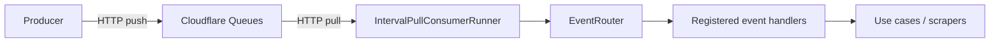

# Consumer Shopping Suggestions

Long-running TypeScript consumer for SkyDIIV marketplace scraping. Runs on **Oracle Cloud pay-as-you-go** compute with a weekly
**Thursday 11:00–12:00 America/Sao_Paulo** window (1h/week).

**Broker (local + production):** Cloudflare Queues (interval HTTP pull).

Messages use a shared envelope `{ "event", "payload" }`. Handlers are registered
per event name — today: `scrape-shopping-suggestions`; more events will follow.

Env files: [docs/ENV.md](docs/ENV.md) · Localhost OCI deploy: [deploy/README.md](deploy/README.md#localhost-deploy-for-tests-schedule-does-not-apply)

## Events

| Event | Payload | Status |
|---|---|---|
| `scrape-shopping-suggestions` | `{ marketplace, userid, search_terms[] }` | Active — marketplace: **Enjoei** |

Publish: [docs/PUBLISH_EVENTS.md](docs/PUBLISH_EVENTS.md) · Flow: [docs/SCRAPE_SHOPPING_SUGGESTIONS.md](docs/SCRAPE_SHOPPING_SUGGESTIONS.md)

## Architecture

```
src/
├── domain/           # Entities, per-event schemas, ports
├── application/      # Use cases + EventRouter (multi-handler)
├── infrastructure/   # CF Queues, web Redis, Postgres, Camoufox
├── presentation/     # Interval-pull runner
└── main.ts           # Composition root — Cloudflare Queues only
```



## Tech stack

| Piece | Choice |
|---|---|
| Runtime | Node.js 22 |
| Broker | Cloudflare Queues HTTP pull |
| Browser | Camoufox + Playwright |
| Validation | Zod (per event) |
| Tests | Vitest |
| Infra | Terraform (OCI VM + IPv6) + microsocks + Resource Scheduler |
| Deploy | GitHub Actions / `deploy/deploy-from-local.sh` → SSH → systemd |

## Getting started (local)

**One local file: `.env`** in the project root (see [docs/ENV.md](docs/ENV.md)).

```bash
cd apps/consumer-shopping-suggestions
cp .env.example .env
# Required: CF_ACCOUNT_ID, CF_QUEUE_ID, CF_QUEUES_API_TOKEN, DATABASE_URL
chmod +x scripts/*.sh
```

### Option A — Docker Compose (recommended)

```bash
docker compose up --build
```

Run from **`apps/consumer-shopping-suggestions`** (where `docker-compose.yml` and `.env` live).
Compose mounts **`.env`** into the container and Node loads it with `--env-file` (same as `npm run dev`).
Poll interval comes from **`CF_QUEUES_POLL_INTERVAL_MS`** in `.env` (`.env.example` uses `60000`).

For Postgres/Redis on your **host**, use `host.docker.internal` instead of `localhost` in `.env`.

### Option B — Node on the host

```bash
npm install
npm run dev    # loads .env via --env-file
```

Leave `PROXY_URLS` empty locally.

### Publish a test event

```bash
./scripts/publish-event.sh
# or: npm run publish:event
MARKETPLACE=enjoei USER_ID=user-42 TERMS="vestido,jaqueta" ./scripts/publish-event.sh
```

## Configuration

See `.env.example`. Key knobs:

| Variable | Default | Description |
|---|---|---|
| `CF_ACCOUNT_ID` / `CF_QUEUE_ID` / `CF_QUEUES_API_TOKEN` | _(required)_ | Cloudflare Queues credentials |
| `CF_QUEUES_BATCH_SIZE` | `10` | Max messages per poll |
| `CF_QUEUES_POLL_INTERVAL_MS` | `600000` (10 min) | Delay between polls (`.env.example` uses `60000` locally) |
| `CF_QUEUES_VISIBILITY_TIMEOUT_MS` | `7200000` (2 h) | Lease while processing a batch |
| `DATABASE_URL` | _(required)_ | Postgres pooled connection |
| `DATABASE_URL_UNPOOLED` | falls back to `DATABASE_URL` | Postgres direct (writes) |
| `WEB_APP_REDIS_REST_URL` / `TOKEN` | _(optional)_ | Upstash REST in production |
| `WEB_APP_REDIS_URL` | _(optional)_ | Plain `redis://` for local dev (same as web `REDIS_URL`) |
| `CONSUMER_CONCURRENCY` | `10` | Max parallel messages in a batch |
| `PROXY_URLS` | _(empty)_ | SOCKS URLs (infra on the VM only) |

After a successful scrape the consumer updates web Redis:

1. Replaces `scraped_products` for the user's wardrobe panorama
2. Deletes `shopping-suggestions:{userId}`
3. Sets `notification:new-shopping-suggestions:{userId}`

## IPv6 rotation + weekly schedule

On every OCI deploy:

1. Terraform creates/updates VM, VCN, IPv6, schedules
2. `setup-proxy-pool.sh` → local SOCKS + `PROXY_URLS`
3. `merge-env.sh` injects proxies into the consumer env
4. App round-robins `PROXY_URLS` per scrape

Production: **START Thu 11:00 / STOP Thu 12:00** (`America/Sao_Paulo`).
Monthly cost ceiling **$5** — see [deploy/README.md](deploy/README.md#monthly-cost-limit-5-default).

## Tests

```bash
npm run test
npm run test:coverage
npm run lint
```

## Docs

- [Environment files (`.env`, GitHub secret `CONSUMER_SHOPPING_SUGGESTIONS_ENV`)](docs/ENV.md)
- [Publish events (Cloudflare Queues)](docs/PUBLISH_EVENTS.md)
- [Scrape shopping suggestions flow](docs/SCRAPE_SHOPPING_SUGGESTIONS.md)
- [Deploy & infrastructure](deploy/README.md)
