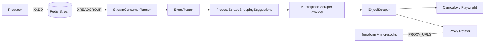

# Consumer Shopping Suggestions

Long-running TypeScript consumer that scrapes clothing suggestions from marketplaces.
Runs on an **Oracle Always Free VM** (provisioned automatically by Terraform) with
**IPv6 egress rotation**, consuming events from **Redis Streams**.

## Event

| Field | Value |
|---|---|
| Name | `scrape-shopping-suggestions` |
| Payload | `{ marketplace: string; userid: string; search_terms: string[] }` |

Currently supported marketplace: **Enjoei** (Playwright + Camoufox).

## Architecture

Clean Architecture layers with SOLID / provider-pattern boundaries:

```
src/
├── domain/           # Entities, events, ports (interfaces)
├── application/      # Use cases + event router
├── infrastructure/   # Redis Streams, Camoufox, Enjoei scraper, proxy rotator
├── presentation/     # Consumer runner (concurrency loop)
└── main.ts           # Composition root
```



## Tech stack

| Piece | Choice |
|---|---|
| Runtime | Node.js 22 |
| Broker | Redis Streams (`ioredis`) |
| Browser | Camoufox + Playwright |
| Validation | Zod |
| Tests | Vitest |
| Infra | Terraform (Always Free VM + IPv6) + microsocks |
| Deploy | GitHub Actions → Terraform → SSH → systemd |

## Getting started (local)

### Option A — Docker Compose (recommended)

```bash
cd apps/consumer-shopping-suggestions
cp .env.docker.example .env.docker
docker compose up --build
```

Publish a test message (another terminal):

```bash
./scripts/publish-test-event.sh
# or: MARKETPLACE=enjoei USER_ID=user-42 TERMS="vestido,jaqueta" ./scripts/publish-test-event.sh
```

Redis only (run the consumer on the host):

```bash
docker compose up redis
cp .env.example .env   # REDIS_URL=redis://127.0.0.1:6380
npm install && npm run dev
```

### Option B — Node on the host

```bash
cd apps/consumer-shopping-suggestions
cp .env.example .env
npm install
npm run dev
```

Leave `PROXY_URLS` empty locally. Publish a test message:

```bash
./scripts/publish-test-event.sh
# or manually:
redis-cli XADD shopping-suggestions '*' \
  event scrape-shopping-suggestions \
  payload '{"marketplace":"enjoei","userid":"user-1","search_terms":["vestido floral"]}'
```

## Configuration

See `.env.example`. Key knobs:

| Variable | Default | Description |
|---|---|---|
| `CONSUMER_CONCURRENCY` | `10` | Max messages processed in parallel |
| `SCRAPE_DELAY_MIN_MS` / `MAX` | `800` / `2500` | Human-like delay range |
| `PROXY_URLS` | _(empty)_ | Comma-separated SOCKS URLs (infra-generated on the VM) |

The app only knows about **proxy URLs**. Raw IPv6 addresses stay in Terraform + the VM proxy pool.

## IPv6 rotation (automated)

On every deploy:

1. **Terraform** creates (or updates) the Always Free VM, VCN/subnet with IPv6, and an IPv6 egress pool.
2. **`setup-proxy-pool.sh`** binds each address to a local microsocks listener and writes `PROXY_URLS`.
3. **`merge-env.sh`** injects those URLs into the consumer environment.
4. The app round-robins across `PROXY_URLS` per scrape session.

See [deploy/README.md](deploy/README.md) for secrets, Always Free shape limits, and Terraform details.

## Tests

```bash
npm run test
npm run test:coverage
npm run lint
```

## Docs

- [Scrape shopping suggestions flow](docs/SCRAPE_SHOPPING_SUGGESTIONS.md)
- [Deploy & infrastructure](deploy/README.md)
