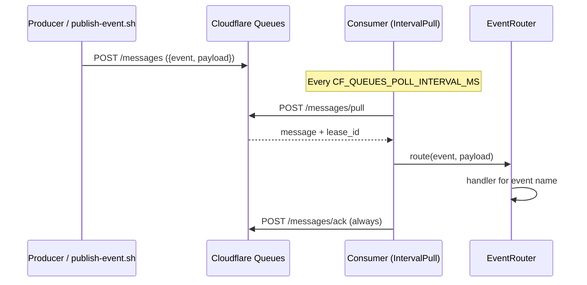

# Publish events — Cloudflare Queues

How to enqueue messages on the **default broker** (**Cloudflare Queues**, HTTP push).

The consumer is an **event router**: every message carries an `event` name and a
`payload`. Today one handler is registered (`scrape-shopping-suggestions`); more
events will be added the same way as the product grows.

Poll interval: `CF_QUEUES_POLL_INTERVAL_MS` (local `.env.example` uses **60s**;
production default is **10 minutes**).

## Envelope (all events)

```json
{
  "event": "<event-name>",
  "payload": { }
}
```

| Field | Required | Description |
|---|---|---|
| `event` | yes | Registered handler name (see table below) |
| `payload` | yes | JSON object — shape depends on the event |

### Registered events

| `event` | Payload (summary) | Doc |
|---|---|---|
| `scrape-shopping-suggestions` | `marketplace`, `userId`, `searchParams[]` | [SCRAPE_SHOPPING_SUGGESTIONS.md](./SCRAPE_SHOPPING_SUGGESTIONS.md) |

Unknown `event` names are rejected (logged + ACKed by the runner).

### Adding a new event

1. Define a Zod schema under `src/domain/events/`
2. Implement an `EventHandler` and register it in `main.ts`
3. Publish with the new `event` name (script / HTTP / producer service)

## Environment

Credentials always come from the **same** CF vars the consumer uses to pull:

```bash
CF_ACCOUNT_ID=...
CF_QUEUE_ID=...
CF_QUEUES_API_TOKEN=...   # needs Queues Edit to publish
```

| Situation | Load from |
|---|---|
| Local publish / consumer / deploy | **`.env`** in the project root |

See [ENV.md](./ENV.md).

## Quick path — script

```bash
cd apps/consumer-shopping-suggestions
chmod +x scripts/*.sh

# Uses ./.env (EVENT defaults to scrape-shopping-suggestions)
./scripts/publish-event.sh

# Preferred: one SearchParams object per term (filters can differ per entry)
SEARCH_PARAMS='[
  {"searchTerm":"vestido floral","gender":"Female","topSize":"M","bottomSize":"40","footSize":"38","brand":"Zara"},
  {"searchTerm":"jaqueta","gender":"Male","topSize":"G","bottomSize":null,"footSize":null,"brand":null}
]' USER_ID=user-42 ./scripts/publish-event.sh

# Fallback shorthand: shared filters applied to every TERMS entry
MARKETPLACE=enjoei USER_ID=user-42 TERMS="vestido floral,jaqueta" \
  GENDER=Female TOP_SIZE=M BOTTOM_SIZE=40 FOOT_SIZE=38 \
  ./scripts/publish-event.sh

# Explicit event name (default is scrape-shopping-suggestions)
EVENT=scrape-shopping-suggestions ./scripts/publish-event.sh

./scripts/publish-event.sh --dry-run
```

Also: `npm run publish:event`

The script `POST`s to:

`https://api.cloudflare.com/client/v4/accounts/{CF_ACCOUNT_ID}/queues/{CF_QUEUE_ID}/messages`

```json
{
  "body": {
    "event": "scrape-shopping-suggestions",
    "payload": {
      "marketplace": "enjoei",
      "userId": "user-42",
      "searchParams": [
        {
          "searchTerm": "vestido floral",
          "gender": "Female",
          "topSize": "M",
          "bottomSize": "40",
          "footSize": "38",
          "brand": null
        }
      ]
    }
  },
  "content_type": "json"
}
```

Expected: HTTP `200` and `"success": true`.

## Manual path — curl

```bash
# Prefer sourcing .env for local work
set -a && source .env && set +a

curl -sS -X POST \
  "https://api.cloudflare.com/client/v4/accounts/${CF_ACCOUNT_ID}/queues/${CF_QUEUE_ID}/messages" \
  -H "Authorization: Bearer ${CF_QUEUES_API_TOKEN}" \
  -H "Content-Type: application/json" \
  --data '{
    "body": {
      "event": "scrape-shopping-suggestions",
      "payload": {
        "marketplace": "enjoei",
        "userId": "user-42",
        "searchParams": [
          {
            "searchTerm": "vestido floral",
            "gender": "Female",
            "topSize": "M",
            "bottomSize": "40",
            "footSize": "38",
            "brand": null
          }
        ]
      }
    },
    "content_type": "json"
  }'
```

Cloudflare: [Publish to a Queue via HTTP](https://developers.cloudflare.com/queues/examples/publish-to-a-queue-via-http/).

## What happens next



1. Message waits until the next pull cycle (or until the VM is RUNNING in the weekly window).
2. Router selects the handler for `event`.
3. For `scrape-shopping-suggestions`, see the scrape flow doc for DB / web Redis side effects.

## Common errors

| Symptom | Likely cause |
|---|---|
| HTTP 403 | Invalid token or missing **Queues Edit** |
| HTTP 404 | Wrong `CF_ACCOUNT_ID` / `CF_QUEUE_ID` |
| `success: false` | Invalid push body |
| Published, no processing | Consumer stopped / VM STOPPED / still inside poll interval |
| `No handler registered` | Typo in `event`, or handler not wired in `main.ts` |
| Scrape ACK with no products | `userId` has no `wardrobe_panorama` |

## Produce from another service

```typescript
const res = await fetch(
  `https://api.cloudflare.com/client/v4/accounts/${accountId}/queues/${queueId}/messages`,
  {
    method: "POST",
    headers: {
      Authorization: `Bearer ${token}`,
      "Content-Type": "application/json",
    },
    body: JSON.stringify({
      content_type: "json",
      body: {
        event: "scrape-shopping-suggestions",
        payload: {
          marketplace: "enjoei",
          userId: "user-42",
          searchParams: [
            {
              searchTerm: "vestido floral",
              gender: "Female",
              topSize: "M",
              bottomSize: "40",
              footSize: "38",
              brand: null,
            },
          ],
        },
      },
    }),
  },
)
```

Swap `event` / `payload` when new handlers ship — the HTTP path stays the same.
