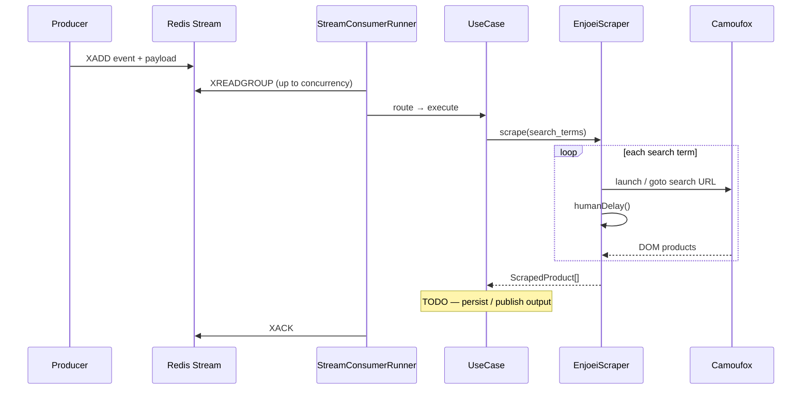

# Scrape Shopping Suggestions

## Overview

Consumes `scrape-shopping-suggestions` events from a Redis Stream and scrapes clothing listings from the requested marketplace. Output handling is deferred (see TODO in the use case).

## Event contract

```json
{
  "event": "scrape-shopping-suggestions",
  "payload": {
    "marketplace": "enjoei",
    "userid": "user-uuid",
    "search_terms": ["vestido floral", "jaqueta jeans"]
  }
}
```

Redis Stream fields:

| Field | Type | Description |
|---|---|---|
| `event` | string | Must be `scrape-shopping-suggestions` |
| `payload` | string (JSON) | Event payload as above |

## Execution flow



## Concurrency

`CONSUMER_CONCURRENCY` (default **10**) caps in-flight messages. The runner:

1. Claims idle pending messages (`XAUTOCLAIM`) for crash recovery
2. Reads new messages (`XREADGROUP`)
3. Processes each message asynchronously under a semaphore
4. Acknowledges only on success (failures stay pending for reclaim)

## Enjoei scraping

- Search URL: `https://www.enjoei.com.br/s/?q={term}`
- Browser: Camoufox (anti-detect Firefox) via `camoufox-js` + Playwright
- Random delays between navigations (`SCRAPE_DELAY_MIN_MS` … `SCRAPE_DELAY_MAX_MS`)
- Optional outbound proxy from the proxy rotator (`PROXY_URLS`, infra-provisioned)

## Adding a marketplace

1. Implement `MarketplaceScraperPort` under `src/infrastructure/scraping/marketplaces/`
2. Register it in `src/main.ts` via `registerMarketplaceScraper("name", factory)`
3. Publish events with `marketplace: "name"`

## Error handling

| Failure | Behavior |
|---|---|
| Invalid payload | Logged; message **not** ACKed → retried via claim |
| Unknown marketplace | Same as above |
| Scrape / browser error | Same as above |
| Redis disconnect | Loop backs off 1s and retries |

## Tests

| Suite | Covers |
|---|---|
| `tests/unit/*` | Zod schemas, use case, router, delay, proxy rotator, provider, config |
| `tests/integration/stream-consumer.runner.test.ts` | Parallel processing + ACK semantics |
| `tests/integration/enjoei.scraper.test.ts` | Scraper orchestration with fake browser |
| `tests/integration/redis-stream.consumer.test.ts` | Redis Stream adapter with fake client |
