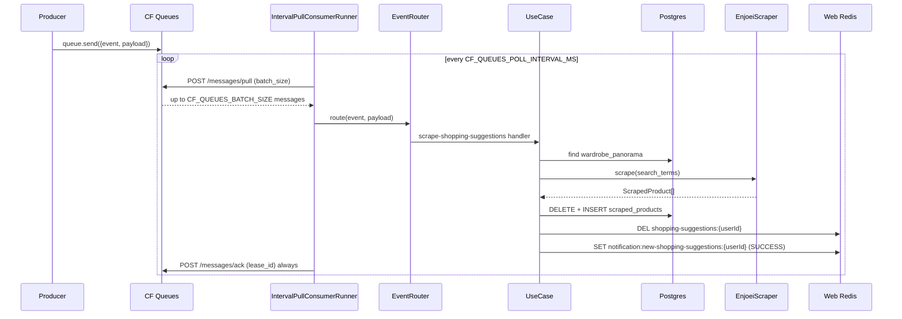

# Scrape shopping suggestions

Feature flow for the **`scrape-shopping-suggestions`** event (one of the events
this consumer can handle). Broker: **Cloudflare Queues** (HTTP pull).

For publishing any event, see [PUBLISH_EVENTS.md](./PUBLISH_EVENTS.md).
For which env file to use locally vs on the VM, see [ENV.md](./ENV.md).

## Overview

Consumes `scrape-shopping-suggestions` from Cloudflare Queues, scrapes clothing
listings from the requested marketplace, replaces `scraped_products` for the
user's wardrobe panorama, and updates caches on the **SkyDIIV web-app Redis**.

## Broker

| Broker | Status | Mode |
|---|---|---|
| **Cloudflare Queues** | **Active (local + production)** | Interval HTTP pull via `IntervalPullConsumerRunner` |
| Redis Streams | Implementation kept under `src/infrastructure/messaging/redis-stream.consumer.ts` — **not wired** in `main.ts` or local Compose | — |

## Redis (web cache only)

| Instance | Env | Role |
|---|---|---|
| Web app | `WEB_APP_REDIS_REST_URL` + `TOKEN` (or `WEB_APP_REDIS_URL`) | `shopping-suggestions:{userId}` + `notification:new-shopping-suggestions:{userId}` |

## Event payload

Envelope (shared by all events):

```json
{
  "event": "scrape-shopping-suggestions",
  "payload": {
    "marketplace": "enjoei",
    "userid": "user-uuid",
    "search_terms": ["vestido floral", "jaqueta jeans"]
  }
}
```

| Field | Type | Description |
|---|---|---|
| `payload.marketplace` | string | Marketplace slug (`enjoei` today) |
| `payload.userid` | string | User id (must have a `wardrobe_panorama`) |
| `payload.search_terms` | string[] | ≥ 1 search term |

Publish helper: `./scripts/publish-event.sh` (see [PUBLISH_EVENTS.md](./PUBLISH_EVENTS.md)).

## Execution flow



Defaults: batch **10**; poll **10 min** in production (local `.env.example` suggests **60s**).

### Persistence rules

| Outcome | `scraping_status` | Notes |
|---|---|---|
| Scrape OK | `SUCCESS` | One row per scraped product |
| Scrape / marketplace error | `ERROR` | One row per `search_term` with error metadata; message is still ACKed |

`scraping_metadata` (JSONB) always stores diagnostics, including raw scraper values
before NOT NULL coercion. Default `image_url` when missing:
`https://assets.skydiiv.space/placeholder--scraped-product.png`.

### Web Redis cache contract (must match skydiiv web)

| Key | Action |
|---|---|
| `shopping-suggestions:{userId}` | `DEL` after replace |
| `notification:new-shopping-suggestions:{userId}` | `SET {"updatedAt":"<ISO>"}` on SUCCESS |

## Concurrency

`CONSUMER_CONCURRENCY` (default **10**) caps in-flight messages within a poll batch.

1. Sleeps `CF_QUEUES_POLL_INTERVAL_MS` between cycles (after accounting for work time)
2. Pulls up to `CF_QUEUES_BATCH_SIZE` messages (short-poll)
3. Processes the batch with bounded concurrency
4. ACKs by `lease_id` always (success or failure)

## Enjoei scraping

- Search URL: `https://www.enjoei.com.br/s/?q={term}`
- Browser: Camoufox (anti-detect Firefox) via `camoufox-js` + Playwright
- Random delays between navigations (`SCRAPE_DELAY_MIN_MS` … `SCRAPE_DELAY_MAX_MS`)
- Optional outbound proxy from the proxy rotator (`PROXY_URLS`, infra-provisioned)

## Adding a marketplace

1. Implement `MarketplaceScraperPort` under `src/infrastructure/scraping/marketplaces/`
2. Register it in `src/main.ts` via `registerMarketplaceScraper("name", factory)`
3. Publish `scrape-shopping-suggestions` with `marketplace: "name"`

## Adding another event (not scrape)

Same broker and envelope — different `event` name + handler. See
[PUBLISH_EVENTS.md](./PUBLISH_EVENTS.md#adding-a-new-event).

## Error handling

| Failure | Behavior |
|---|---|
| Missing wardrobe panorama | Logged; message **ACKed**. No DB rows. |
| Invalid payload | Logged; message **ACKed** |
| Unknown marketplace / scrape error | ERROR rows + metadata; message **ACKed** |
| Unknown `event` | Logged; message **ACKed** |
| Web Redis unavailable | Logged warning; persist still proceeds |
| CF Queues pull/ack HTTP error | Logged; cycle retries on next interval |

## Tests

| Suite | Covers |
|---|---|
| `tests/unit/*` | Zod schemas, use case, router, delay, proxy, provider, config, cache, CF Queues adapter |
| `tests/integration/interval-pull-consumer.runner.test.ts` | Interval pull batching + ACK |
| `tests/integration/enjoei.scraper.test.ts` | Scraper orchestration with fake browser |
| `tests/integration/redis-stream.consumer.test.ts` | Unused Redis Streams adapter (not wired in runtime) |
| `tests/integration/stream-consumer.runner.test.ts` | Unused stream runner (not wired in runtime) |
