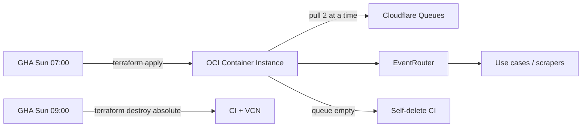

# Robot Shopping Suggestions

Ephemeral **CRON robot** for SkyDIIV marketplace scraping. It exists only while
there is work to do: a weekly GitHub Actions job creates an **OCI Container
Instance** from an OCIR image, the robot drains **Cloudflare Queues** until the
queue is empty, and then it deletes its own instance.

Messages use the envelope `{ "event", "payload" }` and are dispatched by name —
today the only registered event is `scrape-shopping-suggestions`.

Env: [docs/ENV.md](docs/ENV.md) · Deploy: [deploy/README.md](deploy/README.md)

## Events

| Event | Payload | Status |
|---|---|---|
| `scrape-shopping-suggestions` | `{ marketplace, userId, searchParams[] }` | Active — marketplace: **Enjoei** |

Publish: [docs/PUBLISH_EVENTS.md](docs/PUBLISH_EVENTS.md) · Flow: [docs/SCRAPE_SHOPPING_SUGGESTIONS.md](docs/SCRAPE_SHOPPING_SUGGESTIONS.md)

## Lifecycle — how the robot is turned on and off

There is no long-running server to start or stop. The unit of on/off is the
Container Instance itself: **on = create it**, **off = delete it**. The
container never restarts (`container_restart_policy = NEVER`), so the process
runs exactly once per instance.

### Turning it on

| Trigger | How | Result |
|---|---|---|
| **Weekly (normal)** | GHA `Weekly — Robot Shopping Suggestions`, cron `0 10 * * 0` (Sun 07:00 BRT) | lint/test/build → push OCIR image → cost gate → `terraform apply` |
| **Manual** | Same workflow, `workflow_dispatch` with `action=create` | Same as weekly |
| **From your machine** | `./deploy/deploy-from-local.sh apply` | Same stack, local Terraform state |
| **Local process only** | `docker compose up --build` or `npm run dev` | No cloud infra; drains the same queue |

The container starts draining as soon as the image is pulled — there is no
readiness gate or idle state.

### Turning it off

| Path | Trigger | Scope |
|---|---|---|
| **Self-delete** (normal) | A pull returns empty → drain complete | Deletes the Container Instance; compute billing stops. VCN stays (free). |
| **Weekly destroy** (absolute) | GHA cron `0 12 * * 0` (Sun 09:00 BRT), or `workflow_dispatch action=destroy` | `terraform destroy` — Container Instance + VCN + budget, **even if messages remain** |
| **From your machine** | `./deploy/deploy-from-local.sh destroy` | Same destroy, local state |
| **Cost guard** (safety net) | Daily 12:00 UTC, MTD spend ≥ `$5` | `terraform destroy`, and refuses the next apply |
| **Local process** | `Ctrl-C` / `docker compose down` | `SIGINT`/`SIGTERM` finish in-flight messages, then exit |

Self-delete only works from `ACTIVE`, and a drain over a short queue finishes
before OCI promotes the instance out of `CREATING`. The robot therefore waits
for `ACTIVE` and lingers `SELF_DELETE_ACTIVE_GRACE_MS` (default 120s) so the
in-flight `terraform apply` sees `ACTIVE` too — details in
[deploy/README.md](deploy/README.md#self-delete-vs-destroy).

If self-delete fails, the 09:00 destroy still tears everything down; if that
also fails, the cost guard does. No single failure leaves compute billing
forever.

## Architecture

```
src/
├── domain/           # Entities, per-event schemas, ports
├── application/      # Use cases + EventRouter (multi-handler)
├── infrastructure/   # CF Queues, web Redis, Postgres, Camoufox, OCI self-delete
├── presentation/     # BatchDrainRunner (drain until empty)
└── main.ts           # Composition root — CRON batch mode
```



## Tech stack

| Piece | Choice |
|---|---|
| Runtime | Node.js 22 |
| Mode | Batch drain CRON (not a long-runner) |
| Broker | Cloudflare Queues HTTP pull |
| Browser | Camoufox + Playwright |
| Validation | Zod (per event) |
| Tests | Vitest |
| Infra | Terraform (ephemeral OCI Container Instance + VCN) + OCIR |
| Deploy | Weekly GHA create (Sun 07:00 BRT) / destroy (Sun 09:00 BRT) |

## Getting started (local)

```bash
cd apps/robot-shopping-suggestions
cp .env.example .env
# Required: CF_ACCOUNT_ID, CF_SCRAPE_SHOPP_SUGG_QUEUE_ID, CF_QUEUES_API_TOKEN, DATABASE_URL
chmod +x scripts/*.sh
```

```bash
docker compose up --build   # container
npm install && npm run dev  # host
```

Either way the robot drains the queue once and exits; self-delete is a no-op
without OCI credentials.

### Publish a test event

```bash
./scripts/publish-event.sh
MARKETPLACE=enjoei USER_ID=user-42 TERMS="vestido,jaqueta" ./scripts/publish-event.sh
```

## Configuration

Full reference in [docs/ENV.md](docs/ENV.md). Most-used values:

| Variable | Default | Description |
|---|---|---|
| `CF_ACCOUNT_ID` / `CF_SCRAPE_SHOPP_SUGG_QUEUE_ID` / `CF_QUEUES_API_TOKEN` | _(required)_ | Cloudflare Queues |
| `CF_QUEUES_BATCH_SIZE` | `2` | Max messages per pull |
| `ROBOT_CONCURRENCY` | `2` | Max parallel messages in a batch |
| `DATABASE_URL` | _(required)_ | Postgres |
| `WEB_APP_REDIS_REST_*` | _(optional)_ | Web-app cache + notification flag |
| `COMPUTE_PROVIDER` | auto | `oci` self-delete, `noop` locally |

## Tests

```bash
npm run test
npm run test:coverage
npm run lint
```

## Docs

- [Environment files](docs/ENV.md)
- [Publish events](docs/PUBLISH_EVENTS.md)
- [Scrape shopping suggestions flow](docs/SCRAPE_SHOPPING_SUGGESTIONS.md)
- [Deploy & infrastructure](deploy/README.md)
