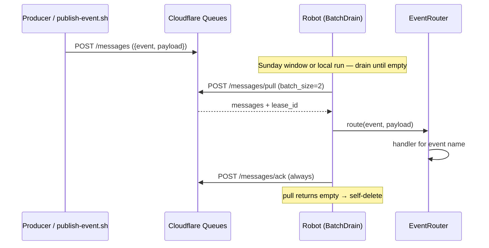

# Publish events — Cloudflare Queues

Producers **push** messages over the Cloudflare Queues HTTP API; the robot
**pulls** them during its window. Publishing works at any time and is
independent of whether the robot is currently running — messages simply wait in
the queue until the next drain (weekly Sunday window, a manual create, or a
local run).

## Envelope (all events)

```json
{
  "event": "<event-name>",
  "payload": { }
}
```

| Field | Required | Description |
|---|---|---|
| `event` | yes | Registered handler name |
| `payload` | yes | JSON object — shape depends on the event |

| `event` | Payload (summary) | Doc |
|---|---|---|
| `scrape-shopping-suggestions` | `marketplace`, `userId`, `searchParams[]` | [SCRAPE_SHOPPING_SUGGESTIONS.md](./SCRAPE_SHOPPING_SUGGESTIONS.md) |

Unknown `event` names are logged and ACKed — they are dropped, not retried.

## Credentials

The same Cloudflare vars the robot uses to pull, loaded from `.env` (see
[ENV.md](./ENV.md)):

```bash
CF_ACCOUNT_ID=...
CF_SCRAPE_SHOPP_SUGG_QUEUE_ID=...
CF_QUEUES_API_TOKEN=...   # needs Queues Edit to publish
```

## Publish with the script

```bash
cd apps/robot-shopping-suggestions
chmod +x scripts/*.sh

# Defaults: EVENT=scrape-shopping-suggestions, MARKETPLACE=enjoei, USER_ID=user-1
./scripts/publish-event.sh
./scripts/publish-event.sh --dry-run

MARKETPLACE=enjoei USER_ID=user-42 TERMS="vestido floral,jaqueta" \
  GENDER=Female TOP_SIZE=M BOTTOM_SIZE=40 FOOT_SIZE=38 \
  ./scripts/publish-event.sh

SEARCH_PARAMS='[
  {"searchTerm":"vestido floral","gender":"Female","topSize":"M","bottomSize":"40","footSize":"38","brand":"Zara"},
  {"searchTerm":"jaqueta","gender":"Male","topSize":"G","bottomSize":null,"footSize":null,"brand":null}
]' USER_ID=user-42 ./scripts/publish-event.sh
```

Also available as `npm run publish:event`. The script `POST`s to
`https://api.cloudflare.com/client/v4/accounts/{CF_ACCOUNT_ID}/queues/{CF_SCRAPE_SHOPP_SUGG_QUEUE_ID}/messages`
and expects HTTP `200` with `"success": true`.

## Publish from another service

```typescript
const res = await fetch(
  `https://api.cloudflare.com/client/v4/accounts/${accountId}/queues/${queueId}/messages`,
  {
    method: "POST",
    headers: {
      Authorization: `Bearer ${token}`,
      "Content-Type": "application/json",
    },
    body: JSON.stringify({
      content_type: "json",
      body: {
        event: "scrape-shopping-suggestions",
        payload: {
          marketplace: "enjoei",
          userId: "user-42",
          searchParams: [
            {
              searchTerm: "vestido floral",
              gender: "Female",
              topSize: "M",
              bottomSize: "40",
              footSize: "38",
              brand: null,
            },
          ],
        },
      },
    }),
  },
)
```

Swap `event` / `payload` when new handlers ship — the HTTP path stays the same.

## What happens next



Every message is ACKed, successful or not, so nothing is redelivered; failures
are recorded in logs and (for scrapes) as `ERROR` rows.

## Adding a new event

1. Define a Zod schema under `src/domain/events/`
2. Implement an `EventHandler` and register it in `main.ts`
3. Publish with the new `event` name

## Common errors

| Symptom | Likely cause |
|---|---|
| HTTP 403 | Invalid token or missing **Queues Edit** |
| HTTP 404 | Wrong `CF_ACCOUNT_ID` / `CF_SCRAPE_SHOPP_SUGG_QUEUE_ID` |
| `success: false` | Invalid body |
| Published, nothing processed | Outside the Sunday window — the stack does not exist yet |
| `No handler registered` | Typo in `event`, or handler not wired in `main.ts` |
| ACKed with no products | `userId` has no `wardrobe_panorama` |
