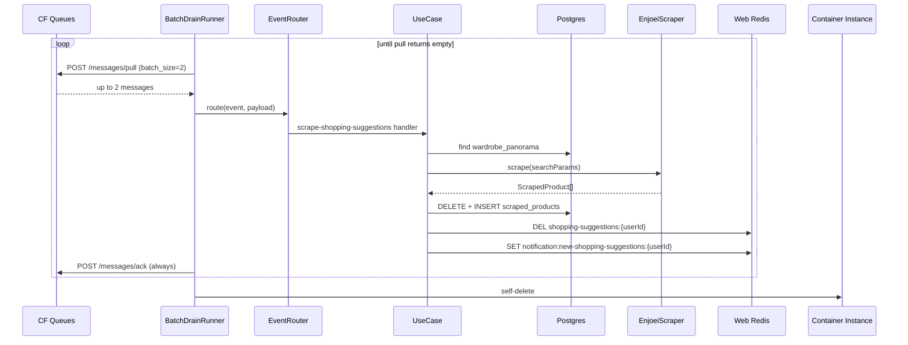

# Scrape shopping suggestions

Flow for the **`scrape-shopping-suggestions`** event: scrape clothing listings
from the requested marketplace, replace `scraped_products` for the user's
wardrobe panorama, and refresh the SkyDIIV web-app caches.

Publishing: [PUBLISH_EVENTS.md](./PUBLISH_EVENTS.md) · Env: [ENV.md](./ENV.md)

## Payload

```json
{
  "event": "scrape-shopping-suggestions",
  "payload": {
    "marketplace": "enjoei",
    "userId": "user-uuid",
    "searchParams": [
      {
        "searchTerm": "vestido floral",
        "gender": "Female",
        "topSize": "M",
        "bottomSize": "40",
        "footSize": "38",
        "brand": "Zara"
      },
      {
        "searchTerm": "jaqueta jeans",
        "gender": "Female",
        "topSize": "M, G",
        "bottomSize": null,
        "footSize": null,
        "brand": null
      }
    ]
  }
}
```

| Field | Type | Description |
|---|---|---|
| `marketplace` | string | Marketplace slug (`enjoei` today) |
| `userId` | string | User id — must have a `wardrobe_panorama` |
| `searchParams` | `SearchParams[]` | ≥ 1 search entry |

### `SearchParams`

| Field | Type | Description |
|---|---|---|
| `searchTerm` | string | Free-text query (≥ 1 char) |
| `gender` | string \| null | `Female` / `Male` / `No preference` → Enjoei `dep` |
| `topSize` | string \| null | Top sizes (`"M"` or `"M, G"`) → Enjoei `sc` |
| `bottomSize` | string \| null | Bottom sizes → Enjoei `sw` |
| `footSize` | string \| null | Footwear sizes → Enjoei `ss` |
| `brand` | string \| null | Brand name → Enjoei `b` (kebab-case slug) |

## Execution flow



1. Pull up to `CF_QUEUES_BATCH_SIZE` (default **2**) messages
2. Process the batch with up to `ROBOT_CONCURRENCY` (default **2**) in flight
3. ACK by `lease_id` — always, success or failure
4. Repeat until a pull returns empty, then self-delete (no-op locally)

## Persistence

`scraped_products` rows for the panorama are **replaced** on every run
(`DELETE` + `INSERT` in one transaction).

| Outcome | `scraping_status` | Rows |
|---|---|---|
| Scrape OK | `SUCCESS` | One per scraped product |
| Scrape / marketplace error | `ERROR` | One per `searchParams` entry, with error metadata |

`scraping_metadata` (JSONB) always carries diagnostics, including the raw
scraper values before NOT NULL coercion. Missing images fall back to
`https://assets.skydiiv.space/placeholder--scraped-product.png`.

## Web Redis cache contract

Must match the SkyDIIV web app.

| Key | Action |
|---|---|
| `shopping-suggestions:{userId}` | `DEL` after the replace (both SUCCESS and ERROR) |
| `notification:new-shopping-suggestions:{userId}` | `SET {"updatedAt":"<ISO>"}` — SUCCESS only |

## Enjoei scraping

- Search URL: `https://www.enjoei.com.br/s/?q={term}&dep={gender}&b={brand}&sc={top}&sw={bottom}&ss={foot}`
  - `dep` — `Female` → `feminino`, `Male` → `masculino`, omitted for `No preference`
  - `b` — brand slug (kebab-case); `sc` / `sw` / `ss` — clothes / waist / shoes sizes
- Browser: Camoufox (anti-detect Firefox) via `camoufox-js` + Playwright
- Random delay between navigations (`SCRAPE_DELAY_MIN_MS` … `SCRAPE_DELAY_MAX_MS`)
- Optional outbound proxy rotation (`PROXY_URLS`)

## Error handling

Nothing is retried: every message is ACKed, and failures are recorded instead.

| Failure | Behavior |
|---|---|
| Missing wardrobe panorama | Logged; ACKed. No DB rows. |
| Invalid payload / unknown `event` | Logged; ACKed |
| Unknown marketplace or scrape error | `ERROR` rows + metadata; ACKed |
| Web Redis unavailable | Warning; persistence still proceeds |
| CF Queues pull/ack HTTP error | Logged; drain aborts, self-delete still attempted |
| Self-delete failure | Logged; Sunday soft destroy (and cost-guard hard destroy) are the fallback |

## Extending

- **New marketplace:** implement `MarketplaceScraperPort` under
  `src/infrastructure/scraping/marketplaces/`, register it in `src/main.ts` via
  `registerMarketplaceScraper("name", factory)`, publish with
  `marketplace: "name"`.
- **New event:** same broker and envelope, different handler — see
  [PUBLISH_EVENTS.md](./PUBLISH_EVENTS.md#adding-a-new-event).

## Tests

| Suite | Covers |
|---|---|
| `tests/unit/*` | Zod schemas, use case, router, delay, proxy, config, cache, CF Queues adapter, Enjoei URL builder, self-delete factory, schedule, cost limit |
| `tests/integration/batch-drain.runner.test.ts` | Drain until empty + ACK + self-delete |
| `tests/integration/enjoei.scraper.test.ts` | Scraper orchestration with a fake browser |
