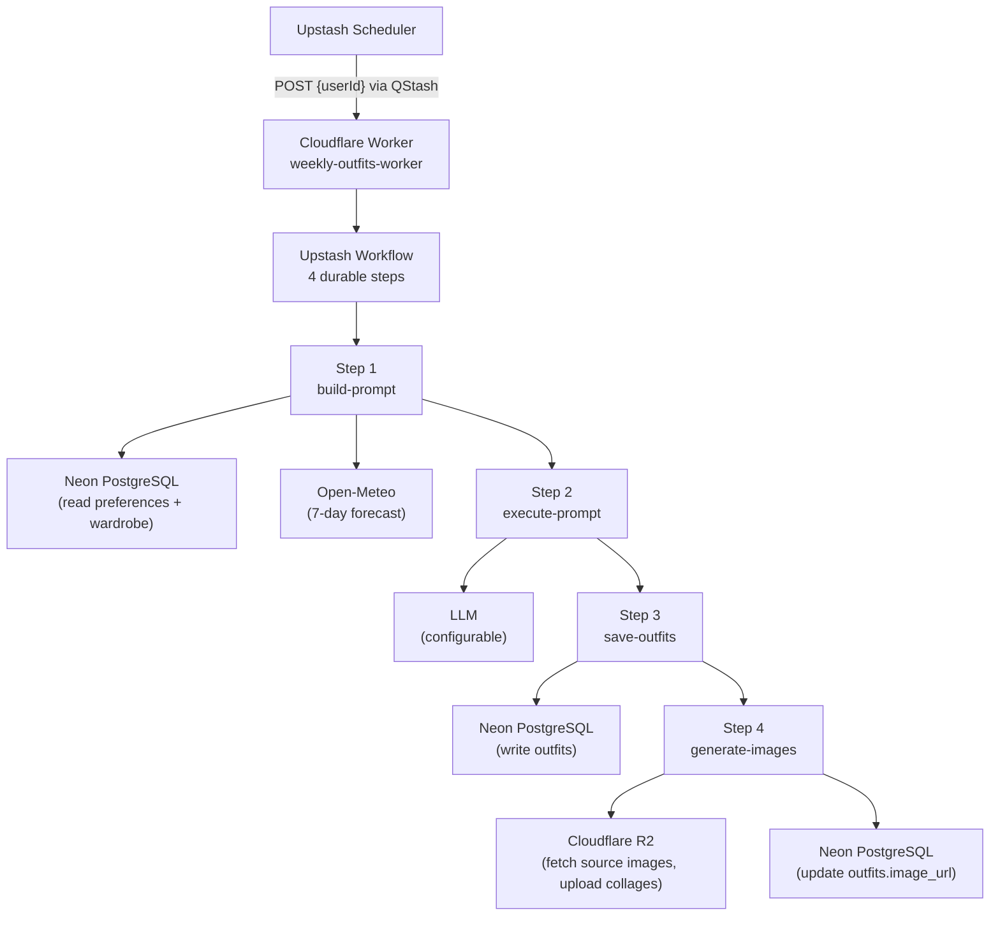
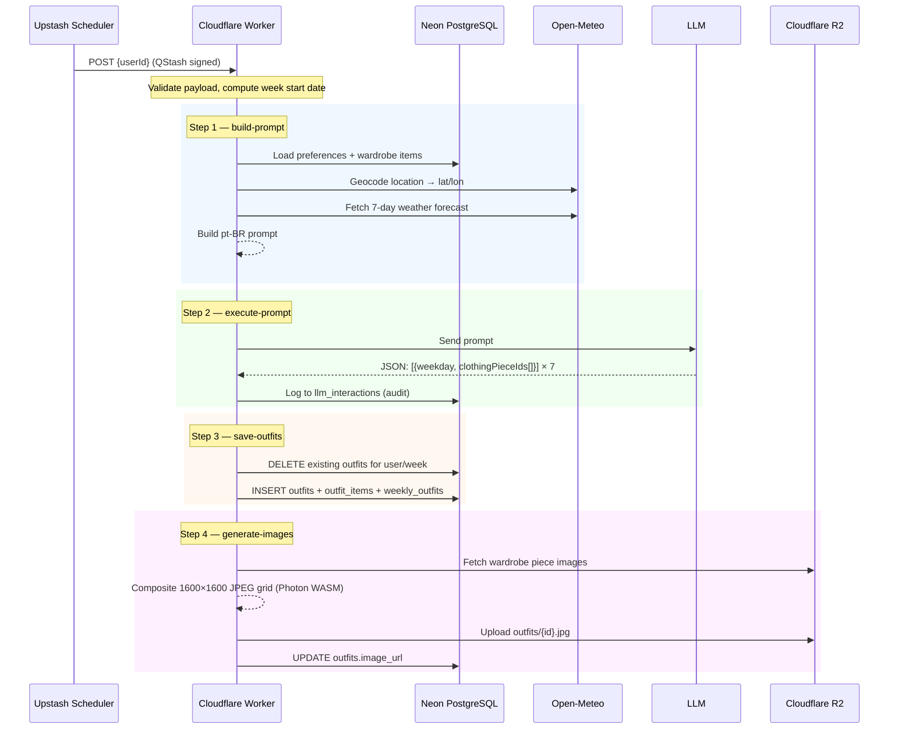
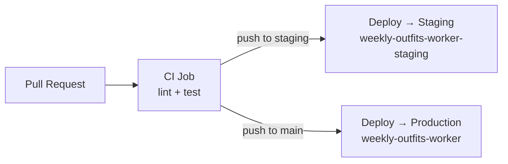

# Generate Weekly Outfits — Upstash Workflow

A **Cloudflare Worker** that runs a durable **Upstash Workflow** to automatically generate a full week of outfit suggestions (Sunday–Saturday) for a given user.

## What It Does

Given a `userId`, the worker:

1. Loads the user's wardrobe, style preferences, and location from the shared PostgreSQL database
2. Fetches a 7-day weather forecast for the user's location via Open-Meteo
3. Builds a prompt in Brazilian Portuguese and calls an LLM to select clothing items by ID for each day
4. Persists the generated outfits to the database (idempotent per user/week — safe to re-run)
5. Composites per-day wardrobe images into 1600×1600 JPEG collage thumbnails and uploads them to **Cloudflare R2**

## Architecture



## Workflow Steps in Detail



## Tech Stack

| Layer | Technology |
|---|---|
| Runtime | Cloudflare Workers (`nodejs_compat`) |
| Language | TypeScript 5.7 (strict) |
| Workflow orchestration | [@upstash/workflow](https://upstash.com/docs/workflow) + QStash |
| Database | PostgreSQL via [postgres.js](https://github.com/porsager/postgres) (Neon) |
| LLM | Configurable (default: Google Gemini `gemini-2.5-flash`) |
| Weather | Open-Meteo Forecast + Geocoding APIs |
| Object storage | Cloudflare R2 (S3-compatible via `@aws-sdk/client-s3`) |
| Image processing | `@cf-wasm/photon` (WASM) |
| Validation | Zod |
| Dev / deploy | Wrangler 4 |
| Testing | Vitest 4 (unit + integration) |
| Linting | ESLint 10 + typescript-eslint |
| CI/CD | GitHub Actions |

## Project Structure

```
├── src/
│   ├── index.ts                        # Worker HTTP entry point (health check + workflow dispatch)
│   ├── workflow.ts                     # Upstash Workflow definition (4 steps)
│   ├── steps/
│   │   ├── build-prompt.ts             # Step 1: load data + build LLM prompt
│   │   ├── execute-prompt.ts           # Step 2: call LLM + parse response
│   │   ├── save-outfits.ts             # Step 3: persist outfits to DB (idempotent)
│   │   └── generate-images.ts          # Step 4: composite + upload collage images
│   └── lib/
│       ├── db/
│       │   ├── client.ts               # Read/write Postgres pool singletons
│       │   ├── preferences.repository.ts
│       │   ├── wardrobe.repository.ts
│       │   ├── weekly-outfits.repository.ts
│       │   └── llm-interactions.repository.ts
│       ├── prompt/
│       │   ├── template.ts             # pt-BR fashion-assistant prompt template
│       │   └── builder.ts              # Prompt interpolation + Zod parsing of LLM JSON
│       ├── llm/
│       │   └── gemini.provider.ts      # Default LLM provider (Gemini)
│       ├── weather/
│       │   └── open-meteo.provider.ts  # 7-day forecast fetcher
│       ├── image/
│       │   └── composite.ts            # 1600×1600 collage builder (Photon WASM)
│       ├── storage/
│       │   └── r2-client.ts            # R2 upload via S3 API
│       └── logger.ts                   # Structured JSON logger
├── tests/
│   ├── unit/                           # Unit tests per module
│   └── integration/                    # Full 4-step pipeline integration tests
├── wrangler.toml                       # Cloudflare Worker config + environments
├── .env.example                        # Secret reference (copy to .dev.vars for local dev)
└── package.json
```

## Database

The worker reads from and writes to the following tables:

| Table | Operation | Purpose |
|---|---|---|
| `weekly_outfit_preferences` | Read | User's location and style/routine description used to build the prompt |
| `clothing_items` | Read | User's wardrobe items (id, title, image URL, tags) passed to the LLM |
| `outfits` | Write | One record per day created with `type = 'AI_GENERATED'`; `image_url` updated after step 4 |
| `outfit_items` | Write | Join table linking each outfit to its selected clothing items |
| `weekly_outfits` | Write | Links each outfit to the week (`week_start_date`) and day (`day_of_week`) with a weather summary |
| `llm_interactions` | Write | Audit log of every LLM call (prompt, response, latency, status) |

**Key behaviors:**
- `weekly_outfits.week_start_date` is always the **Sunday** of the target week (UTC)
- `weekly_outfits.day_of_week` is `0` (Sunday) through `6` (Saturday)
- Re-running for the same `userId` + `week_start_date` deletes and re-creates outfits atomically (idempotent)

---

## Security

This worker does not handle end-user authentication. Security is enforced at the transport layer:

- **Request signing** — all workflow requests are signed by Upstash QStash and verified by `@upstash/workflow` using `QSTASH_CURRENT_SIGNING_KEY` / `QSTASH_NEXT_SIGNING_KEY` before any step executes
- **Health endpoint** — `GET /` is the only public endpoint; it returns `{ status: "ok", timestamp }`
- **Database access** — direct Postgres connections via env secrets; `userId` comes from the verified workflow payload
- **R2 access** — S3 API key pair scoped to the shared Skydiiv bucket

---

## Getting Started

### Prerequisites

- [Node.js](https://nodejs.org/) 22+
- [Wrangler](https://developers.cloudflare.com/workers/wrangler/) 4 (`npm i -g wrangler`)
- [cloudflared](https://developers.cloudflare.com/cloudflare-one/connections/connect-networks/get-started/) (for local testing with Upstash callbacks)
- A [Cloudflare](https://cloudflare.com) account with Workers and R2 enabled
- An [Upstash](https://upstash.com) account (QStash)
- A [Neon](https://neon.tech) PostgreSQL database (shared with the Skydiiv web app)
- An API key for the configured LLM provider

### Local Development

**1. Install dependencies and set up secrets:**

```bash
npm install

# Copy env template and fill in your values
cp .env.example .dev.vars
```

`wrangler dev` reads secrets from `.dev.vars` (not `.env`).

**2. Start the local worker:**

```bash
npm run dev
```

The worker starts at `http://localhost:8787`.

**3. Expose the local worker to the internet** (required for Upstash workflow callbacks):

```bash
cloudflared tunnel --url http://localhost:8787
```

`cloudflared` prints a public URL, e.g. `https://foo.bar.baz.trycloudflare.com`. Set this as `UPSTASH_WORKFLOW_URL` in your `.dev.vars` and restart `npm run dev`.

**4. Trigger the workflow:**

```bash
curl -X POST https://foo.bar.baz.trycloudflare.com \
  -H "Content-Type: application/json" \
  -d '{"userId": <USER_ID>}'
```

Replace the URL with your `cloudflared` tunnel URL and `userId` with a real user ID from the database.

### Running Tests

```bash
npm test              # run once
npm run test:watch    # watch mode
npm run test:coverage # with coverage report
```

### Linting

```bash
npm run lint          # check
npm run lint:fix      # auto-fix
```

---

## Configuration

### `wrangler.toml`

| Setting | Value |
|---|---|
| Worker name (production) | `weekly-outfits-worker` |
| Worker name (staging) | `weekly-outfits-worker-staging` |
| Entry point | `src/index.ts` |
| Compatibility date | `2025-01-01` |
| Compatibility flags | `nodejs_compat` |
| Default LLM provider | `gemini_flash` |

### Required Secrets

Set via `wrangler secret put <KEY>` in production, or `.dev.vars` locally:

| Secret | Description |
|---|---|
| `DATABASE_URL` | Neon pooled endpoint (pgbouncer) — for reads |
| `DATABASE_URL_UNPOOLED` | Neon direct endpoint — for writes and transactions |
| `QSTASH_URL` | Upstash QStash URL |
| `QSTASH_TOKEN` | QStash API token |
| `QSTASH_CURRENT_SIGNING_KEY` | Request verification (current) |
| `QSTASH_NEXT_SIGNING_KEY` | Request verification (rotation) |
| `UPSTASH_WORKFLOW_URL` | Public URL of this worker (used for workflow callbacks) |
| `GEMINI_API_KEY` | API key for the default LLM provider (Gemini) |
| `GEMINI_MODEL` | _(optional)_ Defaults to `gemini-2.5-flash` |
| `R2_ACCOUNT_ID` | Cloudflare account ID for R2 |
| `R2_BUCKET` | R2 bucket name (shared with Skydiiv web app) |
| `R2_ACCESS_KEY_ID` | R2 S3-compatible access key |
| `R2_SECRET_ACCESS_KEY` | R2 S3-compatible secret key |
| `R2_PUBLIC_URL` | Public base URL for generated outfit images |

---

## Deployment

### CI/CD Pipeline

The GitHub Actions workflow (`.github/workflows/deploy-weekly-outfits-worker.yml`) triggers on pushes to `main` or `staging` branches when files under `apps/upstash-workflow-generate-weekly-outfits/` change.



### Required GitHub Secrets

| Secret | Description |
|---|---|
| `CLOUDFLARE_API_TOKEN` | Cloudflare API token with Workers deploy permissions |
| `CLOUDFLARE_ACCOUNT_ID` | Cloudflare account ID |
| `CLOUDFLARE_SUBDOMAIN` | Your `*.workers.dev` subdomain (for environment URLs) |

### Manual Deploy

```bash
# Deploy to production
npm run deploy

# Deploy to staging
npm run deploy -- --env staging
```

After the first deploy, update `UPSTASH_WORKFLOW_URL` with the deployed worker URL:

```bash
wrangler deployments list   # copy the workers.dev URL
wrangler secret put UPSTASH_WORKFLOW_URL
```

---

## Behavioral Notes

- **Week boundaries** — the week always starts on **Sunday UTC**. Re-running mid-week regenerates the entire week.
- **Idempotency** — safe to re-run for the same user/week. Existing outfits are replaced atomically.
- **Graceful degradation** — if the weather API fails, the workflow continues without weather data. If image generation fails for an individual outfit, a warning is logged but the workflow still completes.
- **Locale** — prompts and weather descriptions are in **Brazilian Portuguese** (`pt-BR`).
- **Audit logging** — every LLM call (prompt, response, latency, status) is logged to the `llm_interactions` table.

---

## External Dependencies

| Service | Role |
|---|---|
| [Neon](https://neon.tech) | Serverless PostgreSQL (shared schema with the Skydiiv web app) |
| [Upstash](https://upstash.com) | QStash scheduler + durable workflow orchestration |
| [Open-Meteo](https://open-meteo.com) | Free weather forecast + geocoding APIs |
| [Cloudflare R2](https://developers.cloudflare.com/r2/) | Image storage (shared bucket with the Skydiiv web app) |
