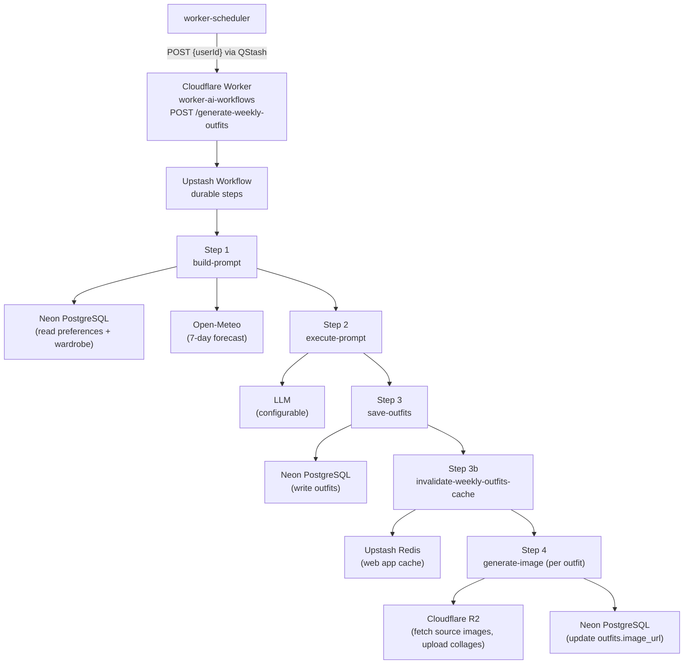
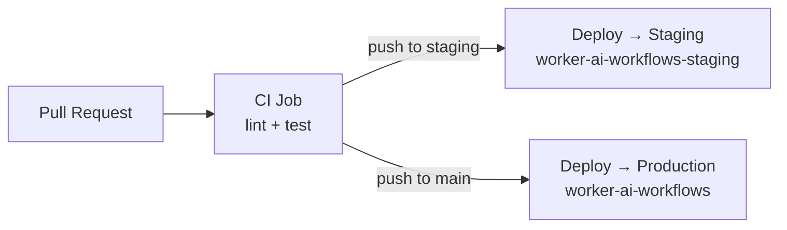

# worker-ai-workflows

A generic **Cloudflare Worker** that hosts AI-related **Upstash Workflows**. Each workflow is exposed at its own endpoint and runs as a durable, multi-step QStash workflow.

Workflows are registered with `serveMany`, which routes each request by the **last path segment** of its URL.

| Endpoint | Workflow | Purpose |
|---|---|---|
| `POST /generate-weekly-outfits` | `generate-weekly-outfits` | Generates a full week of outfit suggestions for one user |
| `POST /generate-wardrobe-panorama` | `generate-wardrobe-panorama` | Generates a wardrobe panorama for one user when the web app marks their wardrobe as updated |
| `GET /` | — | Health check → `{ status: "ok", timestamp }` |

## generate-weekly-outfits

Given a `userId`, the workflow:

1. Loads the user's wardrobe, style preferences, and location from the shared PostgreSQL database
2. Fetches a 7-day weather forecast for the user's location via Open-Meteo
3. Builds a prompt in Brazilian Portuguese and calls an LLM to select clothing items by ID for each day
4. Persists the generated outfits to the database (idempotent per user/week — safe to re-run)
5. Invalidates the Skydiiv web app's Redis cache for that user/week
6. Composites per-day wardrobe images into 400×400 JPEG collage thumbnails (via the Cloudflare Images binding) and uploads them to **Cloudflare R2**

## generate-wardrobe-panorama

Given a `userId`, the workflow runs only when the Skydiiv web app has set the Redis marker `wardrobe-update-check:{userId}--wardrobe-panorama`. Five sequential durable steps:

1. **check-wardrobe-update** — verifies the Redis marker exists; exits early if absent
2. **build-prompt** — loads preferences and wardrobe from PostgreSQL, builds the LLM prompt
3. **execute-prompt** — calls the LLM and logs the interaction
4. **save-panorama** — persists the markdown panorama to `wardrobe_panorama` (idempotent per user)
5. **invalidate-wardrobe-panorama-cache** — clears all wardrobe-panorama-related Redis keys after a successful run (`wardrobe-update-check:{userId}--wardrobe-panorama`, `wardrobe-panorama:{userId}`)

Dispatched by `worker-scheduler` via QStash (`WARDROBE_PANORAMA_WORKER_URL`).

## Architecture



## Tech Stack

| Layer | Technology |
|---|---|
| Runtime | Cloudflare Workers (`nodejs_compat`) |
| Language | TypeScript 5.7 (strict) |
| Workflow orchestration | [@upstash/workflow](https://upstash.com/docs/workflow) (`serveMany`) + QStash |
| Database | PostgreSQL via [postgres.js](https://github.com/porsager/postgres) (Neon) |
| LLM | Configurable (default: Google Gemini `gemini-2.5-flash`) |
| Weather | Open-Meteo Forecast + Geocoding APIs |
| Object storage | Cloudflare R2 (S3-compatible via `@aws-sdk/client-s3`) |
| Image processing | Cloudflare Images binding (`env.IMAGES`) |
| Validation | Zod |
| Dev / deploy | Wrangler 4 |
| Testing | Vitest 4 (unit + integration) |
| Linting | ESLint 10 + typescript-eslint |
| CI/CD | GitHub Actions |

## Project Structure

```
├── src/
│   ├── index.ts                            # Worker HTTP entry point (health check + serveMany dispatch)
│   ├── workflows/
│   │   ├── index.ts                        # serveMany registry: endpoint key → workflow
│   │   ├── generate-weekly-outfits/
│   │   │   ├── workflow.ts                 # createWorkflow() definition (durable steps)
│   │   │   └── steps/
│   │   │       ├── build-prompt.ts         # Step 1: load data + build LLM prompt
│   │   │       ├── execute-prompt.ts       # Step 2: call LLM + parse response
│   │   │       ├── save-outfits.ts         # Step 3: persist outfits to DB (idempotent)
│   │   │       ├── invalidate-weekly-outfits-cache.ts  # Step 3b: clear web app Redis cache
│   │   │       └── generate-images.ts      # Step 4: composite + upload collage images
│   │   └── generate-wardrobe-panorama/
│   │       ├── workflow.ts                 # createWorkflow() definition (durable steps)
│   │       └── steps/
│   │           ├── check-wardrobe-update.ts        # Step 1: verify Redis marker
│   │           ├── build-prompt.ts                 # Step 2: load data + build LLM prompt
│   │           ├── execute-prompt.ts             # Step 3: call LLM
│   │           ├── save-panorama.ts              # Step 4: persist panorama to DB
│   │           └── invalidate-wardrobe-panorama-cache.ts  # Step 5: clear web app Redis cache
│   └── lib/                                # Shared infrastructure across workflows
│       ├── db/
│       │   ├── client.ts                   # Read/write Postgres pool singletons
│       │   ├── preferences.repository.ts
│       │   ├── wardrobe.repository.ts
│       │   ├── weekly-outfits.repository.ts
│       │   ├── wardrobe-panorama.repository.ts
│       │   └── llm-interactions.repository.ts
│       ├── prompt/                         # pt-BR prompt template + builder/parser
│       ├── llm/                            # LLM provider registry (default: Gemini)
│       ├── weather/                        # Open-Meteo forecast + geocoding
│       ├── cache/                          # Upstash Redis client + web app cache keys
│       ├── storage/r2-client.ts            # R2 upload via S3 API
│       ├── cf-images.ts                    # Cloudflare Images binding accessor
│       └── logger.ts                       # Structured JSON logger
├── tests/
│   ├── unit/                               # Unit tests per module
│   └── integration/                        # Full pipeline integration tests
├── wrangler.toml                           # Cloudflare Worker config + environments
├── .env.example                            # Secret reference (copy to .dev.vars for local dev)
└── package.json
```

## Adding a new workflow

1. Create `src/workflows/<endpoint-name>/workflow.ts` and export a workflow built with `createWorkflow(...)`:

```ts
import { createWorkflow } from "@upstash/workflow/cloudflare"

export interface MyWorkflowPayload {
  userId: string
}

export const myWorkflow = createWorkflow<MyWorkflowPayload, void>(async (context) => {
  // context.run("step-name", async () => { ... })
})
```

2. Register it in `src/workflows/index.ts` under its endpoint key:

```ts
export const { fetch: workflowsFetch } = serveMany({
  "generate-weekly-outfits": generateWeeklyOutfitsWorkflow,
  "my-endpoint": myWorkflow,
})
```

3. The workflow is now reachable at `POST /my-endpoint`. No changes to `src/index.ts` are needed.

> Workflow keys cannot contain `/`. `serveMany` derives the workflow from the last URL path segment, and QStash step callbacks preserve that path automatically.

## Database

The `generate-weekly-outfits` workflow reads from and writes to the following tables:

| Table | Operation | Purpose |
|---|---|---|
| `weekly_outfit_preferences` | Read | User's location and style/routine description used to build the prompt |
| `clothing_items` | Read | User's wardrobe items (id, title, image URL, tags) passed to the LLM |
| `outfits` | Write | One record per day created with `type = 'AI_GENERATED'`; `image_url` updated after step 4 |
| `outfit_items` | Write | Join table linking each outfit to its selected clothing items |
| `weekly_outfits` | Write | Links each outfit to the week (`week_start_date`) and day (`day_of_week`) with a weather summary |
| `llm_interactions` | Write | Audit log of every LLM call (prompt, response, latency, status) |

**Key behaviors:**
- `weekly_outfits.week_start_date` is always the **Sunday** of the target week (UTC)
- `weekly_outfits.day_of_week` is `0` (Sunday) through `6` (Saturday)
- Re-running for the same `userId` + `week_start_date` deletes and re-creates outfits atomically (idempotent)

The `generate-wardrobe-panorama` workflow reads from and writes to the following tables:

| Table | Operation | Purpose |
|---|---|---|
| `weekly_outfit_preferences` | Read | User's location and style/routine description used to build the prompt |
| `clothing_items` | Read | User's wardrobe items (id, title, image URL, tags) passed to the LLM |
| `wardrobe_panorama` | Write | One markdown panorama per user; updated on re-run (idempotent) |
| `llm_interactions` | Write | Audit log of every LLM call (prompt, response, latency, status) |

**Key behaviors:**
- Runs only when Redis key `wardrobe-update-check:{userId}--wardrobe-panorama` exists
- Step 5 invalidates all wardrobe-panorama Redis keys (`wardrobe-update-check:{userId}--wardrobe-panorama`, `wardrobe-panorama:{userId}`) after a successful save (non-fatal if Redis is unavailable)
- Re-running for the same `userId` updates the existing `wardrobe_panorama` record

---

## Security

This worker does not handle end-user authentication. Security is enforced at the transport layer:

- **Request signing** — all workflow requests are signed by Upstash QStash and verified by `@upstash/workflow` using `QSTASH_CURRENT_SIGNING_KEY` / `QSTASH_NEXT_SIGNING_KEY` before any step executes
- **Health endpoint** — `GET /` is the only unsigned public endpoint; it returns `{ status: "ok", timestamp }`
- **Database access** — direct Postgres connections via env secrets; `userId` comes from the verified workflow payload
- **R2 access** — S3 API key pair scoped to the shared Skydiiv bucket

---

## Getting Started

### Prerequisites

- [Node.js](https://nodejs.org/) 22+
- [Wrangler](https://developers.cloudflare.com/workers/wrangler/) 4 (`npm i -g wrangler`)
- [cloudflared](https://developers.cloudflare.com/cloudflare-one/connections/connect-networks/get-started/) (for local testing with Upstash callbacks)
- A [Cloudflare](https://cloudflare.com) account with Workers and R2 enabled
- An [Upstash](https://upstash.com) account (QStash + Redis)
- A [Neon](https://neon.tech) PostgreSQL database (shared with the Skydiiv web app)
- An API key for the configured LLM provider

### Local Development

**1. Install dependencies and set up secrets:**

```bash
npm install

# Copy env template and fill in your values
cp .env.example .dev.vars
```

`wrangler dev` reads secrets from `.dev.vars` (not `.env`).

**2. Start the local worker:**

```bash
npm run dev
```

The worker starts at `http://localhost:8787`.

**3. Expose the local worker to the internet** (required for Upstash workflow callbacks):

```bash
cloudflared tunnel --url http://localhost:8787
```

`cloudflared` prints a public URL, e.g. `https://foo.bar.baz.trycloudflare.com`. Set this **origin** (no path) as `UPSTASH_WORKFLOW_URL` in your `.dev.vars` and restart `npm run dev`.

**4. Trigger a workflow:**

```bash
curl -X POST https://foo.bar.baz.trycloudflare.com/generate-weekly-outfits \
  -H "Content-Type: application/json" \
  -d '{"userId": <USER_ID>}'
```

Replace the origin with your `cloudflared` tunnel URL and `userId` with a real user ID from the database.

### Running Tests

```bash
npm test              # run once
npm run test:watch    # watch mode
npm run test:coverage # with coverage report
```

### Linting

```bash
npm run lint          # check
npm run lint:fix      # auto-fix
```

---

## Configuration

### `wrangler.toml`

| Setting | Value |
|---|---|
| Worker name (production) | `worker-ai-workflows` |
| Worker name (staging) | `worker-ai-workflows-staging` |
| Entry point | `src/index.ts` |
| Compatibility date | `2025-01-01` |
| Compatibility flags | `nodejs_compat` |
| Default LLM provider | `gemini_flash` |

### Required Secrets

Set via `wrangler secret put <KEY>` in production, or `.dev.vars` locally:

| Secret | Description |
|---|---|
| `DATABASE_URL` | Neon pooled endpoint (pgbouncer) — for reads |
| `DATABASE_URL_UNPOOLED` | Neon direct endpoint — for writes and transactions |
| `QSTASH_URL` | Upstash QStash URL |
| `QSTASH_TOKEN` | QStash API token |
| `QSTASH_CURRENT_SIGNING_KEY` | Request verification (current) |
| `QSTASH_NEXT_SIGNING_KEY` | Request verification (rotation) |
| `UPSTASH_WORKFLOW_URL` | Public **origin** of this worker (used for workflow callbacks; no path) |
| `GEMINI_API_KEY` | API key for the default LLM provider (Gemini) |
| `GEMINI_MODEL` | _(optional)_ Defaults to `gemini-2.5-flash` |
| `UPSTASH_REDIS_REST_URL` | Upstash Redis REST URL (web app cache read/write) |
| `UPSTASH_REDIS_REST_TOKEN` | Upstash Redis REST token |
| `R2_ACCOUNT_ID` | Cloudflare account ID for R2 |
| `R2_BUCKET` | R2 bucket name (shared with Skydiiv web app) |
| `R2_ACCESS_KEY_ID` | R2 S3-compatible access key |
| `R2_SECRET_ACCESS_KEY` | R2 S3-compatible secret key |
| `R2_PUBLIC_URL` | Public base URL for generated outfit images |

---

## Deployment

### CI/CD Pipeline

The GitHub Actions workflow (`.github/workflows/deploy-worker-ai-workflows.yml`) triggers on pushes to `main` or `staging` branches when files under `apps/worker-ai-workflows/` change.



### Required GitHub Secrets

| Secret | Description |
|---|---|
| `CLOUDFLARE_API_TOKEN` | Cloudflare API token with Workers deploy permissions |
| `CLOUDFLARE_ACCOUNT_ID` | Cloudflare account ID |
| `CLOUDFLARE_SUBDOMAIN` | Your `*.workers.dev` subdomain (for environment URLs) |

### Manual Deploy

```bash
# Deploy to production
npm run deploy

# Deploy to staging
npm run deploy -- --env staging
```

After the first deploy, update `UPSTASH_WORKFLOW_URL` with the deployed worker origin:

```bash
wrangler deployments list   # copy the workers.dev URL (origin only)
wrangler secret put UPSTASH_WORKFLOW_URL
```

> **Upstream triggers:** `worker-scheduler` dispatches to this worker via:
> - `WEEKLY_OUTFITS_WORKER_URL` → `https://worker-ai-workflows.<subdomain>.workers.dev/generate-weekly-outfits`
> - `WARDROBE_PANORAMA_WORKER_URL` → `https://worker-ai-workflows.<subdomain>.workers.dev/generate-wardrobe-panorama`

---

## Behavioral Notes

- **Week boundaries** — the week always starts on **Sunday UTC**. Re-running mid-week regenerates the entire week.
- **Idempotency** — safe to re-run for the same user/week. Existing outfits are replaced atomically.
- **Graceful degradation** — if the weather API fails, the workflow continues without weather data. If Redis cache invalidation/clearing or an individual outfit's image generation fails, a warning is logged but the workflow still completes.
- **Wardrobe panorama gating** — `generate-wardrobe-panorama` skips users without the `wardrobe-update-check:{userId}--wardrobe-panorama` Redis marker.
- **Locale** — prompts and weather descriptions are in **Brazilian Portuguese** (`pt-BR`).
- **Audit logging** — every LLM call (prompt, response, latency, status) is logged to the `llm_interactions` table.

---

## External Dependencies

| Service | Role |
|---|---|
| [Neon](https://neon.tech) | Serverless PostgreSQL (shared schema with the Skydiiv web app) |
| [Upstash](https://upstash.com) | QStash workflow orchestration + Redis cache |
| [Open-Meteo](https://open-meteo.com) | Free weather forecast + geocoding APIs |
| [Cloudflare R2](https://developers.cloudflare.com/r2/) | Image storage (shared bucket with the Skydiiv web app) |

