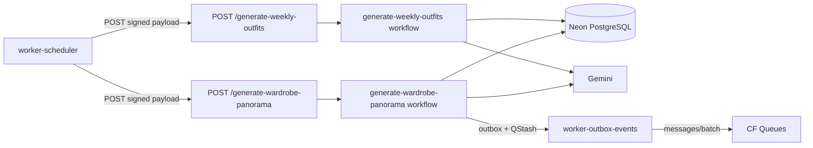

# worker-ai-workflows

Cloudflare Worker that hosts SkyDIIV's AI workflows. Each workflow is a durable, multi-step job exposed at its own HTTP endpoint and orchestrated via Upstash Workflow + QStash.

Workflows are registered with `serveMany`, which routes requests by the **last path segment** of the URL.

| Endpoint | Workflow | Documentation |
|---|---|---|
| `POST /generate-weekly-outfits` | `generate-weekly-outfits` | [docs/WEEKLY_OUTFITS_WORKFLOW.md](./docs/WEEKLY_OUTFITS_WORKFLOW.md) |
| `POST /generate-wardrobe-panorama` | `generate-wardrobe-panorama` | [docs/WARDROBE_PANORAMA_WORKFLOW.md](./docs/WARDROBE_PANORAMA_WORKFLOW.md) |
| `GET /` | — | Health check → `{ status: "ok", timestamp }` |

Upstream dispatch is handled by [`worker-scheduler`](../worker-scheduler/README.md), which publishes signed messages to these endpoints on a configured schedule.



---

## Services & Technologies

| Layer | Technology | Role |
|---|---|---|
| Runtime | [Cloudflare Workers](https://developers.cloudflare.com/workers/) (`nodejs_compat`) | Hosts this worker |
| Language | TypeScript 5 (strict) | Implementation |
| Workflow orchestration | [Upstash Workflow](https://upstash.com/docs/workflow) + [QStash](https://upstash.com/docs/qstash) | Durable steps, retries, signed delivery |
| Database | [Neon](https://neon.tech) PostgreSQL via [postgres.js](https://github.com/porsager/postgres) | Shared schema with the SkyDIIV web app |
| Cache | [Upstash Redis](https://upstash.com/docs/redis) (REST API) | Web app cache keys and notifications |
| Language model | [Google Gemini](https://ai.google.dev/) (`gemini-2.5-flash` default) | Wardrobe selection and panorama generation |
| Weather | [Open-Meteo](https://open-meteo.com) | Forecast + geocoding (`generate-weekly-outfits` only) |
| Validation | [Zod](https://zod.dev/) | LLM response parsing |
| Dev / deploy | Wrangler 4 | Local dev and Cloudflare deployment |
| Testing | Vitest 4 | Unit + integration tests |
| Linting | ESLint 10 + typescript-eslint | Code quality |
| CI/CD | GitHub Actions | Lint, test, deploy on push to `main` / `staging` |

---

## Project Structure

```
├── docs/
│   ├── I18N.md                             # Multi-language support (locales, resolution, module map)
│   ├── WEEKLY_OUTFITS_WORKFLOW.md          # generate-weekly-outfits — full workflow reference
│   └── WARDROBE_PANORAMA_WORKFLOW.md       # generate-wardrobe-panorama — full workflow reference
├── src/
│   ├── index.ts                            # Worker entry (health check + serveMany dispatch)
│   ├── workflows/
│   │   ├── index.ts                        # Endpoint registry
│   │   ├── generate-weekly-outfits/
│   │   └── generate-wardrobe-panorama/
│   └── lib/                                # Shared DB, i18n, LLM, weather, cache, logging
├── tests/
├── wrangler.toml
├── .env.example                            # Copy to .dev.vars for local dev
└── package.json
```

---

## Adding a New Workflow

1. Create `src/workflows/<endpoint-name>/workflow.ts` with `createWorkflow(...)`:

```ts
import { createWorkflow } from "@upstash/workflow/cloudflare"

export interface MyWorkflowPayload {
  userId: string
}

export const myWorkflow = createWorkflow<MyWorkflowPayload, void>(async (context) => {
  // context.run("step-name", async () => { ... })
})
```

2. Register it in `src/workflows/index.ts`:

```ts
export const { fetch: workflowsFetch } = serveMany({
  "generate-weekly-outfits": generateWeeklyOutfitsWorkflow,
  "my-endpoint": myWorkflow,
})
```

3. Add a doc under `docs/` and link it from this README. No changes to `src/index.ts` are needed.

> Workflow keys cannot contain `/`. `serveMany` matches on the last URL path segment; QStash step callbacks preserve that path automatically.

---

## Security

- No end-user authentication — internal automation only
- All workflow requests are signed by QStash and verified before any step runs
- `GET /` is the only unsigned endpoint (health check)
- `userId` comes from the verified workflow payload
- Secrets (database, cache, storage, LLM) are Cloudflare Worker secrets — never in source control

---

## Getting Started

### Prerequisites

- Node.js 22+
- Wrangler 4
- Accounts / credentials for Cloudflare Workers, Upstash (QStash + Redis), Neon PostgreSQL, and the configured LLM provider
- [cloudflared](https://developers.cloudflare.com/cloudflare-one/connections/connect-networks/get-started/) for local workflow callback testing

### Local Development

```bash
npm install
cp .env.example .dev.vars   # fill in secrets
npm run dev                 # http://localhost:8787
```

Expose the local worker for Upstash callbacks:

```bash
cloudflared tunnel --url http://localhost:8787
```

Set the tunnel origin (no path) as `WORKER_AI_WORKFLOWS_URL` in `.dev.vars` and restart `npm run dev`.

Trigger a workflow (see each workflow doc for payload details and prerequisites):

```bash
curl -X POST https://<tunnel-origin>/generate-weekly-outfits \
  -H "Content-Type: application/json" \
  -d '{"userId": "<USER_ID>"}'
```

### Tests & Lint

```bash
npm test
npm run test:watch
npm run test:coverage
npm run lint
npm run lint:fix
```

---

## Configuration

### `wrangler.toml`

| Setting | Value |
|---|---|
| Worker name (production) | `worker-ai-workflows` |
| Worker name (staging) | `worker-ai-workflows-staging` |
| Entry point | `src/index.ts` |
| Compatibility date | `2025-01-01` |
| Compatibility flags | `nodejs_compat` |
| Default LLM provider | `gemini_flash` |

### Secrets

Set via `wrangler secret put <KEY>` in production, or `.dev.vars` locally. See `.env.example` for the full list.

| Secret | Used by |
|---|---|
| `DATABASE_URL` / `DATABASE_URL_UNPOOLED` | All workflows |
| `QSTASH_URL`, `QSTASH_TOKEN`, `QSTASH_*_SIGNING_KEY` | All workflows |
| `WORKER_AI_WORKFLOWS_URL` | All workflows — this worker's public origin (no path) |
| `WORKER_OUTBOX_EVENTS_URL` | `generate-wardrobe-panorama` — origin of worker-outbox-events (shopping suggestions enqueue) |
| `GEMINI_API_KEY`, `GEMINI_MODEL` | All workflows |
| `UPSTASH_REDIS_REST_URL`, `UPSTASH_REDIS_REST_TOKEN` | All workflows |

Per-workflow env requirements and scheduler upstream URLs are documented in each workflow's doc.

---

## Deployment

CI runs lint + test on PRs; deploys on push to `staging` or `main` when files under `apps/worker-ai-workflows/` change (`.github/workflows/deploy-worker-ai-workflows.yml`).

```bash
npm run deploy                  # production
npm run deploy -- --env staging # staging
```

After the first deploy, set `WORKER_AI_WORKFLOWS_URL` to the deployed worker origin:

```bash
wrangler deployments list
wrangler secret put WORKER_AI_WORKFLOWS_URL
```

Configure `worker-scheduler` with `WORKER_AI_WORKFLOWS_URL` (origin only). Flows append their paths automatically:

- `{WORKER_AI_WORKFLOWS_URL}/generate-weekly-outfits`
- `{WORKER_AI_WORKFLOWS_URL}/generate-wardrobe-panorama`

### GitHub Secrets (deploy)

| Secret | Description |
|---|---|
| `CLOUDFLARE_API_TOKEN` | Workers deploy permissions |
| `CLOUDFLARE_ACCOUNT_ID` | Cloudflare account ID |
| `CLOUDFLARE_SUBDOMAIN` | `*.workers.dev` subdomain |
