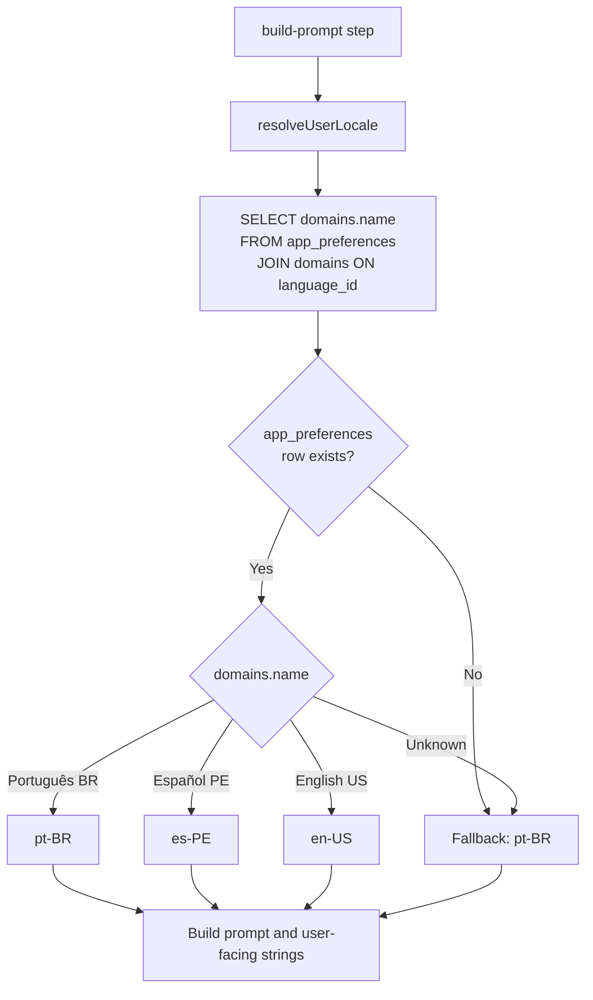
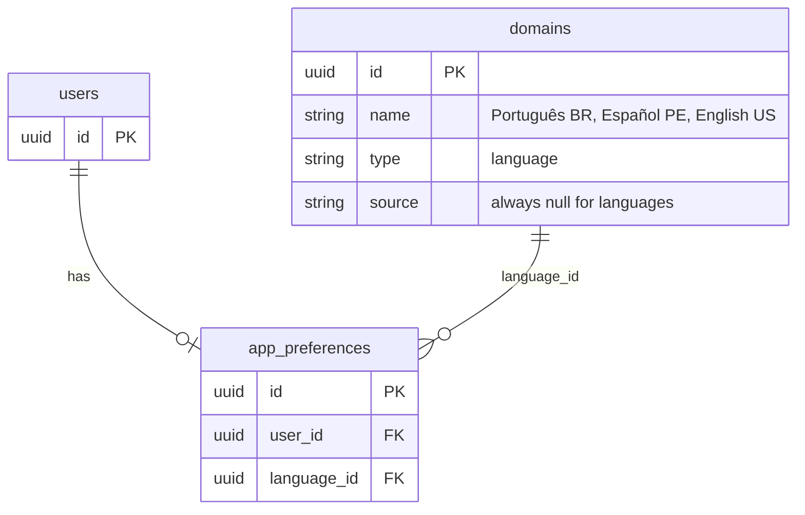
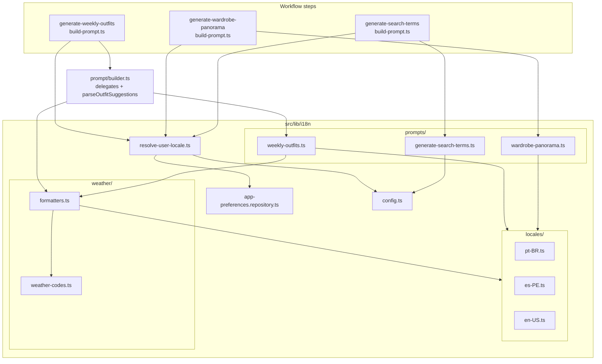
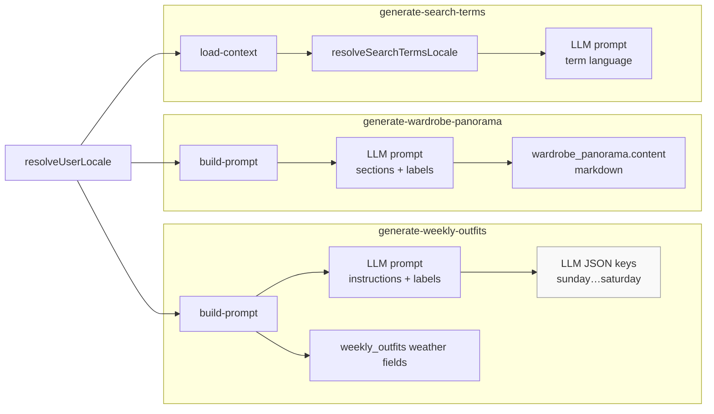
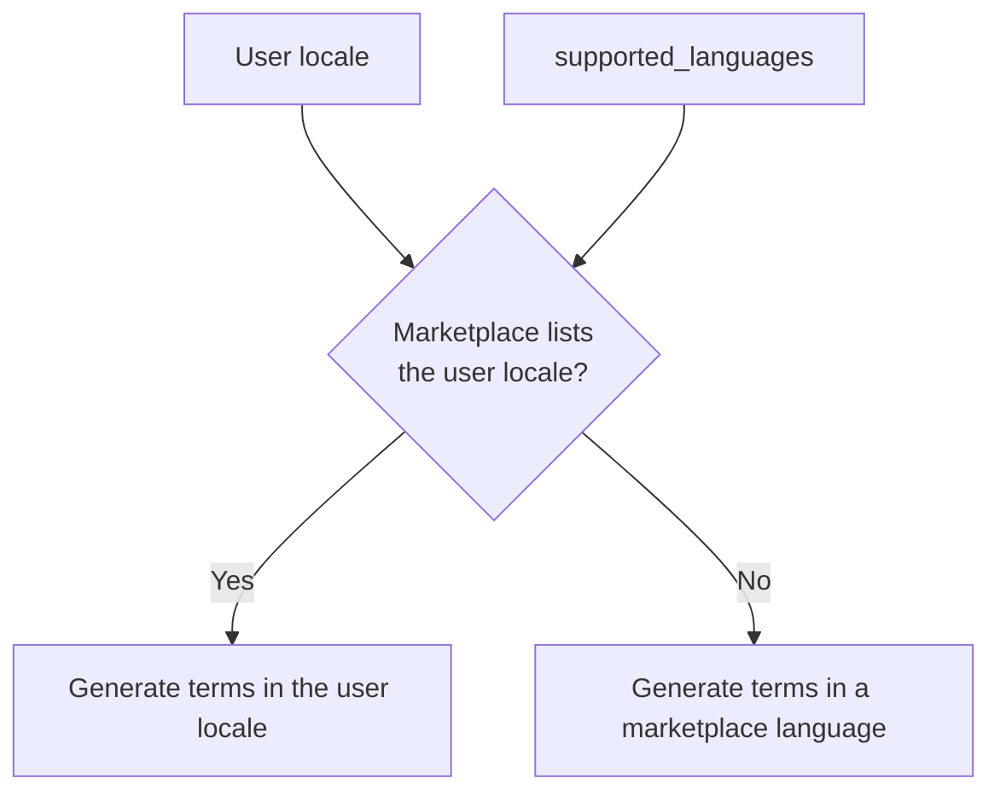
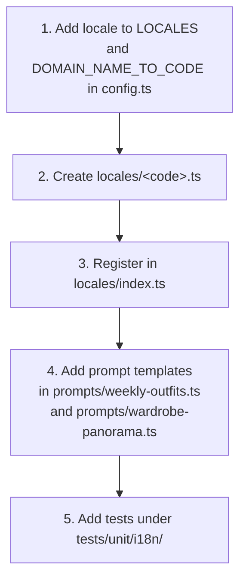

# Internationalization (i18n)

This worker generates user-facing text (LLM prompts, weather summaries, wardrobe panorama markdown, marketplace search terms) in the user's preferred language. Generate-search-terms uses a marketplace language instead when the catalog does not list the user's locale.

---

## Supported locales

| Code | Language | Default |
|---|---|---|
| `pt-BR` | Português (Brasil) | Yes |
| `es-PE` | Español (Perú) | |
| `en-US` | English (United States) | |

These codes align with the SkyDIIV web app (`web/lib/i18n/config.ts`) and the `domains` table seeded with type `language`.

---

## How the user's language is resolved

Workflows call `resolveUserLocale(userId)` when loading context or building a prompt. The lookup reads `app_preferences.language_id` joined to `domains.name` and maps the domain name to a locale code.

### Database model

| Table | Column | Purpose |
|---|---|---|
| `app_preferences` | `language_id` | FK to the user's language domain |
| `domains` | `name`, `type` | Language lookup (`type = 'language'`) |

---

## Module layout

The legacy `src/lib/prompt/builder.ts` delegates to this module and remains the public API for weekly-outfits parsing (`parseOutfitSuggestions`).

---

## What is localized per workflow

Legend: shaded nodes are **not** localized (schema-stable English keys).

### generate-weekly-outfits

| Output | Localized? | Notes |
|---|---|---|
| LLM prompt (instructions + data labels) | Yes | Template selected by locale |
| `weekly_outfits.weather_summary` | Yes | Stored in the user's locale |
| `weekly_outfits.weather_code` | No | WMO code from Open-Meteo (locale-independent integer) |
| `weekly_outfits.description_temperature` | Yes | WMO weather code description in the user's locale |
| `weekly_outfits.min_temperature` / `max_temperature` | No | Raw Celsius values from Open-Meteo |
| `weekly_outfits.unity_temperature` | No | Always `°C` (matches the weather provider) |
| LLM JSON weekday keys (`sunday`, …) | No | Schema-stable English keys |

### generate-wardrobe-panorama

| Output | Localized? | Notes |
|---|---|---|
| LLM prompt (instructions + section headers) | Yes | Built by `buildWardrobePanoramaPrompt()` |
| `wardrobe_panorama.content` | Yes | LLM output language follows the prompt locale |

### generate-search-terms-products-scraping

Search terms follow the user's locale when that locale is listed in the marketplace `supported_languages`. Otherwise they follow a language from `supported_languages`.

| Output | Localized? | Notes |
|---|---|---|
| LLM prompt output-language line | Yes | `resolveSearchTermsLocale()` — user locale if listed, else a marketplace language |
| `json_search.term` | Yes | Written in that resolved locale |

---

## Adding a new locale

---

## Tests

| File | Coverage |
|---|---|
| `tests/unit/i18n/config.test.ts` | Locale resolution and domain mapping |
| `tests/unit/i18n/app-preferences-repository.test.ts` | SQL repository |
| `tests/unit/i18n/resolve-user-locale.test.ts` | End-to-end locale lookup |
| `tests/unit/i18n/weather-formatters.test.ts` | Per-locale weather strings |
| `tests/unit/i18n/weekly-outfits-prompt.test.ts` | Prompt templates (3 locales) |
| `tests/unit/i18n/wardrobe-panorama-prompt.test.ts` | Panorama prompts (3 locales) |
| `tests/unit/i18n/generate-search-terms-prompt.test.ts` | Search-term prompt output language |
| `tests/unit/generate-search-terms.test.ts` | Marketplace eligibility and `resolveSearchTermsLocale` |

Integration tests in `tests/integration/` mock `app_preferences` queries and assert default `pt-BR` resolution. Generate-search-terms integration tests cover user-locale vs marketplace-language matching.
