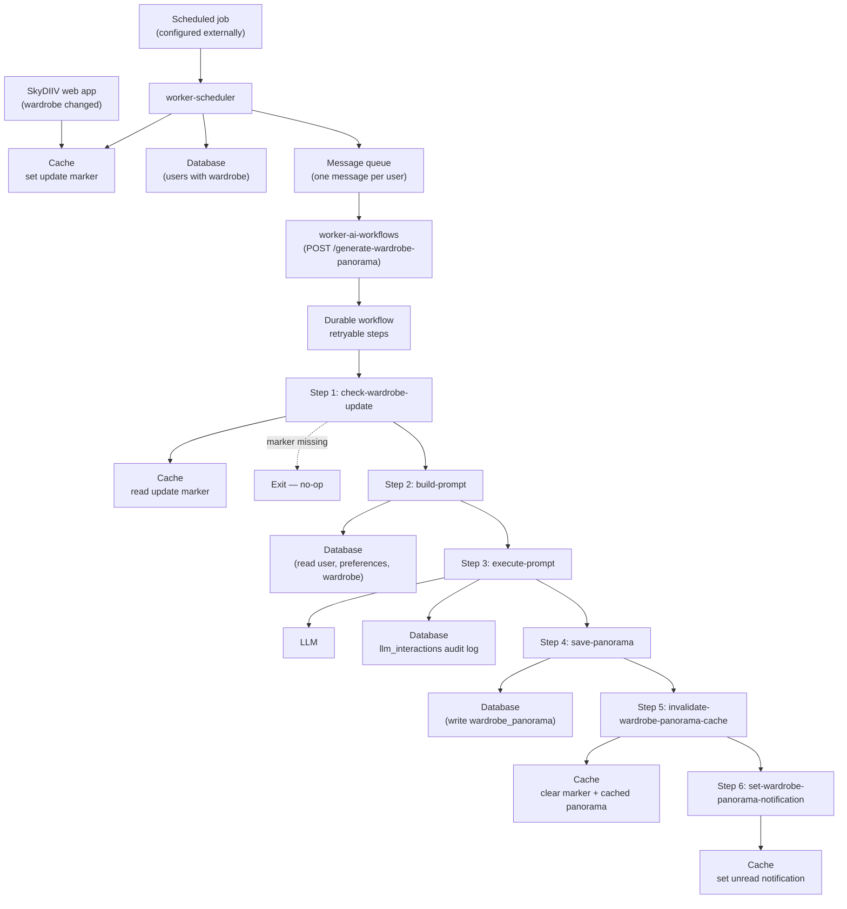
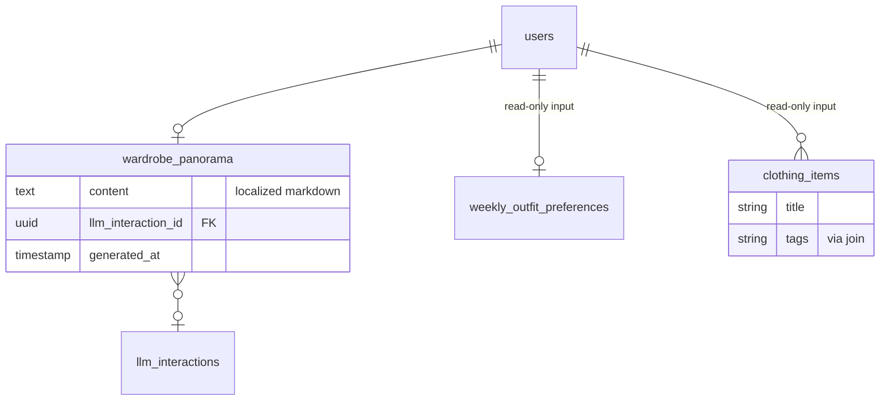
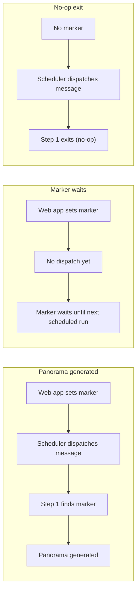
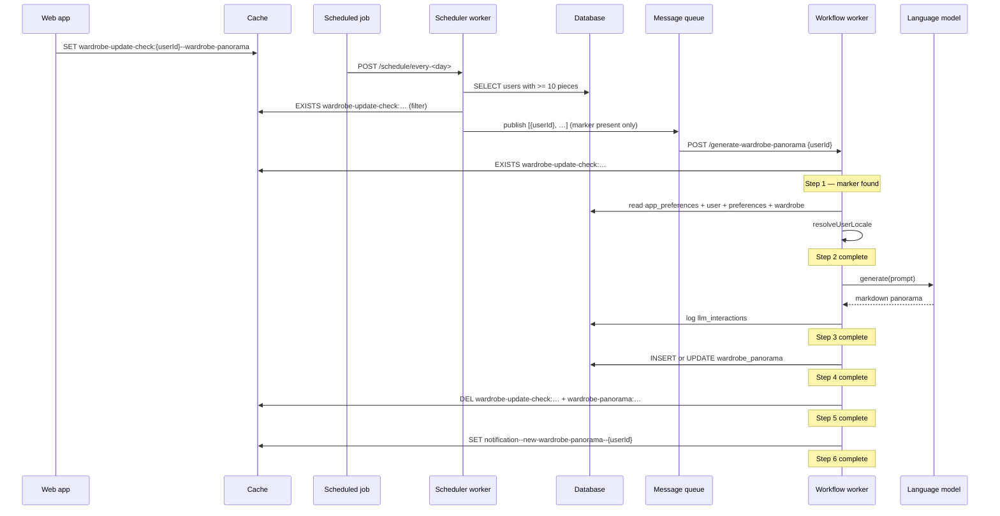

# Generate Wardrobe Panorama Workflow

This document describes the **generate-wardrobe-panorama** workflow end to end: how it is triggered, what each durable step does, which external services it touches, and how it integrates with the SkyDIIV web app.

---

## Overview

The **generate-wardrobe-panorama** workflow produces a personalized **markdown panorama** of a user's wardrobe — an editorial-style analysis covering balance, style, and shopping suggestions. Given a `userId`, it:

1. Verifies the web app has marked the wardrobe as needing a refresh
2. Loads the user's profile, preferences, and wardrobe from the database
3. Calls a language model to generate the panorama text in the user's preferred language
4. Persists the result to the database (one record per user, updated on re-run)
5. Invalidates related cache entries and sets an unread notification

**Hosted in:** `worker-ai-workflows` (workflow worker)  
**Endpoint:** `POST /generate-wardrobe-panorama`  
**Payload:** `{ "userId": "<uuid>" }`

The workflow operates on **one user at a time**. A dispatched message does **not** guarantee execution: step 1 exits early unless the web app has set a cache marker indicating the wardrobe changed. In production, the scheduler publishes messages only for users with that marker; ad-hoc triggers are still gated at step 1.

---

## End-to-End Architecture



### Component roles

| Component | Repository path | Role |
|---|---|---|
| SkyDIIV web app | _(separate repo)_ | Sets the wardrobe-update marker when the user changes their wardrobe; reads the panorama from the database (via cached API); consumes notification keys |
| `worker-scheduler` | `apps/worker-scheduler/` | Optional upstream dispatcher; queries users with large enough wardrobes, filters by update marker, and publishes messages to the queue |
| `worker-ai-workflows` | `apps/worker-ai-workflows/` | Hosts the durable workflow and all step implementations |

---

## Triggering and Scheduling

The workflow itself only requires a signed `POST /generate-wardrobe-panorama` with a `userId`. How and when those requests are produced is configured outside this worker.

### Web app marker (execution gate)

Before any generation happens, the SkyDIIV web app must set a cache marker when the user's wardrobe changes:

```
wardrobe-update-check:{userId}--wardrobe-panorama
```

Step 1 checks for this key. If it is absent, the workflow **exits successfully without doing any work**. The scheduler applies the same filter before dispatching, so scheduled runs do not publish messages for users without a pending update. Ad-hoc triggers are still gated here.

### Scheduled dispatch (via worker-scheduler)

In the current setup, `worker-scheduler` acts as the bulk entry point:

1. An external **scheduled job** calls a weekday endpoint on the scheduler worker (today: `POST /schedule/every-thursday`).
2. The scheduler verifies the request signature, resolves the flow registered for that weekday, and runs `generateWardrobePanoramaFlow`.
3. The flow queries users with at least **10 clothing items**, keeps only those with the wardrobe-update cache marker, and publishes one queue message per filtered user to the workflow endpoint.

The weekday, schedule expression, and endpoint are configured in the external scheduler and the scheduler's flow registry — not in this workflow. Changing the schedule does not require changes to `generate-wardrobe-panorama`.

### Eligible users (scheduler)

The scheduler selects users who have at least **10** rows in `clothing_items`. This is a throughput filter — it avoids considering wardrobes too small to produce a meaningful panorama.

It then filters that set to users whose `wardrobe-update-check:{userId}--wardrobe-panorama` cache marker is present (set by the web app when the wardrobe changes). Only those users receive a queue message.

The workflow still re-checks the marker at step 1 as a safety gate (e.g. for ad-hoc triggers or races between dispatch and execution).

### Message dispatch

```21:43:apps/worker-scheduler/src/flows/generate-wardrobe-panorama.flow.ts
export async function dispatchUsersToPanoramaWorkflow(users: { userId: string }[]): Promise<number> {
  // ...
  const messages = batch.map((user) => ({
    url: workerUrl,
    body: { userId: user.userId } satisfies GenerateWardrobePanoramaPayload,
    headers: { "Content-Type": "application/json" },
  }))
  await client.batchJSON(messages)
  // ...
}
```

- Messages are batched in groups of **100** (queue provider limit)
- `WARDROBE_PANORAMA_WORKER_URL` must include the full path to the workflow endpoint

### Manual / ad-hoc trigger

For local development or debugging, POST directly to the workflow endpoint (requires signed requests in production; expose the local worker via a tunnel and set `UPSTASH_WORKFLOW_URL` for callback routing):

```bash
curl -X POST https://<worker-origin>/generate-wardrobe-panorama \
  -H "Content-Type: application/json" \
  -d '{"userId": "<USER_ID>"}'
```

Ensure the wardrobe-update cache marker exists for the user, or step 1 will exit immediately.

---

## Workflow Definition

**Source:** `src/workflows/generate-wardrobe-panorama/workflow.ts`  
**Registration:** `src/workflows/index.ts` under key `"generate-wardrobe-panorama"`

Each step is wrapped in `context.run("<step-name>", …)`, making it a **durable workflow step**. If a step fails, only that step is retried on the next invocation — completed steps are not re-executed.

At the start of every run, `resetDbClients()` clears the database connection singletons so they pick up environment bindings injected in `src/index.ts`.

### Early exit

If step 1 returns `false`, the workflow logs a skip message and returns without running steps 2–6. This is intentional — not an error.

---

## Step-by-Step Reference

### Step 1 — `check-wardrobe-update`

**Source:** `src/workflows/generate-wardrobe-panorama/steps/check-wardrobe-update.ts`  
**Cache module:** `src/lib/cache/wardrobe-panorama-cache.ts`

Checks whether the cache marker exists:

```
wardrobe-update-check:{userId}--wardrobe-panorama
```

| Result | Behavior |
|---|---|
| Marker present | Returns `true`; workflow continues |
| Marker absent | Returns `false`; workflow exits (no-op) |
| Cache unavailable | Returns `false` (same as absent) |

This step is the **execution gate** between "message received" and "work performed".

---

### Step 2 — `build-prompt`

**Source:** `src/workflows/generate-wardrobe-panorama/steps/build-prompt.ts`

Loads data and assembles the language model prompt via `buildWardrobePanoramaPrompt()` (see [I18N.md](./I18N.md)).

| Input | Source | Notes |
|---|---|---|
| User locale | `app_preferences` + `domains` | Resolved via `resolveUserLocale()` |
| User name | `users` | `first_name`; locale-specific fallback when missing |
| Preferences | `weekly_outfit_preferences` | Optional — location and routine description |
| Wardrobe items | `clothing_items` + `tags` | ID, title, tags per piece |

**Parallel fetches:** locale, user profile, preferences, and wardrobe are loaded concurrently.

**Soft handling:** Missing preferences use locale-specific fallback text in the prompt. An empty wardrobe is represented with a localized "no items" string — the step does not throw. (In practice, the scheduler only dispatches users with ≥10 pieces.)

**Outputs passed to later steps:**

| Field | Purpose |
|---|---|
| `locale` | Resolved user locale (`pt-BR`, `es-PE`, `en-US`) |
| `prompt` | Full localized prompt string for the language model |
| `wardrobeItems` | Summary list for logging |
| `validClothingItemIds` | All wardrobe IDs (reserved for future validation) |

---

### Step 3 — `execute-prompt`

**Source:** `src/workflows/generate-wardrobe-panorama/steps/execute-prompt.ts`

1. Calls the configured language model (temperature `0.2`)
2. Logs the interaction to `llm_interactions` on success
3. Returns the raw markdown response and the interaction ID for linking in step 4

**Expected model output:** Markdown prose with exactly three sections (see [Prompt Design](#prompt-design)):

```markdown
## equilíbrio do guarda-roupa
...

## seu estilo
...

## o que vale buscar
...
```

Unlike the weekly outfits workflow, there is **no JSON parsing** — the raw model text is stored as-is.

**Hard failures:**
- Language model API error (logged to `llm_interactions` with `status = 'ERROR'`, then re-thrown)

---

### Step 4 — `save-panorama`

**Source:** `src/workflows/generate-wardrobe-panorama/steps/save-panorama.ts`  
**Repository:** `src/lib/db/wardrobe-panorama.repository.ts`

Persists the markdown panorama to the database.

**Idempotency:** One row per user in `wardrobe_panorama`:
- **Insert** if no existing row for the user
- **Update** if a row already exists (content, `llm_interaction_id`, `generated_at`, audit fields)

**Hard failures:**
- Database write error

---

### Step 5 — `invalidate-wardrobe-panorama-cache`

**Source:** `src/workflows/generate-wardrobe-panorama/steps/invalidate-wardrobe-panorama-cache.ts`  
**Cache module:** `src/lib/cache/wardrobe-panorama-cache.ts`

Deletes **both** wardrobe-panorama-related cache keys for the user:

| Key | Purpose |
|---|---|
| `wardrobe-update-check:{userId}--wardrobe-panorama` | Clears the update marker (prevents re-generation on next dispatch unless the web app sets it again) |
| `wardrobe-panorama:{userId}` | Busts the cached panorama API response |

**Non-fatal:** If the cache is unavailable, a warning is logged and the workflow continues.

---

### Step 6 — `set-wardrobe-panorama-notification`

**Source:** `src/workflows/generate-wardrobe-panorama/steps/set-wardrobe-panorama-notification.ts`  
**Cache module:** `src/lib/cache/notification-cache.ts`

Sets an unread notification flag in the cache:

```
Key:   notification--new-wardrobe-panorama--{userId}
Value: {"updatedAt":"<ISO timestamp>"}
```

**Non-fatal:** Same graceful-degradation behavior as cache invalidation.

---

## Prompt Design

**Source:** `src/workflows/generate-wardrobe-panorama/steps/build-prompt.ts` (inline template)

The prompt instructs the model to act as a SkyDIIV personal fashion consultant. Output is **Markdown in Brazilian Portuguese**, with a friendly, editorial tone — written as continuous paragraphs, no bullet lists.

### Required sections (in order)

| Section | Content |
|---|---|
| `## equilíbrio do guarda-roupa` | Patterns, concentrations, and gaps in the wardrobe based on pieces and tags |
| `## seu estilo` | Predominant style in 2–3 sentences; compare with user-stated preferences when available |
| `## o que vale buscar` | 2–4 specific piece types that would complement the wardrobe, with justification |

### Input sections in the prompt

1. **DADOS DO USUÁRIO** — first name
2. **PREFERÊNCIAS DO USUÁRIO** — location and routine description (or `"não definidas"`)
3. **DADOS DO GUARDA-ROUPA** — total piece count and one line per item:
   ```
   ID: {id} Título: {title}; Tags: {tags}
   ```

### Constraints

- Use only the data provided — do not invent pieces or categories
- If preferences are undefined, analyze wardrobe data only
- Address the user by name when appropriate

---

## Database Schema (tables touched)

| Table | Operation | Purpose |
|---|---|---|
| `users` | Read | User's first name for personalized prompt |
| `weekly_outfit_preferences` | Read | Optional location and routine description |
| `clothing_items` | Read | Wardrobe items with titles and image URLs |
| `clothing_item_tags` / `tags` | Read (join) | Tags describing each piece |
| `wardrobe_panorama` | Write | One markdown panorama per user (insert or update) |
| `llm_interactions` | Write | Audit log of the language model call |

### Key conventions

| Field | Value |
|---|---|
| `wardrobe_panorama.user_id` | One row per user |
| `wardrobe_panorama.content` | Raw markdown from the language model |
| `wardrobe_panorama.llm_interaction_id` | FK to the audit log entry from step 3 |
| `wardrobe_panorama.generated_at` | Timestamp of the latest generation |
| `created_by` / `updated_by` | `'worker-ai-workflows'` |

### Entity relationship (simplified)



---

## Web App Integration (cache)

These cache key formats **must stay in sync** with the SkyDIIV web app.

| Key pattern | Operation | When | Purpose |
|---|---|---|---|
| `wardrobe-update-check:{userId}--wardrobe-panorama` | Set | Web app (wardrobe changed) | Gate — workflow runs only when this exists |
| `wardrobe-update-check:{userId}--wardrobe-panorama` | Delete | Step 5 | Clear gate after successful generation |
| `wardrobe-panorama:{userId}` | Delete | Step 5 | Bust cached panorama API response |
| `notification--new-wardrobe-panorama--{userId}` | Set | Step 6 | Signal unread panorama to the user |

### Dispatch vs. execution



---

## Configuration

Environment variable names required to run this workflow:

### Workflow worker secrets

Set via `wrangler secret put <KEY>` (production) or `.dev.vars` (local):

| Variable | Required | Used by |
|---|---|---|
| `DATABASE_URL` | ✅ | Read pool (SELECT queries) |
| `DATABASE_URL_UNPOOLED` | ✅ | Write pool (INSERT/UPDATE) |
| `QSTASH_URL` | ✅ | Workflow callback routing |
| `QSTASH_TOKEN` | ✅ | Workflow orchestration |
| `QSTASH_CURRENT_SIGNING_KEY` | ✅ | Request verification |
| `QSTASH_NEXT_SIGNING_KEY` | ✅ | Key rotation |
| `UPSTASH_WORKFLOW_URL` | ✅ | Public worker origin (no path) |
| `GEMINI_API_KEY` | ✅ | Language model calls |
| `GEMINI_MODEL` | — | Model name override |
| `UPSTASH_REDIS_REST_URL` | ✅* | Cache gate, invalidation, notifications |
| `UPSTASH_REDIS_REST_TOKEN` | ✅* | Cache gate, invalidation, notifications |

\*Steps 1, 5, and 6 degrade gracefully when the cache is not configured (step 1 treats missing cache as "marker absent").

This workflow does **not** use object storage or the image service binding.

### Scheduler worker secrets (separate deployable)

| Variable | Purpose |
|---|---|
| `WARDROBE_PANORAMA_WORKER_URL` | Full URL to `POST /generate-wardrobe-panorama` |
| `QSTASH_TOKEN` | Publishing batch messages |
| `DATABASE_URL` | Query users with sufficient wardrobe size |
| `UPSTASH_REDIS_REST_URL`, `UPSTASH_REDIS_REST_TOKEN` (or `REDIS_URL`) | Filter users by wardrobe-update cache marker |

---

## Error Handling and Operational Behavior

### Failure modes by step

| Step | Fatal? | Notes |
|---|---|---|
| Missing `userId` in payload | ✅ Fatal | Throws before any step runs |
| Update marker absent | ❌ No-op | Step 1 returns `false`; workflow exits cleanly |
| Language model failure | ✅ Fatal | Step 3 throws; prior steps not re-run on retry |
| Database save failure | ✅ Fatal | Step 4 throws |
| Cache invalidation failure | ❌ Non-fatal | Warning logged |
| Notification set failure | ❌ Non-fatal | Warning logged |

### Idempotency

Safe to re-run for the same `userId` when the update marker is present. The save step updates the existing `wardrobe_panorama` row rather than creating duplicates.

After a successful run, step 5 deletes the update marker. The panorama will not regenerate on the next scheduled dispatch unless the web app sets the marker again (i.e., the user changes their wardrobe).

### Logging

All steps emit structured JSON logs via `createLogger("<component>", userId)`. Log fields include step name, counts, latencies, and error messages.

---

## Security

- **No end-user authentication** on the workflow endpoint — it is an internal automation surface
- All workflow requests are **cryptographically signed** by the message queue and verified before any step executes
- `GET /` is the only unsigned endpoint (health check)
- `userId` comes from the verified request payload; the workflow never trusts client-supplied identity outside that envelope
- Database credentials are worker secrets, never in source control

---

## Source File Map

```
apps/worker-ai-workflows/
├── src/
│   ├── index.ts                                              # Worker entry; env injection + routing
│   ├── workflows/
│   │   ├── index.ts                                          # Workflow registry
│   │   └── generate-wardrobe-panorama/
│   │       ├── workflow.ts                                   # Workflow orchestration
│   │       └── steps/
│   │           ├── check-wardrobe-update.ts                  # Step 1
│   │           ├── build-prompt.ts                           # Step 2
│   │           ├── execute-prompt.ts                         # Step 3
│   │           ├── save-panorama.ts                          # Step 4
│   │           ├── invalidate-wardrobe-panorama-cache.ts     # Step 5
│   │           └── set-wardrobe-panorama-notification.ts     # Step 6
│   └── lib/
│       ├── db/
│       │   ├── users.repository.ts                           # User profile (first name)
│       │   ├── preferences.repository.ts
│       │   ├── wardrobe.repository.ts
│       │   ├── wardrobe-panorama.repository.ts
│       │   └── llm-interactions.repository.ts
│       ├── llm/                                              # Language model provider
│       └── cache/
│           ├── wardrobe-panorama-cache.ts                    # Marker check + invalidation
│           └── notification-cache.ts

apps/worker-scheduler/
└── src/
    ├── flows/
    │   ├── registry.ts                                           # weekday → generateWardrobePanoramaFlow
    │   └── generate-wardrobe-panorama.flow.ts                    # User query + cache filter + dispatch
    └── lib/cache/
        └── wardrobe-panorama-cache.ts                              # Update-marker filter
```

---

## Testing

Unit and integration tests cover the workflow's critical paths:

| Test file | Coverage |
|---|---|
| `tests/integration/generate-wardrobe-panorama.test.ts` | Prompt build, LLM call, and DB save (mocked externals) |
| `tests/unit/check-wardrobe-update-step.test.ts` | Step 1 marker gate |
| `tests/unit/wardrobe-panorama-cache.test.ts` | Cache key helpers |
| `tests/unit/invalidate-wardrobe-panorama-cache-step.test.ts` | Step 5 behavior |
| `tests/unit/set-wardrobe-panorama-notification-step.test.ts` | Step 6 behavior |
| `apps/worker-scheduler/tests/unit/generate-wardrobe-panorama-flow.test.ts` | Scheduler fan-out + cache filter |
| `apps/worker-scheduler/tests/unit/wardrobe-panorama-cache.test.ts` | Scheduler update-marker filter |

Run from `apps/worker-ai-workflows/`:

```bash
npm test
npm run test:coverage
```

---

## Sequence Diagram (single user, marker present)



---
