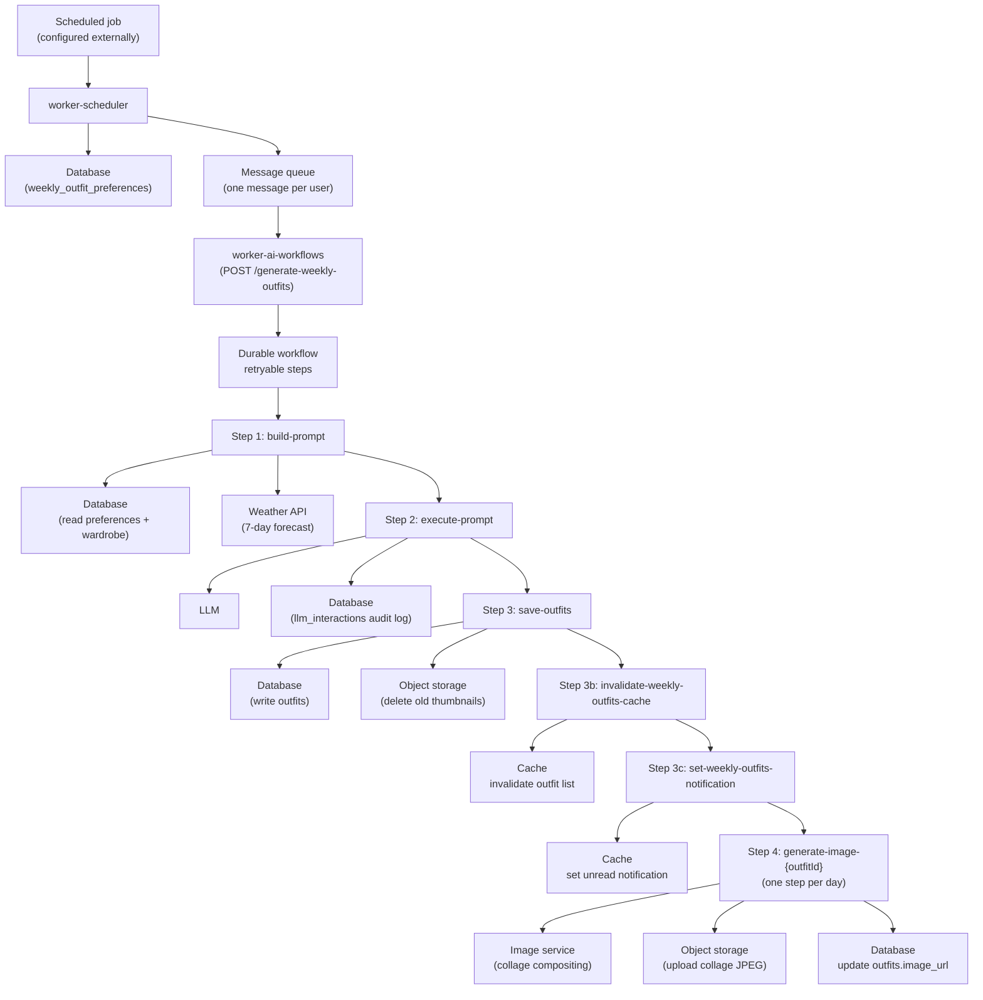
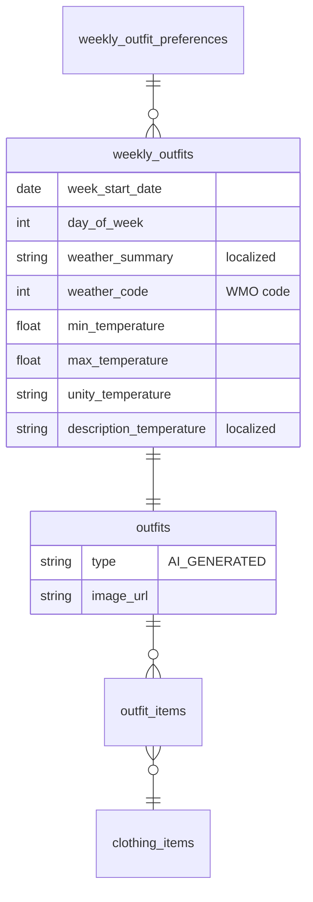
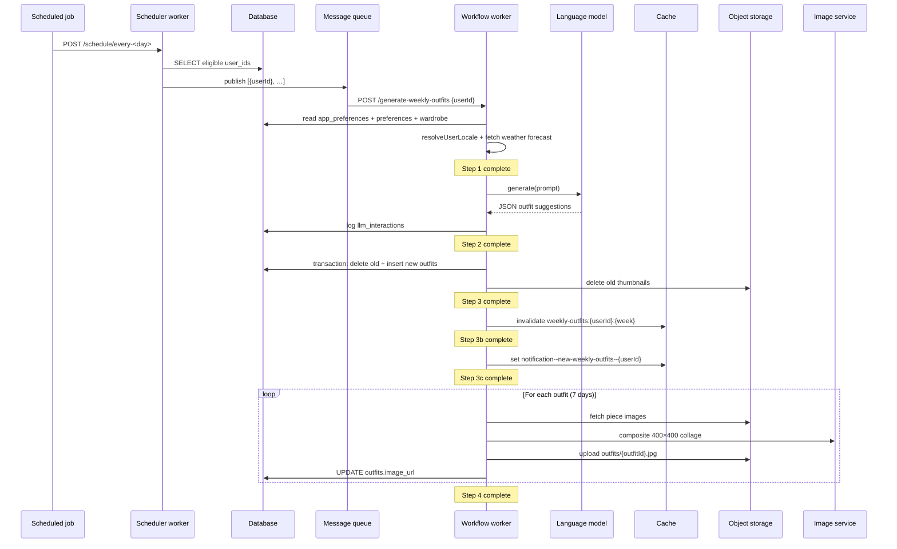

# Generate Weekly Outfits Workflow

This document describes the **generate-weekly-outfits** workflow end to end: how it is triggered, what each durable step does, which external services it touches, and how it integrates with the SkyDIIV web app.

---

## Overview

The **generate-weekly-outfits** workflow produces a full week of AI-curated outfit suggestions (Sunday through Saturday) for a single user. Given a `userId`, it:

1. Selects clothing items from the user's existing wardrobe using a language model
2. Persists the outfits to the database
3. Invalidates the web app's cache and sets an unread notification
4. Composites a 400×400 JPEG thumbnail collage from the selected pieces and uploads it to object storage

**Hosted in:** `worker-ai-workflows` (workflow worker)  
**Endpoint:** `POST /generate-weekly-outfits`  
**Payload:** `{ "userId": "<uuid>" }`

The workflow operates on **one user at a time**. In production it is typically invoked by `worker-scheduler`, which queries eligible users and dispatches one message per user through a message queue — but it can also be triggered ad hoc by POSTing directly to the endpoint (see [Triggering and Scheduling](#triggering-and-scheduling)).

---

## End-to-End Architecture



### Component roles

| Component | Repository path | Role |
|---|---|---|
| `worker-scheduler` | `apps/worker-scheduler/` | Optional upstream dispatcher; queries eligible users and publishes messages to the queue |
| `worker-ai-workflows` | `apps/worker-ai-workflows/` | Hosts the durable workflow and all step implementations |
| SkyDIIV web app | _(separate repo)_ | Reads outfits from the database (via cached API); consumes notification keys from the cache |

---

## Triggering and Scheduling

The workflow itself only requires a signed `POST /generate-weekly-outfits` with a `userId`. How and when those requests are produced is configured outside this worker.

### Scheduled dispatch (via worker-scheduler)

In the current setup, `worker-scheduler` acts as the bulk entry point:

1. An external **scheduled job** calls a weekday endpoint on the worker-scheduler (today: `POST /schedule/every-sunday`).
2. The scheduler verifies the request signature, resolves the flow registered for that weekday, and runs `weeklyOutfitsFlow`.
3. The flow queries all users with outfit preferences and publishes one queue message per user to the workflow endpoint.

The weekday, schedule expression, and endpoint are configured in the external scheduler and the scheduler's flow registry — not in this workflow. Changing the schedule does not require changes to `generate-weekly-outfits`.

### Eligible users

The scheduler selects users from `weekly_outfit_preferences` where both `location` and `routine_description` are non-null and non-empty. A row in this table is the opt-in signal for weekly generation.

The per-user workflow additionally requires:
- At least one clothing item in the user's wardrobe
- A preferences row (re-checked in step 1)

### Message dispatch

```22:44:apps/worker-scheduler/src/flows/weekly-outfits.flow.ts
export async function dispatchUsersToWorkflow(users: EligibleUser[]): Promise<number> {
  // ...
  const messages = batch.map((user) => ({
    url: workerUrl,
    body: { userId: user.userId } satisfies GenerateWeeklyOutfitsPayload,
    headers: { "Content-Type": "application/json" },
  }))
  await client.batchJSON(messages)
  // ...
}
```

- Messages are batched in groups of **100** (queue provider limit)
- `WORKER_AI_WORKFLOWS_URL` on `worker-scheduler` must be this worker's origin (no path); the scheduler appends `/generate-weekly-outfits`

### Manual / ad-hoc trigger

For local development or debugging, POST directly to the workflow endpoint (requires signed requests in production; expose the local worker via a tunnel and set `WORKER_AI_WORKFLOWS_URL` for callback routing):

```bash
curl -X POST https://<worker-origin>/generate-weekly-outfits \
  -H "Content-Type: application/json" \
  -d '{"userId": "<USER_ID>"}'
```

---

## Workflow Definition

**Source:** `src/workflows/generate-weekly-outfits/workflow.ts`  
**Registration:** `src/workflows/index.ts` under key `"generate-weekly-outfits"`

Each step is wrapped in `context.run("<step-name>", …)`, making it a **durable workflow step**. If a step fails, only that step is retried on the next invocation — completed steps are not re-executed.

At the start of every run, `resetDbClients()` clears the database connection singletons so they pick up environment bindings injected in `src/index.ts`.

### Week start date

The target week is always anchored to **Sunday UTC**:

```15:20:apps/worker-ai-workflows/src/workflows/generate-weekly-outfits/workflow.ts
function getCurrentWeekStartDate(): string {
  const now = new Date()
  const dayOfWeek = now.getUTCDay()
  const sundayMs = now.getTime() - dayOfWeek * 24 * 60 * 60 * 1000
  return new Date(sundayMs).toISOString().split("T")[0]
}
```

Re-running mid-week regenerates the **entire current week** (Sunday–Saturday), not just remaining days.

---

## Step-by-Step Reference

### Step 1 — `build-prompt`

**Source:** `src/workflows/generate-weekly-outfits/steps/build-prompt.ts`

Loads all inputs needed for the language model call:

| Input | Source | Notes |
|---|---|---|
| User locale | `app_preferences` + `domains` | Resolved via `resolveUserLocale()`; used for weather_summary DB storage and locale-specific fallbacks |
| User preferences | `weekly_outfit_preferences` | `location`, `routine_description` |
| Wardrobe items | `clothing_items` + `tags` + `domains` | ID, title, tags, optional `image_url`, piece type and subtype (always present, values in en-US) |
| Weather forecast | Weather API | 7 days from week start; geocoded from `location`; formatted in pt-BR for the prompt |

**Parallel fetches:** locale, preferences, and wardrobe are loaded concurrently.

**Hard failures (workflow aborts):**
- No preferences row for the user
- Empty wardrobe (zero clothing items)

**Soft failures (workflow continues):**
- Weather API unavailable → prompt is built with an empty forecast block; weather summaries for database storage will be empty for those days

**Outputs passed to later steps:**

| Field | Purpose |
|---|---|
| `locale` | Resolved user locale (`pt-BR`, `es-PE`, `en-US`) |
| `prompt` | Full localized prompt string for the language model |
| `weeklyOutfitPreferencesId` | FK for `weekly_outfits` inserts |
| `weekStartDate` | Sunday ISO date (`YYYY-MM-DD`) |
| `dayWeatherByWeekday` | Map of English weekday → structured weather data for the database (summary + temperature fields) |
| `wardrobeImageMap` | `clothing_item_id → image_url` for thumbnail generation |
| `validClothingItemIds` | All wardrobe IDs; used to filter invalid model output in step 3 |

---

### Step 2 — `execute-prompt`

**Source:** `src/workflows/generate-weekly-outfits/steps/execute-prompt.ts`

1. Calls the configured language model (temperature `0.2`)
2. Parses the response as JSON and validates its structure
3. Logs the interaction to `llm_interactions` (success or error)

**Expected model output schema:**

```json
[
  { "weekday": "sunday",    "clothing_piece_ids": ["id1", "id2"] },
  { "weekday": "monday",    "clothing_piece_ids": ["id3", "id4"] },
  ...
  { "weekday": "saturday",  "clothing_piece_ids": ["id5"] }
]
```

- `weekday` must be a lowercase English day name (`sunday` … `saturday`)
- The prompt requires **exactly 7 elements**, one per day
- Markdown code fences are stripped before parsing if the model includes them despite instructions

**Hard failures:**
- Language model API error
- Response is not valid JSON
- Response fails schema validation

Interaction logging is wrapped in `safeLog()` — a logging failure never crashes the workflow.

---

### Step 3 — `save-outfits`

**Source:** `src/workflows/generate-weekly-outfits/steps/save-outfits.ts`  
**Repository:** `src/lib/db/weekly-outfits.repository.ts`

Persists outfit suggestions atomically and idempotently.

**Pre-save sanitization:** Any clothing item ID returned by the model that is not in `validClothingItemIds` is dropped with a warning. This prevents foreign-key violations from invalid IDs.

**Idempotency:** For the same `(weeklyOutfitPreferencesId, weekStartDate)`:
1. Existing outfit IDs are looked up
2. Inside a single database transaction:
   - Old `outfits` rows are deleted (cascades to `outfit_items` and `weekly_outfits`)
   - New `outfits`, `outfit_items`, and `weekly_outfits` rows are inserted
3. After commit, old thumbnails in object storage (`outfits/{outfitId}.jpg`) are deleted (non-fatal on failure)

**Records created per valid suggestion:**

| Table | Key fields |
|---|---|
| `outfits` | `type = 'AI_GENERATED'`, title `Weekly AI Outfit — {Weekday}`, `created_by = 'worker-ai-workflows'` |
| `outfit_items` | One row per selected clothing item |
| `weekly_outfits` | Links outfit to preferences, week, day (`0`=Sun … `6`=Sat), weather summary, and temperature fields |

Suggestions with unknown weekdays or zero clothing pieces after sanitization are skipped with a warning.

**Output:** Array of `SavedOutfitRef` objects (`outfitId`, `weekday`, `clothingPieceIds`) passed to step 4.

---

### Step 3b — `invalidate-weekly-outfits-cache`

**Source:** `src/workflows/generate-weekly-outfits/steps/invalidate-weekly-outfits-cache.ts`  
**Cache module:** `src/lib/cache/weekly-outfits-cache.ts`

Deletes the cache key used by the SkyDIIV web app's weekly outfits API:

```
weekly-outfits:{userId}:{weekStartDate}
```

**Non-fatal:** If the cache is unavailable or not configured, a warning is logged and the workflow continues.

---

### Step 3c — `set-weekly-outfits-notification`

**Source:** `src/workflows/generate-weekly-outfits/steps/set-weekly-outfits-notification.ts`  
**Cache module:** `src/lib/cache/notification-cache.ts`

Sets an unread notification flag in the cache:

```
Key:   notification--new-weekly-outfits--{userId}
Value: {"updatedAt":"<ISO timestamp>"}
```

**Non-fatal:** Same graceful-degradation behavior as cache invalidation.

---

### Step 4 — `generate-image-{outfitId}` (one step per outfit)

**Source:** `src/workflows/generate-weekly-outfits/steps/generate-images.ts`

Each saved outfit gets its own durable workflow step so every image compositing call runs in a **fresh worker invocation** with a fresh CPU budget.

**Per-outfit flow:**

1. Resolve piece image URLs from `wardrobeImageMap` (max **12** pieces)
2. Fetch images concurrently; individual fetch failures are dropped
3. Build a 400×400 JPEG collage via the image processing service
4. Upload to object storage at `outfits/{outfitId}.jpg` with metadata `{ userid: userId }`
5. Update `outfits.image_url` in the database

**Grid layout:** Mirrors the SkyDIIV web app's composite logic:
- Columns = `ceil(sqrt(n))`, rows = `ceil(n / cols)`
- Last row spreads remaining images evenly
- Pixel sizes are distributed so the grid exactly fills 400×400

**Image pipeline batching:** The image service caps a single pipeline at 10 operations. Overlays are drawn in batches of 3 (`DRAWS_PER_BATCH`) across multiple pipeline executions to support any number of pieces.

**Outcomes:**

| Result | Behavior |
|---|---|
| No piece images / all fetches fail | Step returns `false`; workflow continues |
| Composite + upload succeed | Step returns `true`; `outfits.image_url` updated |
| Unexpected error (storage, image service, database) | Step throws; the workflow engine retries that step |

---

## LLM Prompt Design

**Template:** `src/lib/i18n/prompts/weekly-outfits.ts` (single pt-BR template)  
**Builder:** `src/lib/prompt/builder.ts` → delegates to i18n  
**Locale resolution:** `src/lib/i18n/resolve-user-locale.ts` (reads `app_preferences.language_id`)

The prompt is **always written in Brazilian Portuguese (pt-BR)**, regardless of the user's locale. Since the output is structured JSON (not natural-language prose), no output-language directive is needed. Item titles and tags may be in the user's language; types and subtypes are always in English (en-US).

### Input sections

1. **Guarda-roupa (wardrobe)** — one line per item, always in pt-BR format:
   ```
   ID:{id} | TÍTULO:{title} | TIPO:{pieceType} | SUBTIPO:{pieceSubtype} | TAGS:{tag1, tag2, …}
   ```
   `TIPO` and `SUBTIPO` are always present and in English (en-US). `TÍTULO` and `TAGS` may be in the user's language.
2. **Resumo por tipo** — piece count grouped by type and subtype, sorted by frequency, e.g.:
   ```
   - Top: 8 peças → T-Shirt (5), Shirt (3)
   - Bottom: 5 peças → Jeans (3), Shorts (2)
   Total: 13 peças
   ```
   Helps the model build balanced outfits across categories throughout the week.
3. **Preferências do usuário** — free-text `routine_description`
4. **Previsão meteorológica** — 7-day forecast formatted in pt-BR (weekday names and weather descriptions)

### Selection rules (highlights)

- Use **only** IDs from the provided wardrobe
- Use piece **type and subtype** (English en-US values) to build balanced outfits (e.g. pair a Bottom with a Top)
- Use the **type summary** to ensure category balance across the week
- Consider weather, tags, user preferences, and day-to-day variety
- Do not translate or interpret item titles/tags
- Prioritize thermal comfort (cold/hot/rainy day heuristics)
- Do not invent pieces or IDs

### Output rules

- Raw JSON array only — no markdown, no code fences, no prose
- Exactly 7 entries, Sunday through Saturday

---

## Database Schema (tables touched)

| Table | Operation | Purpose |
|---|---|---|
| `app_preferences` | Read | User language preference (`language_id`) |
| `domains` | Read (join) | Language domain (`name`; `source` is always null for languages) |
| `weekly_outfit_preferences` | Read | User location and style/routine description |
| `clothing_items` | Read | Wardrobe items with titles, image URLs, and piece type/subtype FKs |
| `clothing_item_tags` / `tags` | Read (join) | Tags describing each piece |
| `domains` | Read (join) | Piece type and subtype names (`type = 'piece_type'` / `'piece_subtype'`) |
| `outfits` | Write | One AI-generated outfit per day; `image_url` updated in step 4 |
| `outfit_items` | Write | Join table: outfit ↔ clothing item |
| `weekly_outfits` | Write | Links outfit to week/day with weather summary |
| `llm_interactions` | Write | Audit log of every language model call |

### Key conventions

| Field | Value |
|---|---|
| `weekly_outfits.week_start_date` | Sunday of the target week (`YYYY-MM-DD`, UTC) |
| `weekly_outfits.day_of_week` | `0` (Sunday) through `6` (Saturday) |
| `outfits.type` | `'AI_GENERATED'` |
| `outfits.created_by` / `updated_by` | `'worker-ai-workflows'` |
| `weekly_outfits.weather_summary` | Localized string in the user's locale, e.g. `"Parcialmente nublado, máx. 27°C / mín. 21°C, chuva: 30%"` (pt-BR) |
| `weekly_outfits.weather_code` | WMO weather interpretation code from Open-Meteo (e.g. `0` = clear sky) |
| `weekly_outfits.min_temperature` | Minimum daily temperature from the forecast (°C, raw float from Open-Meteo) |
| `weekly_outfits.max_temperature` | Maximum daily temperature from the forecast (°C, raw float from Open-Meteo) |
| `weekly_outfits.unity_temperature` | Temperature unit symbol (`°C`) |
| `weekly_outfits.description_temperature` | Localized WMO weather code description, e.g. `"Céu limpo"` (pt-BR) |

### Entity relationship (simplified)



---

## Web App Integration (cache)

These cache key formats **must stay in sync** with the SkyDIIV web app.

| Key pattern | Operation | When | Purpose |
|---|---|---|---|
| `weekly-outfits:{userId}:{weekStart}` | Delete | Step 3b | Bust cached weekly outfits API response |
| `notification--new-weekly-outfits--{userId}` | Set | Step 3c | Signal unread weekly outfits to the user |

---

## Configuration

Environment variable names required to run this workflow:

### Workflow worker secrets

Set via `wrangler secret put <KEY>` (production) or `.dev.vars` (local):

| Variable | Required | Used by |
|---|---|---|
| `DATABASE_URL` | ✅ | Read pool (SELECT queries) |
| `DATABASE_URL_UNPOOLED` | ✅ | Write pool (transactions) |
| `QSTASH_URL` | ✅ | Workflow callback routing |
| `QSTASH_TOKEN` | ✅ | Workflow orchestration |
| `QSTASH_CURRENT_SIGNING_KEY` | ✅ | Request verification |
| `QSTASH_NEXT_SIGNING_KEY` | ✅ | Key rotation |
| `WORKER_AI_WORKFLOWS_URL` | ✅ | Public worker origin (no path) |
| `GEMINI_API_KEY` | ✅ | Language model calls |
| `GEMINI_MODEL` | — | Model name override |
| `UPSTASH_REDIS_REST_URL` | ✅* | Cache + notifications |
| `UPSTASH_REDIS_REST_TOKEN` | ✅* | Cache + notifications |
| `R2_ACCOUNT_ID` | ✅ | Object storage upload |
| `R2_BUCKET` | ✅ | Object storage upload |
| `R2_ACCESS_KEY_ID` | ✅ | Object storage upload |
| `R2_SECRET_ACCESS_KEY` | ✅ | Object storage upload |
| `R2_PUBLIC_URL` | ✅ | Public URL for `outfits.image_url` |

\*Cache-related steps degrade gracefully when not configured.

### Image service binding

Configured in `wrangler.toml`:

```toml
[images]
binding = "IMAGES"
```

### Scheduler worker secrets (separate deployable)

| Variable | Purpose |
|---|---|
| `WORKER_AI_WORKFLOWS_URL` | worker-scheduler origin → `{origin}/generate-weekly-outfits` |
| `QSTASH_TOKEN` | Publishing batch messages |
| `DATABASE_URL` | Query eligible users |

---

## Error Handling and Operational Behavior

### Failure modes by step

| Step | Fatal? | Notes |
|---|---|---|
| Missing `userId` in payload | ✅ Fatal | Throws before any step runs |
| No preferences / empty wardrobe | ✅ Fatal | Step 1 throws |
| Weather API failure | ❌ Non-fatal | Continues without forecast data |
| Language model failure / bad JSON | ✅ Fatal | Step 2 throws; prior step not re-run on retry |
| Database save failure | ✅ Fatal | Transaction rolls back |
| Cache invalidation failure | ❌ Non-fatal | Warning logged |
| Notification set failure | ❌ Non-fatal | Warning logged |
| Individual image generation failure | ⚠️ Partial | That step retries; other outfits unaffected |
| No images for an outfit | ❌ Non-fatal | Step returns `false`; outfit saved without thumbnail |

### Idempotency

Safe to re-run for the same `userId` + week. The save step atomically replaces all outfits for that week. Old thumbnails in object storage are cleaned up after a successful save.

### Logging

All steps emit structured JSON logs via `createLogger("<component>", userId)`. Log fields include step name, counts, latencies, and error messages.

---

## Security

- **No end-user authentication** on the workflow endpoint — it is an internal automation surface
- All workflow requests are **cryptographically signed** by the message queue and verified before any step executes
- `GET /` is the only unsigned endpoint (health check)
- `userId` comes from the verified request payload; the workflow never trusts client-supplied identity outside that envelope
- Database and storage credentials are worker secrets, never in source control

---

## Source File Map

```
apps/worker-ai-workflows/
├── src/
│   ├── index.ts                                          # Worker entry; env injection + routing
│   ├── workflows/
│   │   ├── index.ts                                      # Workflow registry
│   │   └── generate-weekly-outfits/
│   │       ├── workflow.ts                               # Workflow orchestration
│   │       └── steps/
│   │           ├── build-prompt.ts                       # Step 1
│   │           ├── execute-prompt.ts                     # Step 2
│   │           ├── save-outfits.ts                       # Step 3
│   │           ├── invalidate-weekly-outfits-cache.ts    # Step 3b
│   │           ├── set-weekly-outfits-notification.ts    # Step 3c
│   │           └── generate-images.ts                    # Step 4
│   └── lib/
│       ├── db/                                           # Database repositories
│       ├── i18n/                                         # Locale resolution, prompts, weather labels
│       ├── prompt/                                       # Weekly-outfits builder + JSON parser
│       ├── llm/                                          # Language model provider
│       ├── weather/                                      # Weather API provider
│       ├── cache/                                        # Cache client + key helpers
│       ├── storage/                                      # Object storage upload/delete
│       └── cf-images.ts                                  # Image service binding accessor

apps/worker-scheduler/
└── src/flows/
    ├── registry.ts                                       # weekday → weeklyOutfitsFlow
    └── weekly-outfits.flow.ts                            # User query + message dispatch
```

---

## Testing

Unit and integration tests cover the workflow's critical paths:

| Test file | Coverage |
|---|---|
| `tests/integration/workflow-steps.test.ts` | End-to-end data flow through all steps (mocked externals) |
| `tests/unit/prompt-builder.test.ts` | Prompt construction and response parsing |
| `tests/unit/weekly-outfits-repository.test.ts` | Idempotent save, weekday mapping, storage cleanup |
| `tests/unit/weekly-outfits-cache.test.ts` | Cache key deletion |
| `tests/unit/invalidate-weekly-outfits-cache-step.test.ts` | Step 3b behavior |
| `tests/unit/set-weekly-outfits-notification-step.test.ts` | Step 3c behavior |
| `tests/unit/generate-images-step.test.ts` | Image compositing step |
| `tests/unit/workflows-registry.test.ts` | Endpoint registration |
| `apps/worker-scheduler/tests/unit/weekly-outfits-flow.test.ts` | Scheduler fan-out |

Run from `apps/worker-ai-workflows/`:

```bash
npm test
npm run test:coverage
```

---

## Sequence Diagram (single user)



---

## Related Documentation

- [`WARDROBE_PANORAMA_WORKFLOW.md`](./WARDROBE_PANORAMA_WORKFLOW.md) — sibling workflow for wardrobe panorama generation
- [`apps/worker-ai-workflows/README.md`](../README.md) — worker setup, deployment, and all workflows
- [`apps/worker-scheduler/README.md`](../../worker-scheduler/README.md) — scheduling infrastructure and adding new flows
