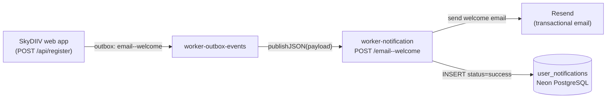

# worker-notification

Cloudflare Worker that hosts SkyDIIV's notification workflows. Each workflow is a durable, multi-step job exposed at its own HTTP endpoint and orchestrated via Upstash Workflow + QStash.

Workflows are registered with `serveMany`, which routes requests by the **last path segment** of the URL.

| Endpoint | Workflow | Documentation |
|---|---|---|
| `POST /email--welcome` | `email--welcome` | [docs/EMAIL_WELCOME_WORKFLOW.md](./docs/EMAIL_WELCOME_WORKFLOW.md) |
| `GET /` | — | Health check → `{ status: "ok", timestamp }` |



---

## Services & Technologies

| Layer | Technology | Role |
|---|---|---|
| Runtime | [Cloudflare Workers](https://developers.cloudflare.com/workers/) (`nodejs_compat`) | Hosts this worker |
| Language | TypeScript 5 (strict) | Implementation |
| Workflow orchestration | [Upstash Workflow](https://upstash.com/docs/workflow) + [QStash](https://upstash.com/docs/qstash) | Durable steps, retries, signed delivery |
| Email delivery | [Resend](https://resend.com) (via provider abstraction) | Transactional welcome email |
| Database | [Neon](https://neon.tech) PostgreSQL via [postgres.js](https://github.com/porsager/postgres) | Writes `user_notifications` (shared schema with the web app) |
| Validation | [Zod](https://zod.dev/) | Payload validation |
| Dev / deploy | Wrangler 4 | Local dev and Cloudflare deployment |
| Testing | Vitest 4 | Unit tests |
| Linting | ESLint 10 + typescript-eslint | Code quality |
| CI/CD | GitHub Actions | Lint, test, deploy on push to `main` / `staging` |

---

## Project Structure

```
├── docs/
│   └── EMAIL_WELCOME_WORKFLOW.md           # email--welcome — workflow reference
├── src/
│   ├── index.ts                            # Worker entry (health check + serveMany dispatch)
│   ├── workflows/
│   │   ├── index.ts                        # Endpoint registry
│   │   └── email--welcome/
│   │       ├── workflow.ts                 # Durable workflow orchestration
│   │       ├── types.ts                    # Zod payload schema + result types
│   │       ├── steps/                      # render-email, send-email, record-notification
│   │       └── templates/
│   │           └── resend/                 # Resend-compatible email templates
│   │               └── welcome/            # index.ts (render) + copy.ts (per-locale)
│   └── lib/
│       ├── logger.ts                       # Structured JSON logger
│       ├── workflow-base-url.ts            # WORKER_NOTIFICATION_URL resolver
│       ├── app-url.ts                      # Public app URL resolver (CTA links)
│       ├── email/                          # Email provider abstraction (provider pattern)
│       │   ├── types.ts                    # EmailProvider interface
│       │   ├── index.ts                    # Provider registry (getEmailProvider)
│       │   └── resend.provider.ts          # Resend implementation
│       └── db/
│           ├── client.ts                   # postgres.js singletons
│           └── user-notifications.repository.ts
├── tests/unit/
├── wrangler.toml
├── .env.example                            # Copy to .dev.vars for local dev
└── package.json
```

---

## The Email Provider Abstraction

Email sending goes through a small **provider registry**, so the transactional
backend can be swapped without touching workflow code:

```ts
export interface EmailProvider {
  readonly name: string
  send(input: SendEmailInput): Promise<SendEmailResult>
}
```

- `getEmailProvider(name?)` resolves the provider by explicit name → `EMAIL_PROVIDER` env → `"resend"`.
- `registerEmailProvider(name, factory)` adds a new backend (also handy in tests).
- The default provider is `ResendProvider`, which talks to the Resend REST API with `fetch`.

To add a provider (e.g. SendGrid): implement `EmailProvider`, call
`registerEmailProvider("sendgrid", () => new SendGridProvider())`, and set
`EMAIL_PROVIDER=sendgrid`.

---

## Adding a New Notification Workflow

1. Create `src/workflows/<name>/workflow.ts` with `createWorkflow(...)`:

```ts
import { createWorkflow } from "@upstash/workflow/cloudflare"

export const myWorkflow = createWorkflow<MyPayload, void>(async (context) => {
  // context.run("step-name", async () => { ... })
})
```

2. Register it in `src/workflows/index.ts` under the **last path segment** of the public URL:

```ts
export const workflowRegistry = {
  "email--welcome": emailWelcomeWorkflow,
  "my-endpoint": myWorkflow, // POST /my-endpoint
} as const
```

3. Add a doc under `docs/` and link it from this README. No changes to `src/index.ts` are needed.

> Workflow keys cannot contain `/`. `serveMany` matches on the last URL path segment; QStash step callbacks preserve that path automatically. The `email--welcome` key intentionally matches the outbox `flow` value written by the web app.

---

## Security

- No end-user authentication — internal automation only
- All workflow requests are signed by QStash and verified before any step runs (via `serveMany`)
- `GET /` is the only unsigned endpoint (health check)
- Recipient data comes from the verified workflow payload
- User-provided values (e.g. first name) are HTML-escaped in the email template
- Secrets (database, email API key) are Cloudflare Worker secrets — never in source control

---

## Getting Started

### Prerequisites

- Node.js 22+
- Wrangler 4
- Accounts / credentials for Cloudflare Workers, Upstash (QStash), Neon PostgreSQL, and Resend
- [cloudflared](https://developers.cloudflare.com/cloudflare-one/connections/connect-networks/get-started/) for local workflow callback testing

### Local Development

```bash
npm install
cp .env.example .dev.vars   # fill in secrets
npm run dev                 # http://localhost:8787
```

Expose the local worker for Upstash callbacks:

```bash
cloudflared tunnel --url http://localhost:8787
```

Set the tunnel origin (no path) as `WORKER_NOTIFICATION_URL` in `.dev.vars` and restart `npm run dev`.

Trigger the email--welcome workflow:

```bash
curl -X POST https://<tunnel-origin>/email--welcome \
  -H "Content-Type: application/json" \
  -d '{"user_id":"<USER_ID>","first_name":"Jane","last_name":"Doe","email":"jane@example.com"}'
```

### Tests & Lint

```bash
npm test
npm run test:watch
npm run test:coverage
npm run lint
npm run lint:fix
```

---

## Configuration

### `wrangler.toml`

| Setting | Value |
|---|---|
| Worker name (production) | `worker-notification` |
| Worker name (staging) | `worker-notification-staging` |
| Entry point | `src/index.ts` |
| Compatibility date | `2025-01-01` |
| Compatibility flags | `nodejs_compat` |

### Vars & Secrets

Non-secret config lives in `[vars]`; secrets are set via `wrangler secret put <KEY>` in production, or `.dev.vars` locally. See `.env.example` for the full list.

| Key | Kind | Used by |
|---|---|---|
| `WORKER_NOTIFICATION_URL` | secret | This worker's origin for Upstash Workflow step callbacks; also used by `worker-outbox-events` for dispatch |
| `QSTASH_URL`, `QSTASH_TOKEN`, `QSTASH_*_SIGNING_KEY` | secret | Inbound signature verification + step delivery |
| `DATABASE_URL` / `DATABASE_URL_UNPOOLED` | secret | `record-notification` step (INSERT `user_notifications`) |
| `RESEND_API_KEY` | secret | `send-email` step (Resend API auth) |
| `EMAIL_PROVIDER` | var | Provider selector (default `resend`) |
| `EMAIL_FROM` | var | Verified sender identity |
| `EMAIL_REPLY_TO` | var (optional) | Reply-To header |
| `APP_URL` | var | Public app URL for CTA links |

---

## Deployment

CI runs lint + test on PRs; deploys on push to `staging` or `main` when files under `apps/worker-notification/` change (`.github/workflows/deploy-worker-notification.yml`).

```bash
npm run deploy                  # production
npm run deploy -- --env staging # staging
```

After the first deploy, set `WORKER_NOTIFICATION_URL` to the deployed worker origin (used both as this worker's callback base and as the dispatch target in `worker-outbox-events`):

```bash
wrangler deployments list
wrangler secret put WORKER_NOTIFICATION_URL
# e.g. https://worker-notification.<subdomain>.workers.dev
```

### GitHub Secrets (deploy)

| Secret | Description |
|---|---|
| `CLOUDFLARE_API_TOKEN` | Workers deploy permissions |
| `CLOUDFLARE_ACCOUNT_ID` | Cloudflare account ID |
| `CLOUDFLARE_SUBDOMAIN` | `*.workers.dev` subdomain |
