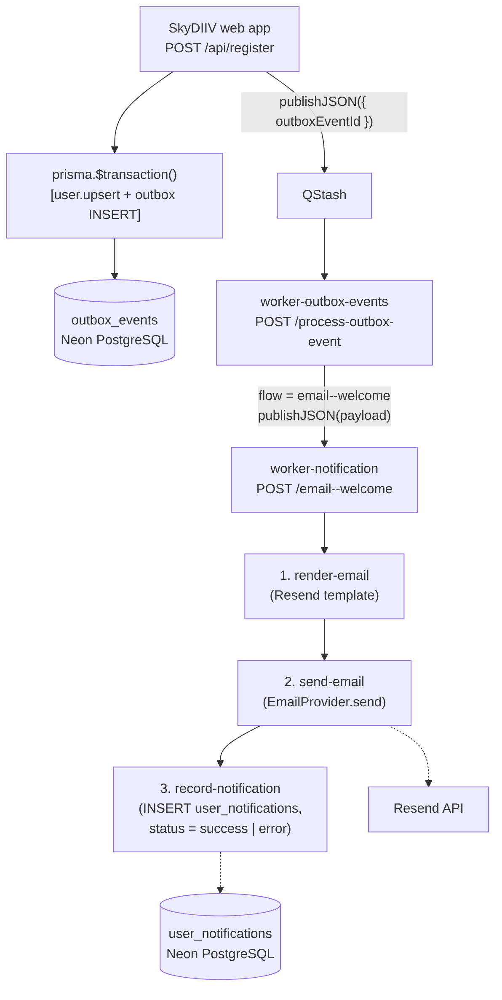

# email--welcome Workflow

This document describes the **email--welcome** workflow end to end: how it is triggered, what each step does, the email provider abstraction, the `user_notifications` write, and how it integrates with the SkyDIIV web app and `worker-outbox-events`.

---

## Overview

The **email--welcome** workflow sends the SkyDIIV welcome email to a newly-registered user and records the outcome in `user_notifications`.

**Hosted in:** `worker-notification` (Upstash Workflow)
**Endpoint:** `POST /email--welcome`
**Payload:** `{ "user_id": "<uuid>", "first_name": "Jane", "last_name": "Doe", "email": "jane@example.com" }`

It is a consumer of SkyDIIV's Transactional Outbox Pattern: on user registration the web app records an `email--welcome / user-account-creation` outbox event; `worker-outbox-events` dispatches it here.

---

## End-to-End Architecture



---

## Trigger

The workflow is triggered by `worker-outbox-events`, which routes outbox rows by `flow`:

| `flow` | Downstream | Endpoint | URL secret |
|---|---|---|---|
| `email--welcome` | `worker-notification` | `POST /email--welcome` | `WORKER_NOTIFICATION_URL` |

The outbox `payload` (written by the web app in `app/api/register/route.ts`) is forwarded verbatim as the workflow request body:

```json
{
  "user_id": "<uuid>",
  "first_name": "Jane",
  "last_name": "Doe",
  "email": "jane@example.com"
}
```

`first_name` and `last_name` are optional; `user_id` and a valid `email` are required. Invalid payloads throw before any email is sent.

---

## Steps

Source: `src/workflows/email--welcome/workflow.ts`. Each step is wrapped in `context.run("<step-name>", …)`, making it a **durable workflow step** — on failure only that step is retried, so a successful `send-email` is never re-sent when `record-notification` is retried.

### 1. `render-email`

`src/workflows/email--welcome/steps/render-email.ts`

Builds the email from the outbox payload and the Resend-compatible template
(`templates/resend/welcome/`). Resolves the user's UI locale from
`app_preferences.language_id` → `domains.name` (`pt-BR`, `en-US`, `es-PE`;
defaults to `pt-BR`). Reads `EMAIL_FROM` (required), optional `EMAIL_REPLY_TO`,
and the public app URL (`APP_URL` → `NEXT_PUBLIC_SITE_URL` →
`https://skydiiv.space`) for the CTA link. Returns
`{ to, from, replyTo?, subject, html, text }`.

**Subject** is always English, regardless of locale:

```
you're in — SkyDIIV
```

**Body** is rendered in the user's locale. Each locale has its own copy in
`templates/resend/welcome/copy.ts`. The English (`en-US`) version:

```
hey, {firstName}.

welcome to skydiiv — glad you made it here.

start by adding your pieces. the more your wardrobe grows,
the better the app gets at knowing your style.
there's no rush — just build it at your own pace.

[ start building your wardrobe ]

— skydiiv
```

The HTML template uses SkyDIIV design tokens (warm-white background, slate-blue
CTA, lowercase typography). The recipient first name is HTML-escaped.

### 2. `send-email`

`src/workflows/email--welcome/steps/send-email.ts`

Resolves the configured provider via `getEmailProvider()` and calls `send(...)`.
Returns a discriminated result instead of throwing:

- `{ ok: true, provider, messageId }` on success
- `{ ok: false, provider, error }` on failure — `error` is normalised by
  `normalize-send-error.ts` (codes like `provider_request_failed`,
  `missing_api_key`, `invalid_provider_response`, `send_failed`)

### 3. `record-notification`

`src/workflows/email--welcome/steps/record-notification.ts`

Always runs after `send-email`, persisting the outcome in `user_notifications`:

| Outcome | `notification_send_status` | `notification_metadata` |
|---|---|---|
| Send succeeded | `"success"` | `{ "message_id": "<resend id>", "locale": "pt-BR" }` |
| Send failed | `"error"` | `{ "error": { "code", "message", "provider", "status_code?", "response_body?" }, "locale": "pt-BR" }` |

```json
{
  "message_id": "abc-123",
  "locale": "pt-BR"
}
```

Example error metadata:

```json
{
  "locale": "pt-BR",
  "error": {
    "code": "provider_request_failed",
    "message": "Resend request failed: 422 — {\"message\":\"invalid from\"}",
    "provider": "resend",
    "status_code": 422,
    "response_body": "{\"message\":\"invalid from\"}"
  }
}
```

After recording an error row the workflow throws so the outbox consumer can
mark the event as `ERROR` and QStash can retry the delivery.

---

## The `user_notifications` Table

Owned by the SkyDIIV web app (Prisma model `UserNotification`, migration
`20260712000002_add_user_notifications`). This worker writes to it with raw SQL
via postgres.js on the **unpooled** endpoint (`DATABASE_URL_UNPOOLED`).

| Column | Type | Notes |
|---|---|---|
| `id` | UUID (PK) | `gen_random_uuid()` default |
| `user_id` | UUID (FK → `users.id`, cascade) | recipient |
| `notification_type` | TEXT | `"welcome"` |
| `notification_service` | TEXT | `"resend"` |
| `notification_metadata` | JSONB (nullable) | `{ message_id, locale }` on success; `{ error: { ... }, locale }` on failure |
| `notification_send_status` | enum `UserNotificationSendStatus` | `pending` \| `success` \| `error` |
| `created_at` | TIMESTAMPTZ | `CURRENT_TIMESTAMP` default |
| `created_by` | TEXT (nullable) | `"worker-notification"` |
| `updated_at` | TIMESTAMPTZ | set to `now()` on insert (no DB default) |
| `updated_by` | TEXT (nullable) | — |

> The status column is a PostgreSQL enum created by Prisma, so the insert casts
> the value: `${status}::"UserNotificationSendStatus"`.

---

## Email Provider Abstraction

Providers implement a minimal interface and register in a factory map:

```ts
export interface EmailProvider {
  readonly name: string
  send(input: SendEmailInput): Promise<SendEmailResult>
}
```

- `getEmailProvider(name?)`: explicit name → `EMAIL_PROVIDER` env → `"resend"`.
- Default: `ResendProvider` (`POST https://api.resend.com/emails`, `Authorization: Bearer $RESEND_API_KEY`), returning the Resend message id.
- Swap/extend: implement the interface and `registerEmailProvider("<name>", factory)`.

---

## Configuration

| Key | Kind | Required | Purpose |
|---|---|---|---|
| `WORKER_NOTIFICATION_URL` | secret | ✅ | serveMany callback base (origin, no path) |
| `QSTASH_CURRENT_SIGNING_KEY`, `QSTASH_NEXT_SIGNING_KEY` | secret | ✅ | Inbound signature verification |
| `QSTASH_URL`, `QSTASH_TOKEN` | secret | ✅ | Step delivery |
| `DATABASE_URL`, `DATABASE_URL_UNPOOLED` | secret | ✅ | `record-notification` insert |
| `RESEND_API_KEY` | secret | ✅ | Resend API auth |
| `EMAIL_FROM` | var | ✅ | Verified sender identity |
| `EMAIL_PROVIDER` | var | — | Provider selector (default `resend`) |
| `EMAIL_REPLY_TO` | var | — | Reply-To header |
| `APP_URL` | var | — | CTA link base (default `https://skydiiv.space`) |

---

## HTTP Responses

Handled by `@upstash/workflow` `serveMany`:

| Situation | Behaviour |
|---|---|
| Missing / invalid QStash signature | `401 Unauthorized` |
| Invalid payload (no `user_id` / bad `email`) | Workflow throws → error surfaced, QStash retry |
| Provider send failure | `send-email` returns `ok:false` → `record-notification` inserts `status=error` with structured `metadata.error` → workflow throws (QStash retry) |
| Success | Email sent, `user_notifications` row inserted with `status=success` |

---

## Local Testing

```bash
curl -X POST https://<tunnel-origin>/email--welcome \
  -H "Content-Type: application/json" \
  -d '{"user_id":"<USER_ID>","first_name":"Jane","last_name":"Doe","email":"jane@example.com"}'
```

See the [README](../README.md) for the full local-development setup (cloudflared tunnel + `.dev.vars`).

---

## Related

- [`apps/worker-outbox-events/docs/PROCESS_OUTBOX_EVENT.md`](../../worker-outbox-events/docs/PROCESS_OUTBOX_EVENT.md) — how the outbox dispatches this flow
- SkyDIIV web app: `docs/features/EMAIL_BOAS_VINDAS.md` — the producer side (registration → outbox → `user_notifications`)
