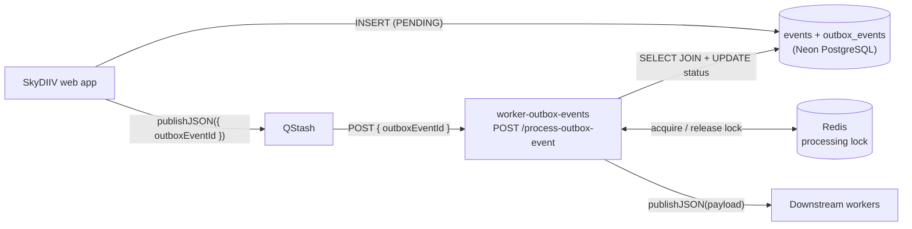

# worker-outbox-events

Cloudflare Worker that implements the processor side of SkyDIIV's Transactional Outbox Pattern. It receives outbox event IDs from QStash, reads the matching record from the database, dispatches the payload to the appropriate downstream worker, and marks the record as `SUCCESS` or `ERROR` when done — using **Upstash Workflow** durable steps so dispatch, status updates, and lock release can be retried independently.

| Endpoint | Description | Documentation |
|---|---|---|
| `POST /process-outbox-event` | Process one outbox event by ID | [docs/PROCESS_OUTBOX_EVENT.md](docs/PROCESS_OUTBOX_EVENT.md) |
| `GET /` | — | Health check → `{ status: "ok", timestamp }` |

Upstream publishing is handled by the **SkyDIIV web app**, which inserts a row into `outbox_events` (with `event_id` referencing the `events` catalog) inside a database transaction, then publishes the row's ID to QStash. This worker is the sole consumer.



---

## Services & Technologies

| Layer | Technology | Role |
|---|---|---|
| Runtime | [Cloudflare Workers](https://developers.cloudflare.com/workers/) (`nodejs_compat`) | Hosts this worker |
| Language | TypeScript 5 (strict) | Implementation |
| Inbound trigger | [Upstash QStash](https://upstash.com/docs/qstash) + [Upstash Workflow](https://upstash.com/docs/workflow) | Delivers signed `{ outboxEventId }` messages; durable step retries |
| Downstream dispatch | [Upstash QStash](https://upstash.com/docs/qstash) + [Cloudflare Queues](https://developers.cloudflare.com/queues/) HTTP API | Publishes to downstream workers (QStash) or to a per-event Cloudflare Queue (CF Queues) |
| Database | [Neon](https://neon.tech) PostgreSQL via [postgres.js](https://github.com/porsager/postgres) | Joins `outbox_events` ↔ `events`; updates status |
| Processing lock | [Upstash Redis](https://upstash.com/docs/redis) (REST API) | Per-event lock that prevents concurrent duplicate dispatches |
| Validation | [Zod](https://zod.dev/) | Request body validation |
| Dev / deploy | Wrangler 4 | Local dev and Cloudflare deployment |
| Testing | Vitest 4 | Unit tests |
| Linting | ESLint 10 + typescript-eslint | Code quality |
| CI/CD | GitHub Actions | Lint, test, deploy on push to `main` / `staging` |

---

## Project Structure

```
├── docs/
│   └── PROCESS_OUTBOX_EVENT.md             # Handler reference — full execution flow and routing
├── src/
│   ├── index.ts                            # Worker entry (health check + serveMany routing)
│   ├── workflows/
│   │   ├── index.ts                        # Workflow registry
│   │   └── process-outbox-event/
│   │       ├── workflow.ts                 # Durable workflow orchestration
│   │       └── steps/                      # acquire-lock, load-event, dispatch-event, mark-*, release-lock
│   └── lib/
│       ├── logger.ts                       # Structured JSON logger
│       ├── workflow-base-url.ts            # WORKER_OUTBOX_EVENTS_URL resolver
│       ├── qstash.ts                       # QStash client singleton
│       ├── dispatcher.ts                   # Routes (event_name, broker_name) → downstream via QStash / CF Queues
│       ├── downstream-urls.ts              # URL resolvers for QStash downstream workers
│       ├── cloudflare-queues.ts            # CF Queues HTTP publish helper
│       ├── cache/
│       │   ├── redis.ts                    # Upstash REST primitives (exists, set, del)
│       │   └── outbox-processing-cache.ts  # Per-event processing lock
│       └── db/
│           ├── client.ts                   # postgres.js singleton
│           └── outbox-events.repository.ts # findById (JOIN events) + updateStatus
├── tests/unit/
│   ├── index.test.ts
│   ├── workflows-registry.test.ts
│   ├── workflow-base-url.test.ts
│   ├── process-outbox-event-workflow.test.ts
│   ├── process-outbox-event-steps.test.ts
│   ├── dispatcher.test.ts
│   ├── cloudflare-queues.test.ts
│   ├── outbox-events-repository.test.ts
│   ├── downstream-urls.test.ts
│   ├── outbox-processing-cache.test.ts
│   └── redis.test.ts
├── wrangler.toml
├── .env.example                            # Copy to .dev.vars for local dev
└── package.json
```

---

## Adding a New Event

1. Seed the new event in the SkyDIIV web `events` catalog and add it to `EVENTS` in `app/lib/outbox.ts`.

2. Add the new `(event_name, broker_name)` pair to `OUTBOX_ROUTES` in `src/lib/dispatcher.ts` and add a `case` to the `dispatch()` switch.

For a **QStash** downstream worker:

```ts
case outboxRouteKey(
  OUTBOX_ROUTES.MY_NEW_EVENT_QSTASH.eventName,
  OUTBOX_ROUTES.MY_NEW_EVENT_QSTASH.brokerName,
): {
  const client = getQStashClient()
  const url = resolveMyWorkerUrl("/my-endpoint")
  await client.publishJSON({ url, body: event.payload })
  break
}
```

For a **CF Queues** route (one queue ID env per event):

```ts
SCRAPE_SHOPPING_SUGGESTIONS_CF_QUEUES: {
  eventName: "scrape-shopping-suggestions",
  brokerName: BROKER_NAMES.CF_QUEUES,
  queueIdEnv: "CF_SCRAPE_SHOPP_SUGG_QUEUE_ID",
},

// in dispatch():
case outboxRouteKey(...): {
  const queueId = resolveCfQueueId(
    OUTBOX_ROUTES.SCRAPE_SHOPPING_SUGGESTIONS_CF_QUEUES.queueIdEnv,
  )
  await publishToCloudflareQueue(
    { event: event.event_name, payload: event.payload },
    queueId,
  )
  break
}
```

3. If the downstream is a new QStash worker, add a URL resolver in `src/lib/downstream-urls.ts`:

```ts
export function resolveMyWorkerUrl(path: string): string {
  return resolveWorkerUrl("MY_WORKER_URL", path)
}
```

4. Add the new secrets (`MY_WORKER_URL` and/or `CF_*`) to `wrangler.toml`, `.env.example`, and the GitHub Actions environment secrets.

5. Add a test case in `tests/unit/dispatcher.test.ts`.

6. Update `docs/PROCESS_OUTBOX_EVENT.md` if any routing or configuration details change.

---

## Security

- No end-user authentication — internal automation only
- All inbound requests must carry a QStash signature (`upstash-signature` header); unsigned or invalid requests receive `401`
- `GET /` is the only unsigned endpoint (health check)
- Secrets (`DATABASE_URL`, `QSTASH_*`, `UPSTASH_REDIS_*`, worker URLs) are Cloudflare Worker secrets — never in source control

---

## Getting Started

### Prerequisites

- Node.js 22+
- Wrangler 4
- Cloudflare Workers account
- Upstash QStash account (signing keys + publish token)
- Upstash Redis instance (shared with the SkyDIIV web app; used for the processing lock)
- Neon PostgreSQL database (shared with the SkyDIIV web app)
- Deployed downstream workers (`worker-sync`, `worker-notification`) and/or CF Queues credentials for registered CF Queues routes

### Local Development

```bash
npm install
cp .env.example .dev.vars   # fill in secrets
npm run dev                 # http://localhost:8787
```

The endpoint requires a valid QStash signature. For end-to-end testing, expose the local worker via a tunnel and trigger from the Upstash console or CLI:

```bash
cloudflared tunnel --url http://localhost:8787
```

Then publish a test message from the Upstash console or with `curl` through a signed QStash request.

### Tests & Lint

```bash
npm test
npm run test:watch
npm run test:coverage
npm run lint
npm run lint:fix
```

---

## Configuration

### `wrangler.toml`

| Setting | Value |
|---|---|
| Worker name (production) | `worker-outbox-events` |
| Worker name (staging) | `worker-outbox-events-staging` |
| Entry point | `src/index.ts` |
| Compatibility date | `2025-01-01` |
| Compatibility flags | `nodejs_compat` |

### Secrets

Set via `wrangler secret put <KEY>` in production, or `.dev.vars` locally. See `.env.example` for the full list.

| Secret | Used by |
|---|---|
| `QSTASH_CURRENT_SIGNING_KEY`, `QSTASH_NEXT_SIGNING_KEY` | Inbound signature verification (via Upstash Workflow) |
| `QSTASH_URL`, `QSTASH_TOKEN` | Downstream dispatch via QStash |
| `WORKER_OUTBOX_EVENTS_URL` | This worker's origin for Upstash Workflow step callbacks |
| `DATABASE_URL` | Reading and updating status on rows in `outbox_events` |
| `UPSTASH_REDIS_REST_URL`, `UPSTASH_REDIS_REST_TOKEN` | Processing lock (or `REDIS_URL` as alternative) |
| `WORKER_SYNC_URL` | Dispatch target for event `language-changed` (QStash) |
| `WORKER_NOTIFICATION_URL` | Dispatch target for event `user-account-created` (QStash) |
| `CF_ACCOUNT_ID` | Cloudflare account for CF Queues publish |
| `CF_SCRAPE_SHOPP_SUGG_QUEUE_ID` | Queue ID for `scrape-shopping-suggestions` |
| `CF_QUEUES_API_TOKEN` | Token with Queues Edit (publish) |

`WORKER_SYNC_URL` and `WORKER_NOTIFICATION_URL` are the worker origins only (no path). The dispatcher appends the endpoint path automatically:

```
{WORKER_SYNC_URL}/sync/language
{WORKER_NOTIFICATION_URL}/email--welcome
```

`scrape-shopping-suggestions` publishes `{ event, payload }` to `CF_SCRAPE_SHOPP_SUGG_QUEUE_ID` (consumed by `consumer-shopping-suggestions`).

---

## Deployment

CI runs lint + test on PRs; deploys on push to `staging` or `main` when files under `apps/worker-outbox-events/` change (`.github/workflows/deploy-worker-outbox-events.yml`).

```bash
npm run deploy                  # production
npm run deploy -- --env staging # staging
```

After the first deploy, set `WORKER_OUTBOX_EVENTS_URL` in the SkyDIIV web app to this worker's origin (no path):

```bash
wrangler deployments list
# then set in the web app: WORKER_OUTBOX_EVENTS_URL=https://worker-outbox-events.<subdomain>.workers.dev
```

### GitHub Secrets (deploy)

| Secret | Description |
|---|---|
| `CLOUDFLARE_API_TOKEN` | Workers deploy permissions |
| `CLOUDFLARE_ACCOUNT_ID` | Cloudflare account ID |
| `DATABASE_URL` | Neon pooled connection string |
| `QSTASH_TOKEN` | QStash API token |
| `QSTASH_CURRENT_SIGNING_KEY` | QStash current signing key |
| `QSTASH_NEXT_SIGNING_KEY` | QStash next signing key |
| `UPSTASH_REDIS_REST_URL` | Upstash Redis REST URL (processing lock) |
| `UPSTASH_REDIS_REST_TOKEN` | Upstash Redis REST token |
| `WORKER_SYNC_URL` | `worker-sync` origin (no path) |
| `WORKER_NOTIFICATION_URL` | `worker-notification` origin (no path) |
| `CF_ACCOUNT_ID` | Cloudflare account ID (CF Queues) |
| `CF_SCRAPE_SHOPP_SUGG_QUEUE_ID` | Cloudflare Queue ID for scrape-shopping-suggestions |
| `CF_QUEUES_API_TOKEN` | Cloudflare API token with Queues Edit |
