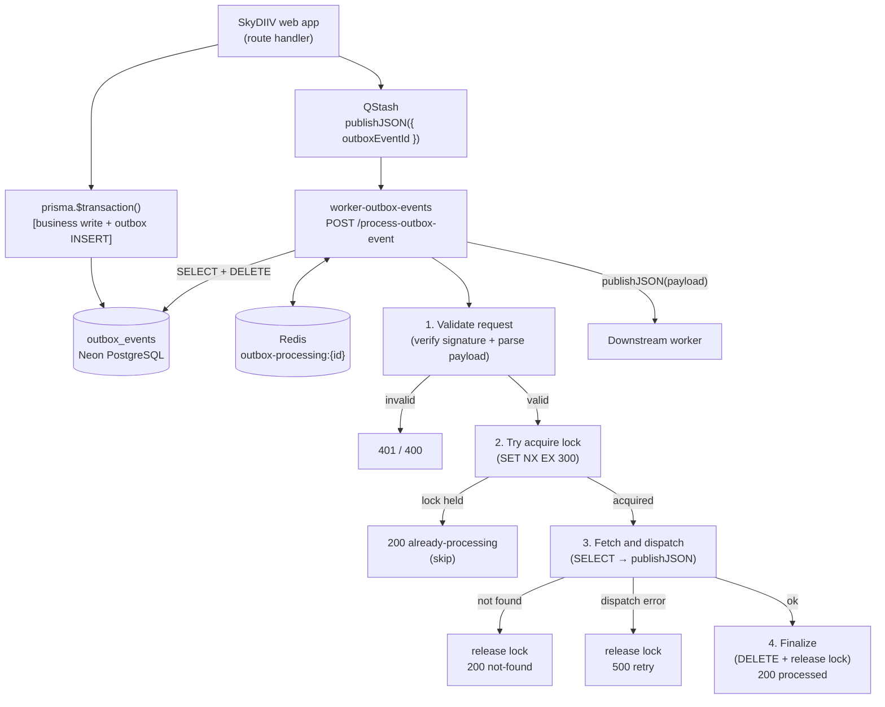
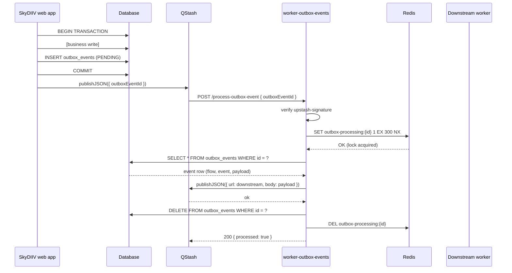

# Process Outbox Event

This document describes the **process-outbox-event** handler end to end: how it is triggered, what each step does, the processing lock strategy, routing by flow, and how it integrates with the SkyDIIV web app and downstream workers.

---

## Overview

The **process-outbox-event** handler receives an outbox event ID via a signed QStash message, reads the matching row from the `outbox_events` table, dispatches the stored payload to the appropriate downstream worker, and deletes the row when done.

**Hosted in:** `worker-outbox-events`  
**Endpoint:** `POST /process-outbox-event`  
**Payload:** `{ "outboxEventId": "<uuid>" }`

It is the consumer side of SkyDIIV's Transactional Outbox Pattern. The SkyDIIV web app produces events inside database transactions and publishes their IDs to QStash; this worker ensures each event is dispatched exactly once to the correct downstream worker.

---

## End-to-End Architecture



---

## Triggering

This endpoint is invoked exclusively by QStash. Producers publish a message after inserting an outbox event:

| Producer | When |
|---|---|
| SkyDIIV web app | Immediately after a successful transaction that inserts an outbox event |
| `worker-scheduler` (`catch-up-outbox-events` flow) | On schedule via `POST /schedule/catch-up-outbox-events` — re-enqueues `PENDING` rows older than `OUTBOX_CATCHUP_MIN_AGE_MINUTES` (default 10 min) |

```
# Single event
QStash.publishJSON({ url: "{WORKER_OUTBOX_EVENTS_URL}/process-outbox-event", body: { outboxEventId } })

# Batch (up to 100 per call)
QStash.batchJSON([{ url, body: { outboxEventId } }, ...])
```

The web app and `worker-scheduler` set `WORKER_OUTBOX_EVENTS_URL` to this worker's origin (no path). QStash signs every delivery and retries on `5xx` responses with exponential backoff.

See [CATCH_UP_OUTBOX_EVENTS.md](../../worker-scheduler/docs/CATCH_UP_OUTBOX_EVENTS.md) for the catch-up flow details.

---

## Handler Execution Flow

**Source:** `src/handlers/process-outbox-event.ts`

### Step 1 — Validate request

Reads the `upstash-signature` header and verifies it with the QStash receiver singleton (`getQStashReceiver()`), then parses and validates the request body.

- Missing `upstash-signature` header → `401 Unauthorized`
- Invalid signature or verification error → `401 Unauthorized`
- Invalid JSON or missing / empty `outboxEventId` → `400 Bad Request`

No further logic executes on rejected requests — no side effects of any kind before this step completes successfully.

---

### Step 2 — Try to acquire processing lock

Atomically sets `outbox-processing:{outboxEventId}` in Redis with a **5-minute TTL** only if the key does not already exist (`SET NX EX`).

- Key **already existed** → another invocation is already processing this event → `200 { processed: false, reason: "already-processing", outboxEventId }`
- Key **set successfully** → lock acquired, processing continues

This prevents two concurrent QStash deliveries for the same event from both dispatching to the downstream worker. The TTL acts as a safety net: if the worker crashes before Step 4, the lock expires automatically so future retries can proceed.

---

### Step 3 — Fetch and dispatch

Queries `outbox_events` for the row with the given ID:

```sql
SELECT id, flow, event, payload, status, created_at, created_by, updated_at, updated_by
FROM outbox_events
WHERE id = $1
LIMIT 1
```

- Row **not found** → releases lock → `200 { processed: false, reason: "not-found", outboxEventId }`

A `not-found` result means the event was already processed and deleted by a previous invocation. Returning `200` prevents QStash from scheduling another retry.

If the row is found, calls `dispatch(event)` in `src/lib/dispatcher.ts`, which switches on `event.flow` and publishes `event.payload` verbatim to the registered downstream worker via QStash.

The `payload` stored in `outbox_events` is forwarded as-is — it carries exactly the fields the downstream worker expects.

- Unknown flow → throws → releases lock → `500 Internal Server Error`
- QStash publish error → releases lock → `500 Internal Server Error`

Returning `500` on dispatch failure causes QStash to retry the delivery. The lock is always released on failure so retries can acquire it and reprocess.

---

### Step 4 — Finalize: delete outbox event and release lock

```sql
DELETE FROM outbox_events WHERE id = $1
```

If the DELETE fails, the error is logged but the handler **does not return `5xx`** — returning `500` would cause QStash to retry the entire handler, re-dispatching to the downstream worker and producing a duplicate.

After the delete attempt (successful or not), `outbox-processing:{outboxEventId}` is deleted from Redis and the handler returns `200 { processed: true, outboxEventId, flow, event }`.

The tradeoff: if the DELETE fails, the row remains in `outbox_events` as an orphan. If QStash happens to retry anyway (e.g. a delivery timeout where it never received the `200`), it would find the row still present and re-dispatch — the lock provides no protection because it was released. This is an accepted risk; the `200` response minimises the probability of a QStash-initiated retry while accepting that delivery-timeout edge cases may cause a duplicate downstream invocation.

---

## Payload

```typescript
export type ProcessOutboxEventPayload = {
  outboxEventId: string
}
```

**Example request body:**

```json
{ "outboxEventId": "d4b3c2a1-0000-0000-0000-000000000001" }
```

---

## Routing by Flow

Routing logic lives in `src/lib/dispatcher.ts`. The `dispatch()` function switches on `event.flow` — read directly from the database row — and publishes `event.payload` verbatim to the corresponding downstream worker endpoint.

To add a new flow, see [Adding a New Flow](../README.md#adding-a-new-flow) in the main README.

---

## HTTP Responses

| Situation | Status | Body |
|---|---|---|
| Missing or invalid QStash signature | `401` | `Unauthorized` |
| Invalid or missing `outboxEventId` | `400` | `Bad Request` |
| Event already being processed (Redis lock present) | `200` | `{ processed: false, reason: "already-processing", outboxEventId }` |
| Event not found in database (already deleted) | `200` | `{ processed: false, reason: "not-found", outboxEventId }` |
| Dispatch failed (unknown flow or QStash error) | `500` | `Internal Server Error` |
| Successfully processed | `200` | `{ processed: true, outboxEventId, flow, event }` |

---

## Idempotency and Processing Lock

### Processing lock

The Redis key `outbox-processing:{outboxEventId}` is used as a short-lived mutex:

| Event | Lock action |
|---|---|
| Processing starts | Atomically acquired via SET NX EX (TTL: 5 min) — skips if key already exists |
| Event not found in DB | Released |
| Dispatch fails | Released (so QStash retries can proceed) |
| Processing completes successfully | Released |
| Worker crashes before release | Expires automatically after TTL |

### Duplicate delivery handling

QStash may deliver the same message more than once under certain retry conditions. The lock prevents two concurrent invocations from both dispatching the same event. Once the first invocation succeeds and deletes the row, any subsequent invocation will find either the lock held (if still in progress) or the row gone (`not-found` → `200`).

### Delete failure after successful dispatch

If the DELETE query fails after a successful dispatch, the lock is still released and the handler returns `200`. The row remains in `outbox_events`.

Returning `200` prevents QStash from scheduling an automatic retry (which would re-dispatch). However, if QStash did not receive the `200` (e.g. a delivery timeout), it may retry regardless — and since the row is still present and the lock is gone, that retry would re-dispatch to the downstream worker. This is an accepted edge case: the `200` minimises the probability of a duplicate while avoiding making it a certainty with a `500`.

---

## Error Handling and Operational Behavior

### Failure modes

| Step | Fatal? | Behavior |
|---|---|---|
| Missing `upstash-signature` | ✅ Fatal | `401` — no further processing |
| Invalid QStash signature | ✅ Fatal | `401` — no further processing |
| Invalid payload | ✅ Fatal | `400` — no lock acquired |
| Redis SET NX failure | ✅ Fatal | Error propagates (unhandled; QStash retries) |
| Outbox event not found | ❌ Non-fatal | `200 not-found` — lock released |
| Unknown flow | ✅ Fatal | `500` — lock released |
| QStash publish failure | ✅ Fatal | `500` — lock released |
| Database DELETE failure | ❌ Non-fatal | Error logged; `200` returned; lock released |

### Idempotency summary

| Scenario | Outcome |
|---|---|
| Same event delivered twice concurrently | Second invocation skipped (`already-processing`) |
| Same event delivered after successful processing | Row gone → `not-found` → `200`, no duplicate dispatch |
| Dispatch succeeded but DELETE failed | `200` returned; lock released; row remains in DB — a QStash delivery-timeout retry may re-dispatch |
| Worker crashes mid-process | Lock expires after 5 min; QStash retry proceeds normally |

### Logging

All steps emit structured JSON via `createLogger("process-outbox-event")`. Log fields include `outboxEventId`, `flow`, `event`, and `error` where applicable.

---

## Configuration

### Worker secrets

Set via `wrangler secret put <KEY>` (production) or `.dev.vars` (local):

| Variable | Required | Used by |
|---|---|---|
| `QSTASH_CURRENT_SIGNING_KEY` | ✅ | Inbound signature verification |
| `QSTASH_NEXT_SIGNING_KEY` | ✅ | Key rotation |
| `QSTASH_URL` | — | QStash client (optional base URL override) |
| `QSTASH_TOKEN` | ✅ | Downstream dispatch |
| `DATABASE_URL` | ✅ | `outbox_events` SELECT + DELETE |
| `UPSTASH_REDIS_REST_URL` | ✅ | Processing lock (or use `REDIS_URL`) |
| `UPSTASH_REDIS_REST_TOKEN` | ✅ | Processing lock (or use `REDIS_URL`) |

One downstream worker URL secret is required per registered flow in `src/lib/dispatcher.ts`. See the [Secrets](../README.md#secrets) section in the main README for the current list.

### Web app secrets (separate deployment)

| Variable | Purpose |
|---|---|
| `WORKER_OUTBOX_EVENTS_URL` | This worker's origin — web app appends `/process-outbox-event` |

---

## Security

- No end-user authentication — internal automation only
- All inbound requests are verified against the QStash signature before any database or Redis access
- `GET /` is the only unsigned endpoint (health check)
- `outboxEventId` comes from the verified QStash payload — the worker never trusts unverified client input
- All secrets are Cloudflare Worker secrets, never in source control

---

## Source File Map

```
apps/worker-outbox-events/
├── src/
│   ├── index.ts                                 # Worker entry; env injection + routing
│   ├── handlers/
│   │   └── process-outbox-event.ts              # Full handler — 4 steps
│   └── lib/
│       ├── logger.ts                            # Structured JSON logger
│       ├── qstash.ts                            # QStash client + receiver singletons
│       ├── dispatcher.ts                        # Flow → downstream routing
│       ├── downstream-urls.ts                   # URL resolvers for downstream workers
│       ├── cache/
│       │   ├── redis.ts                         # Upstash REST primitives (exists / set / del)
│       │   └── outbox-processing-cache.ts       # acquire / check / release lock
│       └── db/
│           ├── client.ts                        # postgres.js singleton
│           └── outbox-events.repository.ts      # findById + deleteById
```

---

## Testing

Unit tests cover all critical paths:

| Test file | Coverage |
|---|---|
| `tests/unit/index.test.ts` | Worker routing (health check, endpoint dispatch, 404) |
| `tests/unit/process-outbox-event.test.ts` | Full handler orchestration (auth, lock, fetch, dispatch, delete) |
| `tests/unit/dispatcher.test.ts` | Flow routing, payload forwarding, unknown flow error |
| `tests/unit/outbox-events-repository.test.ts` | `findById` (found / not-found) and `deleteById` |
| `tests/unit/downstream-urls.test.ts` | URL composition and missing env var errors |
| `tests/unit/outbox-processing-cache.test.ts` | Lock check, acquire, release |
| `tests/unit/redis.test.ts` | Upstash REST primitives (exists, set with/without TTL, del) |

Run from `apps/worker-outbox-events/`:

```bash
npm test
npm run test:coverage
```

---

## Sequence Diagram



---

## Related Documentation

- [`README.md`](../README.md) — worker setup, deployment, adding new flows
- [`apps/worker-sync/README.md`](../../worker-sync/README.md) — `sync-language` workflow reference
- [`apps/worker-ai-workflows/docs/WEEKLY_OUTFITS_WORKFLOW.md`](../../worker-ai-workflows/docs/WEEKLY_OUTFITS_WORKFLOW.md) — `generate-weekly-outfits` workflow reference
