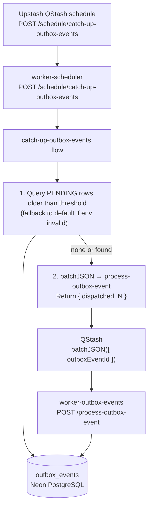

# Catch Up Outbox Events

This document describes the **catch-up-outbox-events** scheduled flow end to end: how it is triggered, which records it selects, how it re-enqueues work to `worker-outbox-events`, and how it fits into SkyDIIV's Transactional Outbox Pattern.

---

## Overview

The **catch-up-outbox-events** flow scans the `outbox_events` table for `PENDING` rows that have been sitting longer than a configurable threshold, then re-publishes each row's ID to `worker-outbox-events` via QStash so the normal **process-outbox-event** handler can pick them up.

**Hosted in:** `worker-scheduler`  
**Endpoint:** `POST /schedule/catch-up-outbox-events`  
**Flow name:** `catch-up-outbox-events`  
**Downstream:** `POST /process-outbox-event` on `worker-outbox-events`  
**Payload per message:** `{ "outboxEventId": "<uuid>" }`

It is a safety net for orphaned outbox rows — for example when the web app's initial QStash publish failed, or when **process-outbox-event** returned `200` after a successful dispatch but the row was not deleted.

---

## End-to-End Architecture



---

## Triggering

The flow is invoked exclusively via **`POST /schedule/catch-up-outbox-events`**, wired in `src/index.ts` to `handleCatchUpOutboxEventsSchedule`. The actual frequency is configured entirely in Upstash QStash.

Recommended: create a QStash schedule pointing at `/schedule/catch-up-outbox-events` on a short interval (every 15–30 minutes) so stale events are picked up promptly.

---

## Handler and Flow Execution

**Handler:** `src/handlers/catch-up-outbox-events.schedule.ts`  
**Flow:** `src/flows/catch-up-outbox-events.flow.ts`

### Step 1 — Verify QStash signature

Same auth rules as weekday endpoints — unsigned or invalid requests get `401`.

### Step 2 — Query stale PENDING events

Resolves `OUTBOX_CATCHUP_MIN_AGE_MINUTES` from the environment (defaults to **10**; invalid values fall back to the default) and queries `outbox_events` for matching rows:

```sql
SELECT id
FROM outbox_events
WHERE status = 'PENDING'
  AND created_at < $cutoff   -- now minus resolved min age
ORDER BY created_at ASC
```

Only `PENDING` rows are eligible. Rows already being processed or successfully deleted are not returned.

### Step 3 — Batch-publish and report result

For each stale event, publishes a signed QStash message:

```
POST {WORKER_OUTBOX_EVENTS_URL}/process-outbox-event
{ "outboxEventId": "<uuid>" }
```

Messages are batched in groups of **100** (QStash limit). The downstream **process-outbox-event** handler applies its own Redis lock, routing, and delete logic — this flow does not dispatch payloads directly.

When no stale events are found, dispatch is skipped and `dispatched` is `0`.

Returns `{ status: "ok", flow: "catch-up-outbox-events", dispatched: <count> }` on success, or `500` with `{ status: "error", error }` on failure.

---

## Idempotency and Safety

| Scenario | Outcome |
|---|---|
| Catch-up re-enqueues an event already being processed | **process-outbox-event** returns `200 already-processing` — no duplicate dispatch |
| Catch-up re-enqueues an event already processed | Row gone → `200 not-found` — no duplicate dispatch |
| Same stale row appears in two catch-up runs | Both publish `{ outboxEventId }`; the lock in **process-outbox-event** prevents concurrent duplicate dispatch |
| Threshold too low (< initial publish latency) | May re-enqueue events the web app just published — harmless due to downstream lock |

The minimum age threshold (default 10 minutes) avoids racing with the web app's normal publish path immediately after insert.

---

## Configuration

### Worker secrets / vars

Set via `wrangler secret put <KEY>` (production) or `.dev.vars` (local):

| Variable | Required | Default | Used by |
|---|---|---|---|
| `DATABASE_URL` | ✅ | — | Stale-event query |
| `QSTASH_TOKEN` | ✅ | — | Outbound QStash publish |
| `QSTASH_URL` | — | — | QStash client (optional base URL override) |
| `WORKER_OUTBOX_EVENTS_URL` | ✅ | — | Target origin — flow appends `/process-outbox-event` |
| `OUTBOX_CATCHUP_MIN_AGE_MINUTES` | — | `10` | Minimum age before a PENDING row is eligible (invalid values fall back to default) |
| `QSTASH_CURRENT_SIGNING_KEY` | ✅ | — | Inbound signature verification |
| `QSTASH_NEXT_SIGNING_KEY` | ✅ | — | Key rotation |

`WORKER_OUTBOX_EVENTS_URL` is the worker-outbox-events origin only (no path):

```
{WORKER_OUTBOX_EVENTS_URL}/process-outbox-event
```

### External schedule

After deploying, create a QStash schedule in the [Upstash Console](https://console.upstash.com/qstash):

```
https://worker-scheduler.<subdomain>.workers.dev/schedule/catch-up-outbox-events
```

Configure the CRON expression for the desired catch-up frequency (for example every 30 minutes).

---

## Source Files

```
apps/worker-scheduler/
├── src/
│   ├── handlers/
│   │   └── catch-up-outbox-events.schedule.ts  # Dedicated endpoint handler
│   ├── flows/
│   │   └── catch-up-outbox-events.flow.ts      # Flow + dispatchStaleOutboxEvents()
│   └── lib/
│       ├── outbox-catchup-config.ts            # OUTBOX_CATCHUP_MIN_AGE_MINUTES parser
│       ├── verify-qstash-request.ts            # Shared QStash auth helper
│       ├── worker-outbox-events-url.ts         # WORKER_OUTBOX_EVENTS_URL resolver
│       └── db/
│           └── outbox-events.repository.ts     # findStalePendingEvents()
└── tests/unit/
    ├── catch-up-outbox-events-schedule.test.ts
    ├── catch-up-outbox-events-flow.test.ts
    ├── catch-up-dispatch.test.ts
    ├── outbox-events-repository.test.ts
    ├── outbox-catchup-config.test.ts
    └── worker-outbox-events-url.test.ts
```

---

## Testing

| Test file | Coverage |
|---|---|
| `catch-up-outbox-events-schedule.test.ts` | Dedicated endpoint handler (auth, success, errors) |
| `catch-up-outbox-events-flow.test.ts` | Flow orchestration (query, config, dispatch, errors) |
| `catch-up-dispatch.test.ts` | QStash batching, URL, headers |
| `outbox-events-repository.test.ts` | `findStalePendingEvents` and `findPendingOlderThan` |
| `outbox-catchup-config.test.ts` | Env var parsing and validation |
| `worker-outbox-events-url.test.ts` | URL resolver |

Run from `apps/worker-scheduler/`:

```bash
npm test
```

---

## Related Documentation

- [worker-scheduler README](../README.md) — endpoints, registry, deployment
- [PROCESS_OUTBOX_EVENT.md](../../worker-outbox-events/docs/PROCESS_OUTBOX_EVENT.md) — downstream handler this flow re-enqueues
