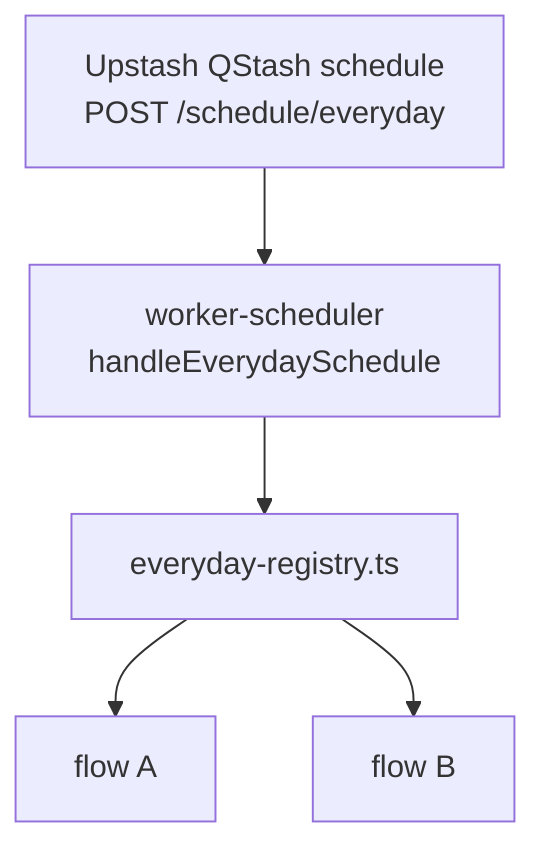

# Everyday Schedule

This document describes the **`POST /schedule/everyday`** endpoint: how it is triggered, how multiple flows are registered and executed, and how to add new daily jobs.

---

## Overview

The everyday endpoint is a **daily schedule slot** in `worker-scheduler`. A single QStash CRON can trigger every flow registered for this route. Flows run **in parallel** — one failing does not stop the others.

**Hosted in:** `worker-scheduler`  
**Endpoint:** `POST /schedule/everyday`  
**Handler:** `src/handlers/everyday.schedule.ts`  
**Registry:** `src/flows/everyday-registry.ts`

---

## Registered Flows

| Flow | Source | Doc |
|---|---|---|
| `neon-database-snapshot` | `src/flows/neon-database-snapshot.flow.ts` | [NEON_DATABASE_SNAPSHOT.md](NEON_DATABASE_SNAPSHOT.md) |

To add another daily job, implement a `ScheduleFlow` and append it to `everydayFlowRegistry` in `src/flows/everyday-registry.ts`. No routing changes are required.

---

## End-to-End Architecture



---

## Triggering

The endpoint is invoked exclusively via **`POST /schedule/everyday`**, wired in `src/index.ts`. The actual frequency is configured entirely in Upstash QStash.

Recommended: create one QStash schedule pointing at `/schedule/everyday` once per day (for example `0 6 * * *` UTC).

---

## Handler Execution

**Handler:** `src/handlers/everyday.schedule.ts`

### Step 1 — Verify QStash signature

Same auth rules as weekday endpoints — unsigned or invalid requests get `401`.

### Step 2 — Resolve registered flows

Loads all flows from `getEverydayFlows()` (`src/flows/everyday-registry.ts`).

### Step 3 — Run flows in parallel

Each flow's `run()` is awaited independently. Errors are captured per flow.

### Step 4 — Return aggregate result

| Situation | HTTP status | Response shape |
|---|---|---|
| No flows registered | `200` | `{ "flows": [] }` |
| All flows succeeded | `200` | `{ "flows": [{ "status": "ok", "flow": "...", ... }] }` |
| Some flows failed | `207` | Mix of `status: "ok"` and `status: "error"` entries |
| All flows failed | `500` | All entries have `status: "error"` |

---

## QStash Schedule Setup

After deploying, create a schedule in the [Upstash Console](https://console.upstash.com/qstash):

```
https://worker-scheduler.<subdomain>.workers.dev/schedule/everyday
```

Example CRON: daily at 06:00 UTC (`0 6 * * *`).

---

## Adding a New Flow

1. Implement `ScheduleFlow` in `src/flows/`:

```ts
import type { FlowResult, ScheduleFlow } from "./types"

export const myDailyFlow: ScheduleFlow = {
  name: "my-daily-flow",
  async run(): Promise<FlowResult> {
    return { flow: "my-daily-flow", processed: 0 }
  },
}
```

2. Register it in `src/flows/everyday-registry.ts`:

```ts
export const everydayFlowRegistry: ScheduleFlow[] = [
  neonDatabaseSnapshotFlow,
  myDailyFlow,
]
```

3. Add unit tests for the new flow and, if needed, document it under `docs/`.

---

## Related Files

```
src/
├── handlers/everyday.schedule.ts
├── flows/
│   ├── everyday-registry.ts
│   └── neon-database-snapshot.flow.ts
tests/unit/
├── everyday-schedule.test.ts
└── everyday-registry.test.ts
```
