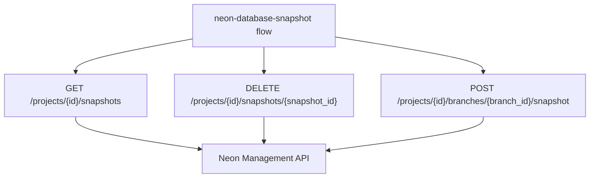

# Neon Database Snapshot

This document describes the **neon-database-snapshot** flow: how it rotates the Neon manual snapshot and which environment variables it requires.

---

## Overview

The **neon-database-snapshot** flow rotates the project's single manual Neon snapshot by deleting any existing snapshots and creating a new one named `skydiiv-daily-YYYY-MM-DD` (UTC).

**Hosted in:** `worker-scheduler`  
**Flow name:** `neon-database-snapshot`  
**Registry:** `src/flows/everyday-registry.ts` (runs on `POST /schedule/everyday`)  
**External API:** [Neon Management API](https://neon.com/docs/reference/api-reference)

On the Neon Free plan only **one manual snapshot** is allowed at a time. Rotation (delete → create) is required when creating snapshots on a schedule.

> This flow keeps a **single recent checkpoint inside Neon**. It does not replace off-platform backups (`pg_dump` → R2/S3) for long-term retention or disaster recovery.

See [EVERYDAY_SCHEDULE.md](EVERYDAY_SCHEDULE.md) for how this flow fits into the everyday endpoint alongside other daily jobs.

---

## Flow Architecture



---

## Flow Execution

**Flow:** `src/flows/neon-database-snapshot.flow.ts`  
**Neon client:** `src/lib/neon/snapshots.ts`

### Step 1 — List existing snapshots

Reads `NEON_API_KEY`, `NEON_PROJECT_ID`, and `NEON_BRANCH_ID` from the environment, then lists current snapshots:

```
GET https://console.neon.tech/api/v2/projects/{project_id}/snapshots
```

### Step 2 — Delete all existing snapshots

For each snapshot returned:

```
DELETE https://console.neon.tech/api/v2/projects/{project_id}/snapshots/{snapshot_id}
```

On the Free plan this is typically zero or one snapshot.

### Step 3 — Create the new daily snapshot

```
POST https://console.neon.tech/api/v2/projects/{project_id}/branches/{branch_id}/snapshot
{ "name": "skydiiv-daily-YYYY-MM-DD" }
```

API calls retry automatically on `423 Locked`, `429 Too Many Requests`, and `503 Service Unavailable` (up to 5 attempts with exponential backoff).

### Step 4 — Return result

On success, the flow returns:

```json
{
  "flow": "neon-database-snapshot",
  "deletedSnapshotIds": ["..."],
  "createdSnapshotId": "...",
  "createdSnapshotName": "skydiiv-daily-YYYY-MM-DD"
}
```

The everyday handler wraps this in `{ "flows": [{ "status": "ok", ... }] }`.

---

## Configuration

Set via `wrangler secret put <KEY>` in production, or `.dev.vars` locally. See `.env.example`.

| Secret | Used by |
|---|---|
| `NEON_API_KEY` | Neon Management API authentication |
| `NEON_PROJECT_ID` | Target Neon project |
| `NEON_BRANCH_ID` | Root branch to snapshot |

Find IDs in the [Neon Console](https://console.neon.tech) or via `GET /api/v2/projects`.

Create an API key at **Account Settings → API keys**.

---

## Limitations (Neon Free plan)

| Constraint | Impact |
|---|---|
| 1 manual snapshot at a time | Rotation required; only the latest snapshot is kept |
| No automated backup schedule | This flow replaces Neon's paid-plan schedule |
| Snapshot stays on Neon | Not off-platform redundancy |
| PITR still 6 hours | Separate from manual snapshots |

---

## Restore

To restore from a snapshot, use the Neon Console **Backup & restore** page or the [Restore snapshot API](https://neon.com/docs/reference/api-reference).

Test restores periodically in a separate Neon project before relying on this in production.

---

## Related Files

```
src/
├── flows/neon-database-snapshot.flow.ts
└── lib/neon/
    ├── config.ts
    └── snapshots.ts
tests/unit/
├── neon-config.test.ts
├── neon-database-snapshot-flow.test.ts
└── neon-snapshots.test.ts
```
