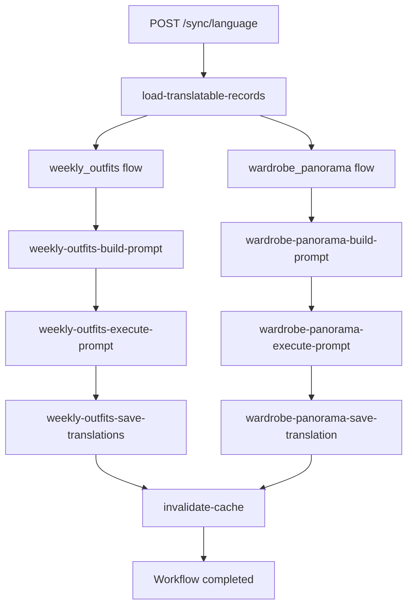

# sync-language

Asynchronous workflow that propagates a user's language preference change across SkyDIIV data stores by translating AI-generated text via LLM.

**Hosted in:** `worker-sync`  
**Endpoint:** `POST /sync/language`  
**Registry key:** `language` (last path segment, required by `serveMany`)

---

## Payload

```json
{
  "userid": "string",
  "old_language": "string",
  "new_language": "string"
}
```

| Field | Type | Description |
|---|---|---|
| `userid` | `string` | SkyDIIV user identifier (`users.id`) |
| `old_language` | `string` | Previous locale code (e.g. `en-US`) |
| `new_language` | `string` | New locale code (e.g. `pt-BR`) |

---

## Database tables

### `weekly_outfits`

One row per weekday in a generated weekly plan. Linked to the user via `weekly_outfit_preferences.user_id`.

| Column | Type | Translated |
|---|---|---|
| `id` | UUID | — (used as key) |
| `weather_summary` | `String?` | yes |
| `description_temperature` | `String?` | yes |

**Read query:** all rows for the user where at least one of the translatable columns is non-null.

### `wardrobe_panorama`

One AI-generated wardrobe analysis per user (`user_id` unique).

| Column | Type | Translated |
|---|---|---|
| `id` | UUID | — (used as key) |
| `content` | `String` | yes |

### `llm_interactions`

Every LLM call (success or failure) is logged for traceability.

---

## Workflow steps

Each translation target runs its own three-step flow with **one dedicated prompt**:



| Step | File | Description |
|---|---|---|
| `load-translatable-records` | `steps/load-translatable-records.ts` | SELECT translatable rows from both tables |
| **weekly_outfits flow** | | |
| `weekly-outfits-build-prompt` | `steps/weekly-outfits/build-prompt.ts` | Builds the single translation prompt for `weekly_outfits` |
| `weekly-outfits-execute-prompt` | `lib/llm/execute-prompt.ts` | Sends that prompt to the LLM (one call) |
| `weekly-outfits-save-translations` | `steps/weekly-outfits/save-translations.ts` | Parses response and UPDATE `weekly_outfits` |
| **wardrobe_panorama flow** | | |
| `wardrobe-panorama-build-prompt` | `steps/wardrobe-panorama/build-prompt.ts` | Builds the single translation prompt for `wardrobe_panorama` |
| `wardrobe-panorama-execute-prompt` | `lib/llm/execute-prompt.ts` | Sends that prompt to the LLM (one call) |
| `wardrobe-panorama-save-translation` | `steps/wardrobe-panorama/save-translation.ts` | Parses response and UPDATE `wardrobe_panorama.content` |
| `invalidate-cache` | `src/steps/invalidate-cache.ts` | Clears affected web app Redis entries via `CACHE_TARGETS` |

**Cache targets invalidated** (see `src/lib/cache/invalidation.ts`):

| Target | Redis key |
|---|---|
| `language-sync-running` | `running-sync-language:{userid}` |
| `weekly-outfits` | `weekly-outfits:{userid}:{weekStart}` (current week, Sunday UTC) |
| `wardrobe-panorama` | `wardrobe-panorama:{userid}` |

Flows with no matching records skip all three steps.

Prompt templates (Portuguese):

- `src/lib/i18n/prompts/sync-weekly-outfits.ts`
- `src/lib/i18n/prompts/sync-wardrobe-panorama.ts`

---

## LLM response format

### `weekly_outfits`

Input and output share the same shape — an array of objects:

```json
[
  {
    "id": "uuid",
    "weather_summary": "translated text or null",
    "description_temperature": "translated text or null"
  }
]
```

Fields that were `null` in the source record remain `null` after translation.

### `wardrobe_panorama`

```json
{
  "id": "uuid",
  "content": "translated markdown content"
}
```

---

## Triggering

Publish a signed QStash message to the worker endpoint:

```bash
curl -X POST https://worker-sync.<subdomain>.workers.dev/sync/language \
  -H "Content-Type: application/json" \
  -d '{"userid":"<USER_ID>","old_language":"en-US","new_language":"pt-BR"}'
```

For local development, expose the worker with `cloudflared` and set `WORKER_SYNC_URL` to the tunnel origin. See [README.md](../README.md).

---

## Environment

| Variable / secret | Required | Used by |
|---|---|---|
| `DATABASE_URL` / `DATABASE_URL_UNPOOLED` | yes | All steps |
| `QSTASH_*` | yes | Workflow orchestration |
| `WORKER_SYNC_URL` | yes | Step callbacks — this worker's origin |

The web app's `WORKER_SYNC_URL` controls the initial QStash delivery; this worker uses the same env as `serveMany` `baseUrl` for step callbacks.
| `GEMINI_API_KEY` | yes | Translation steps |
| `LLM_PROVIDER` | no (default: `gemini_flash`) | Translation steps |
| `GEMINI_MODEL` | no (default: `gemini-2.5-flash`) | Translation steps |
| `UPSTASH_REDIS_REST_URL`, `UPSTASH_REDIS_REST_TOKEN` | yes | `invalidate-cache` |

---

## Tests

| File | Scope |
|---|---|
| `tests/unit/sync-language-payload.test.ts` | Payload validation |
| `tests/unit/sync-weekly-outfits-prompt.test.ts` | Weekly outfits prompt builder |
| `tests/unit/sync-wardrobe-panorama-prompt.test.ts` | Wardrobe panorama prompt builder |
| `tests/unit/build-prompt-steps.test.ts` | One prompt per translation flow |
| `tests/unit/merge-weekly-outfit-translations.test.ts` | LLM response merge logic |
| `tests/unit/weekly-outfits-sync-repository.test.ts` | DB read/update for `weekly_outfits` |
| `tests/unit/wardrobe-panorama-sync-repository.test.ts` | DB read/update for `wardrobe_panorama` |
| `tests/unit/invalidate-cache-step.test.ts` | Generic cache invalidation step |
| `tests/unit/cache-invalidation.test.ts` | `CACHE_TARGETS` and `invalidateCaches` |
| `tests/unit/language-sync-cache.test.ts` | Language sync running marker |
| `tests/unit/weekly-outfits-cache.test.ts` | Weekly outfits cache key |
| `tests/unit/wardrobe-panorama-cache.test.ts` | Wardrobe panorama cache key |
| `tests/integration/sync-language.test.ts` | End-to-end step flow with fakes |

Run from `apps/worker-sync/`:

```bash
npm test
```
