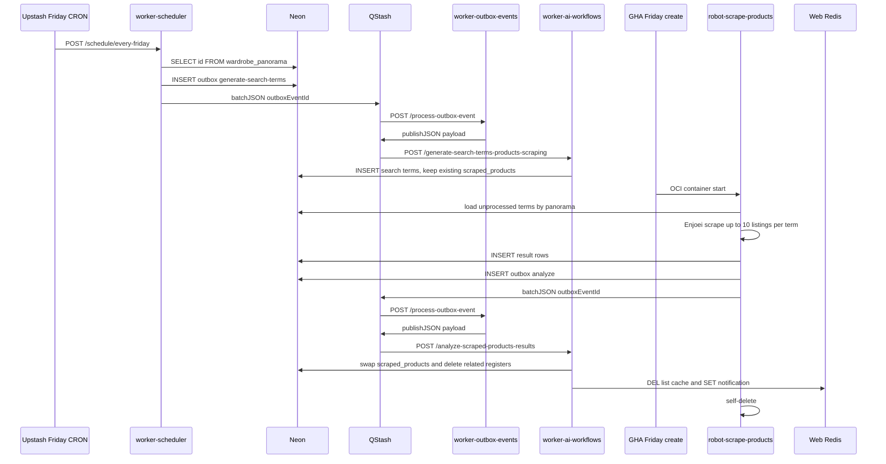

## Context

See proposal.md for why shopping suggestions move to a dedicated **automatic thrifting** pipeline.

Today `generate-wardrobe-panorama` parses a trailing JSON fence, composes Enjoei search params, and inserts `scrape-shopping-suggestions` into `outbox_events`. `worker-outbox-events` batch-publishes `{ event, payload }` to Cloudflare Queues. `robot-shopping-suggestions` drains that queue, replaces `scraped_products`, and writes web Redis keys `shopping-suggestions:{userId}` and `notification:new-shopping-suggestions:{userId}`.

Constraints that shape the new design:

- Prisma schema, outbox catalog (`EVENTS` / `BROKER_NAMES`), and Redis key names live in `skydiiv/web`. This repo uses postgres.js against agreed columns and hardcodes catalog UUIDs after web seeds them (same pattern as `SCRAPE_SHOPPING_SUGGESTIONS_EVENT_ID`).
- `worker-ai-workflows` hosts workflows via `serveMany` — map key = last URL path segment; keys cannot contain `/`. Callback `baseUrl` is `WORKER_AI_WORKFLOWS_URL` (origin only).
- Scheduler weekday flows live in `flows/registry.ts`. Friday currently has no flows. Catch-up already publishes `{ outboxEventId }` to `{WORKER_OUTBOX_EVENTS_URL}/process-outbox-event`.
- Robot is an ephemeral OCI Container Instance. It will be renamed `robot-scrape-products` and will insert outbox rows instead of calling AI workflows directly.
- Tables `search_terms_scraped_products`, `results_search_terms_scraped_products`, and `marketplaces_catalog_scraped_products` are implemented in web; workers assume they exist at apply time.

Requirements: delta specs under `specs/apps/*/automatic-thrifting/`.

## Goals / Non-Goals

**Goals:**

- Four-stage pipeline (Friday scheduler → outbox → generate terms → Friday robot scrape → outbox → analyze) using existing QStash + Upstash Workflow + outbox + Neon + Enjoei scraper.
- Last week’s `scraped_products` stay on the UI until analyze has a replacement set; then one transaction deletes old products and related search/result rows and inserts the new products.
- Rename the robot and its infra to `robot-scrape-products`.
- Keep Redis keys identical to the current web contract so the UI keeps working before a copy rename.

**Non-Goals:**

- Do not restate proposal non-goals (no Prisma in this repo, no second marketplace scraper, no CF Queue deletion).
- Do not keep a dedicated `/trigger-generate-search-terms-products-scraping` path; Friday `/schedule/every-friday` is the trigger.
- Do not publish workflow payloads from scheduler or robot straight to `WORKER_AI_WORKFLOWS_URL`.

## Decisions

### 1. Friday weekday flow, after Thursday panorama

Register `generateSearchTermsProductsScrapingFlow` on `friday` in `flowRegistry`. Reuse `handleSchedule` (signature, parallel flows, 200/207/500). Copy the panorama flow’s `SELECT` + batch style, but insert outbox rows instead of publishing to the AI worker.

Robot GHA create/destroy moves from Thursday 19:00/21:00 BRT to **Friday 19:00/21:00 BRT** (`0 22 * * 5` and `0 0 * * 6` UTC). That keeps the same afternoon window after the weekday CRON, one day after panorama.

- Alternative considered: dedicated `/trigger-…` endpoint. Rejected — the job belongs on a weekday schedule; Friday is the first day after Thursday panorama with a free registry slot.
- Alternative considered: Saturday robot. Rejected — extra calendar day; Friday evening matches the current Thursday pairing.

No new scheduler secrets. Reuse `QSTASH_*`, `WORKER_OUTBOX_EVENTS_URL`, `DATABASE_URL`.

### 2. All automatic-thrifting events go through the outbox

| Event name | Broker | Producer | Downstream |
|---|---|---|---|
| `generate-search-terms-products-scraping` | `QStash` | `worker-scheduler` (Friday) | `{WORKER_AI_WORKFLOWS_URL}/generate-search-terms-products-scraping` |
| `analyze-scraped-products-results` | `QStash` | `robot-scrape-products` | `{WORKER_AI_WORKFLOWS_URL}/analyze-scraped-products-results` |

Payload for both: `{ "wardrobePanoramaId": "<uuid>" }`.

Pattern (same as `enqueue-shopping-suggestions` / catch-up):

1. `INSERT outbox_events` (`PENDING`, catalog UUID from web, `created_by` = producer app).
2. `batchJSON` `{ outboxEventId }` to `{WORKER_OUTBOX_EVENTS_URL}/process-outbox-event` (max 100).
3. Insert failure is fatal. QStash failure after insert leaves `PENDING`; catch-up retries.

`worker-outbox-events`: add two `OUTBOX_ROUTES` + `dispatch` cases modeled on `language-changed` (publishJSON payload to a worker URL). Add `resolveWorkerAiWorkflowsUrl(path)` and secret/var `WORKER_AI_WORKFLOWS_URL` (origin only) on that worker.

- Alternative considered: scheduler/robot `publishJSON` directly to AI workflows. Rejected — user requires outbox for every event.

### 3. Two `createWorkflow` keys on `worker-ai-workflows`

| Key | Payload | Role |
|---|---|---|
| `generate-search-terms-products-scraping` | `{ wardrobePanoramaId }` | LLM → insert new `search_terms_scraped_products` (no deletes) |
| `analyze-scraped-products-results` | `{ wardrobePanoramaId }` | LLM → atomic swap of `scraped_products` + related registers + Redis |

Follow panorama: `createWorkflow` + `context.run` steps, `resetDbClients()` at start, Zod on payload and LLM JSON, `lib/db` repositories, `llm_interactions` via `SqlLlmInteractionsRepository`.

Generate steps: validate id → skip if unprocessed search terms already exist → load panorama, locale, routine, shopping prefs, catalog → if no eligible marketplace, exit without deletes → build prompt → execute LLM → parse/cap 10 → round-robin `marketplace` → insert rows. Do **not** delete `scraped_products` or prior search/result rows.

Analyze steps: validate id → load unprocessed results → if none, exit without deletes → build prompt → execute LLM → if zero listings to insert, exit without deletes → in one transaction: `DELETE scraped_products` for the panorama, `INSERT` chosen rows, `DELETE` that panorama’s `results_search_terms_scraped_products` then `search_terms_scraped_products` → Redis DEL/SET.

- Alternative considered: wipe products and related registers at generate-search-terms start. Rejected — last week’s suggestions would disappear before the new set is ready.
- Alternative considered: skip generate when unprocessed terms exist. Accepted — avoids stacking Friday retries on top of an unfinished scrape.

### 4. Marketplace eligibility and `json_search` shape

Catalog `name` is the scraper slug (`enjoei`). `supported_languages` is a string array of BCP-47 tags. Eligible = locale is in that array. Terms are generated in the user locale. Application code assigns marketplace round-robin.

`json_search` (Zod), aligned with today’s Enjoei `SearchParams` minus `brand`:

```json
{
  "term": "blazer casual bege oversized",
  "gender": "Female",
  "topSize": "M",
  "bottomSize": null,
  "footSize": null
}
```

Compose sizes from `shopping_suggestions_preferences` the same way `composeSearchParams` does (LLM emits `term` + `sizeCategory`; worker fills gender/sizes). Cap 10 after parse.

### 5. Rename robot to `robot-scrape-products`; DB batch + outbox analyze

Move `apps/robot-shopping-suggestions` → `apps/robot-scrape-products`. Rename in lockstep:

- GHA: `weekly-robot-scrape-products.yml`, `cost-guard-robot-scrape-products.yml`, `deploy-robot-scrape-products.yml` (Friday crons on weekly)
- GitHub Environment secret `ROBOT_SCRAPE_PRODUCTS_ENV`
- Terraform/OCI display names, OCIR repository, concurrency group, `CREATED_BY`
- Docs and `package.json` `name`

Replace `BatchDrainRunner` + CF Queues with a runner that:

1. Distinct `wardrobe_panorama_id` from unprocessed search terms.
2. For each panorama, process terms (`ROBOT_CONCURRENCY`).
3. Map `json_search` → `SearchParams` (`term` → `searchTerm`). Extend `EnjoeiScraper` from first `.c-product-card` to **up to 10 cards**.
4. Insert ≤10 result rows; mark the search term processed.
5. Insert analyze outbox + `batchPublishOutboxMessages`.
6. Self-delete.

Robot env: `QSTASH_TOKEN`, `WORKER_OUTBOX_EVENTS_URL` (origin), `DATABASE_URL` / unpooled, catalog event UUID (or read from env). Optional `QSTASH_URL`. Drop required CF Queue vars. Web Redis unused for this feature.

Do not wire staged Redis-stream / interval-pull runners.

### 6. Redis keys stay on the current web contract

Analyze (not the robot) `DEL shopping-suggestions:{userId}` and `SET notification:new-shopping-suggestions:{userId}` `{"updatedAt":"<ISO>"}`. Move the robot’s key builders into `worker-ai-workflows` `lib/cache` (do not use `notification--type--userId`).

### 7. Panorama: markdown only, drop enqueue

Remove trailing JSON instructions from `wardrobe-panorama.ts`, stop parsing shopping-suggestions JSON, drop `enqueue-shopping-suggestions`, stop loading shopping prefs in panorama `build-prompt`. Keep `## o que vale buscar`. CF Queues route may remain unused.

### 8. Assumed table columns (web Prisma)

| Table | Columns |
|---|---|
| `marketplaces_catalog_scraped_products` | `id`, `name`, `supported_languages`, audit |
| `search_terms_scraped_products` | `id`, `wardrobe_panorama_id`, `llm_interaction_id`, `marketplace`, `json_search` (jsonb), `is_processed` default false, audit |
| `results_search_terms_scraped_products` | `id`, `search_term_scraped_product_id`, `json_result` (jsonb), `is_processed` default false, audit |
| `scraped_products` | unchanged; writer becomes `worker-ai-workflows` |

Swap transaction (analyze only, after new product rows are prepared in memory): `DELETE scraped_products` for the panorama → `INSERT` new `scraped_products` → `DELETE` results (FK) → `DELETE` search terms. Seed (web): `name = enjoei`, `supported_languages` includes `pt-BR`.

## End-to-end flow



## Risks / Trade-offs

- [Web tables or catalog UUIDs missing] → Inserts/dispatch fail. Mitigation: web follow-up is a hard prerequisite.
- [Friday CRON after robot create] → Robot sees nothing. Mitigation: robot is Friday 19:00 BRT; keep the Friday QStash schedule in the morning/afternoon.
- [Analyze has nothing to insert] → Last week’s `scraped_products` remain. Mitigation: intended; notify only after a successful swap.
- [Rename misses a secret or OCIR repo] → Friday GHA fails. Mitigation: task checklist for GHA, Terraform, secrets, package name; keep old workflow files deleted in the same PR.
- [Analyze outbox publish fails after scrape] → Terms processed; PENDING analyze row. Mitigation: catch-up; manual process-outbox-event.
- [CF Queue leftovers] → New robot does not drain them. Mitigation: accept stale queued scrapes.
- [2h GHA window vs 10×10 listings] → Unfinished terms stay `is_processed=false` for the next Friday create or `workflow_dispatch`. Soft destroy still wins.

## Migration Plan

1. **skydiiv/web:** tables + Enjoei seed + outbox catalog events (return UUIDs to backstage). Keep Redis keys.
2. **Deploy `worker-outbox-events`** with the two QStash routes and `WORKER_AI_WORKFLOWS_URL`.
3. **Deploy `worker-ai-workflows`** (new workflows + panorama enqueue removed) in the same release window as scheduler.
4. **Deploy `worker-scheduler`** with the Friday flow (existing Friday CRON starts dispatching).
5. **Rename/deploy robot** (`ROBOT_SCRAPE_PRODUCTS_ENV` with `QSTASH_TOKEN`, `WORKER_OUTBOX_EVENTS_URL`, event UUID); first GHA create on Friday.
6. **Smoke:** Friday schedule → outbox → new search terms (old products still present) → robot → analyze outbox → swapped `scraped_products` + Redis.
7. **Rollback:** restore panorama enqueue + old robot folder/GHA (Thursday) together; remove Friday flow; pause is not enough if Friday CRON still hits the worker. Do not drop web tables.

## Open Questions

- Exact hour of the existing (or new) Friday Upstash CRON — operators keep it several hours before 19:00 BRT.
- When web renames Redis keys / UI copy to “automatic thrifting” — independent follow-up.
