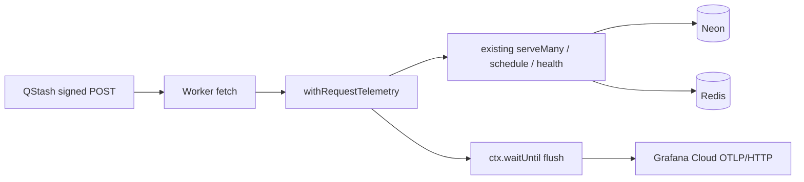
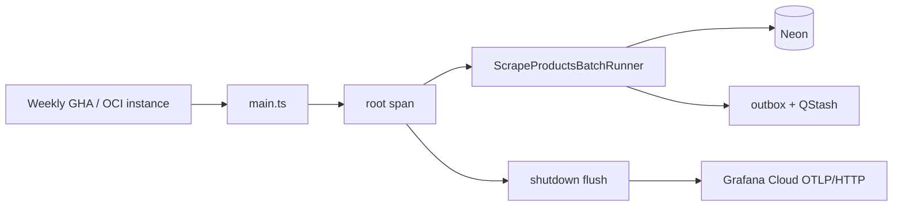

## Context

See proposal.md for why. Specs under `specs/apps/*/observability/` define the behavior.

Today every app logs NDJSON via `createLogger` (`apps/*/src/lib/logger.ts`; robot: `domain/ports/logger.port.ts` + `infrastructure/logging/logger.ts`). Workers already enable Cloudflare `[observability.logs]`. Nothing exports OTLP. Apps are independent Node 22 projects (not a pnpm workspace). The robot already uses Clean Architecture ports/adapters and a provider factory (`createSelfDeleteProvider` / `COMPUTE_PROVIDER`). Workers compose in `src/index.ts`: copy bindings into `process.env`, unsigned `GET /`, then `serveMany` (last path segment; workflow keys cannot contain `/`) or scheduler route handlers. POST bodies stay Zod-validated at existing workflow/handler boundaries. Worker URLs remain origin-only.

Cloudflare Workers cannot run the Node OpenTelemetry SDK or OTLP/gRPC. Export MUST use `fetch` + OTLP/HTTP, and MUST flush with `ExecutionContext.waitUntil` so the isolate is not recycled mid-export. The robot is a Node 22 OCI process and can flush on shutdown.

## Goals / Non-Goals

**Goals:**

- Same domain port in every app: traces, metrics, logs. Grafana Cloud and OTLP stay in infrastructure.
- Provider factory matching `COMPUTE_PROVIDER`: explicit `grafana-cloud` | `noop`, else auto-detect from OTLP credentials.
- Boundary instrumentation only (Worker `fetch`, robot `main` / batch runner). Existing `createLogger` call sites keep compiling; the selected adapter is the sink.
- Safe default: missing credentials → noop; OTLP errors never change HTTP/batch outcomes.

**Non-Goals:**

- Do not restate proposal non-goals (no dashboards, no web follow-up, no workspace package, no deep auto-instrumentation).
- Do not change `serveMany` routing, `createWorkflow` + `context.run` steps, or `lib/db` repositories.
- Do not add a new public HTTP path or worker URL.

## Decisions

### 1. Vendor-agnostic port; Grafana Cloud is one adapter

Domain port (kebab-case file `observability.port.ts`):

- `startSpan(name, attributes?)` → handle with `setAttribute` / `recordException` / `end`
- `recordMetric(name, value, attributes?)`
- `logger(step, context?)` → existing `Logger` (`debug`/`info`/`warn`/`error`)
- `flush()` / `shutdown()`

Application and presentation depend on this port. They MUST NOT import Grafana, `@opentelemetry/*`, or OTLP types.

Factory (copy of the robot self-delete pattern): `createObservabilityProvider({ provider, serviceName, deploymentEnvironment, otlp })`.

| `OBSERVABILITY_PROVIDER` | Result |
|---|---|
| `grafana-cloud` | Grafana Cloud OTLP adapter; incomplete credentials → warn + noop |
| `noop` | Console NDJSON only |
| unset | `grafana-cloud` if endpoint **and** headers are non-empty, else `noop` |
| anything else | throw at boot (same as unknown `COMPUTE_PROVIDER`) |

Adding Datadog (or another vendor) later: implement the port under `infrastructure/observability/providers/`, register the id in the factory. Switching Grafana Cloud → another **OTLP** vendor can reuse the Grafana adapter with different endpoint/headers, or a future generic `otlp` id.

- Alternative considered: put `@opentelemetry/api` in domain. Rejected — OTel would leak into every use case and lock the swap to OTLP-shaped APIs.
- Alternative considered: shared `packages/observability`. Rejected — repo rule is independent apps, not a pnpm workspace. Duplicate the small port/factory/adapters per app; keep paths identical so a later vendor is a mechanical copy.

### 2. Workers get a thin ports layer; workflows are not rewritten

Workers today live under `src/index.ts`, `src/workflows/` or `src/flows/`, and `src/lib/`. Do not migrate workflows onto full domain/application folders.

Per worker:

```
src/domain/ports/logger.port.ts          # move Logger interface here
src/domain/ports/observability.port.ts
src/infrastructure/observability/
  observability.factory.ts
  with-request-telemetry.ts
  providers/noop.provider.ts
  providers/grafana-cloud.otlp.provider.ts
src/lib/logger.ts                        # facade: ALS-backed logger from the port
```

Composition root (`src/index.ts`): `Object.assign(process.env, env)` (existing), then factory, then wrap the current handler with `withRequestTelemetry`. `createLogger` reads `AsyncLocalStorage` (available under `nodejs_compat`) so existing step loggers attach to the request span without threading the port through every `context.run` step.

Robot: add `domain/ports/observability.port.ts` and the same infrastructure folder. `main.ts` creates the provider, passes `observability.logger(...)` into existing DI, starts a root span around `runner.start()`, `flush`/`shutdown` in `finally`. Keep `Logger` as the log facet of the port (robot already injects `Logger`).

### 3. One fetch-based OTLP/HTTP JSON exporter (Workers + Node)

Grafana Cloud adapter POSTs JSON to:

- `{endpoint}/v1/traces`
- `{endpoint}/v1/metrics`
- `{endpoint}/v1/logs`

`endpoint` is the Grafana OTLP gateway origin+`/otlp` path (no trailing slash normalization beyond stripping a single trailing `/`). Headers come from `OTEL_EXPORTER_OTLP_HEADERS` (Grafana: `Authorization=Basic …`). Use global `fetch`, not gRPC. Swallow export errors after `console.warn`. Sample 100% (these apps are low QPS).

Workers: `fetch(request, env, ctx)` gains `ExecutionContext`. `withRequestTelemetry` ends the span, then `ctx.waitUntil(observability.flush())`.

Robot: `await observability.shutdown()` after the batch (flush + close). SIGINT/SIGTERM already close DB; also shut down observability there.

- Alternative considered: `@microlabs/otel-cf-workers`. Rejected — Cloudflare-only; robot would need a second stack; domain would still need a port on top.
- Alternative considered: Node SDK on the robot and a custom Workers exporter. Rejected — two adapters for the same vendor.

Resource attributes: `service.name` (app folder name unless `OTEL_SERVICE_NAME` set), `service.namespace=skydiiv-backstage`, `deployment.environment` (`staging` | `production` | `local`). Span attributes: `http.request.method`, `http.route` (pathname), `http.response.status_code`. Robot: `compute.provider`, `batch.status`. Generate a W3C `traceparent` when the request has none; honor an incoming one if present.

Logs: Grafana adapter writes the same NDJSON line to console **and** an OTLP log record with `traceId`/`spanId` when a span is active. Noop writes console only. Keep wrangler `[observability.logs]`.

Metrics (names are stable for Grafana):

- Workers: `http.server.request.duration` (ms) + `http.server.request.count` with method/route/status
- Robot: `batch.run.duration` (ms) + `batch.run.count` with status

PII: allow `userId` when existing loggers already pass it; forbid email, prompt text, image bytes, proxy URLs, listing HTML, and raw QStash JSON as attributes.

### 4. Env, secrets, and deploy (no new worker URLs)

| Variable | Where | Secret? |
|---|---|---|
| `OBSERVABILITY_PROVIDER` | wrangler.toml `[vars]` / `[env.staging.vars]` optional; robot `.env` optional | no |
| `OTEL_SERVICE_NAME` | optional; default app name | no |
| `DEPLOYMENT_ENVIRONMENT` | wrangler `[vars]=production`, `[env.staging.vars]=staging`; robot from Terraform `environment` or `.env` | no |
| `OTEL_EXPORTER_OTLP_ENDPOINT` | Worker secret; robot `ROBOT_SCRAPE_PRODUCTS_ENV` / `.env` | yes (bulk with other secrets) |
| `OTEL_EXPORTER_OTLP_HEADERS` | same | yes |

Do not put credentials in wrangler.toml `[vars]`. Document in each `.env.example` (empty values). GitHub Environments `staging` and `production`: add the two OTEL secrets; extend each `wrangler secret bulk` key list. Robot: operators append the two keys to `ROBOT_SCRAPE_PRODUCTS_ENV` (Terraform already injects that blob as container env). Local workers: `.dev.vars`. No worker URL changes; callers still append paths.

QStash / Workflow / outbox / Redis are unchanged. Telemetry wraps the existing hop:



Robot:



### 5. Tests

Vitest unit tests per app (no Playwright): factory selection; Grafana adapter POST URL/headers/bodies with mocked `fetch`; noop never fetches; `withRequestTelemetry` records status `401` vs `200` and still returns the inner response when flush rejects. Extend existing `index` / health tests so unsigned POST still `401`. Robot: factory + flush-on-failure does not skip runner completion (mock runner).

## Risks / Trade-offs

- **[Risk] Duplicated port/adapter in six apps drift** → Mitigation: identical relative paths and file names; tasks land the worker-ai-workflows copy first, then clone. A later workspace package can replace copies without changing the port.
- **[Risk] Worker isolate killed before OTLP POST completes** → Mitigation: `waitUntil(flush())`; keep payloads small (boundary spans only).
- **[Risk] Grafana credentials missing in an environment after deploy** → Mitigation: auto-noop; requests succeed; operators notice missing data in Grafana, not 5xx.
- **[Risk] OTLP JSON vs protobuf compatibility** → Mitigation: Grafana Cloud accepts OTLP/HTTP JSON; if a payload is rejected, log the HTTP status and keep serving.
- **[Trade-off] No DB/LLM child spans** → Accepted for this change; the port allows adding them later inside adapters or use cases without a Grafana rewrite.

## Migration Plan

1. Merge code with factory auto-noop so staging/production keep working before secrets exist.
2. Add GitHub Environment secrets (`staging` then `production`) and redeploy workers (secret bulk + deploy). Confirm `GET /` in Grafana Explore (Tempo/traces, metrics, Loki/OTLP logs).
3. Add keys to `ROBOT_SCRAPE_PRODUCTS_ENV` before the next Friday robot create.
4. Rollback: set `OBSERVABILITY_PROVIDER=noop` as a Worker var / robot env, or delete the two OTEL secrets and redeploy. No DB or QStash rollback.

## Open Questions

None. Grafana instance URL, region, and API token are operator-provided at deploy time and do not change the specs or task shape.
