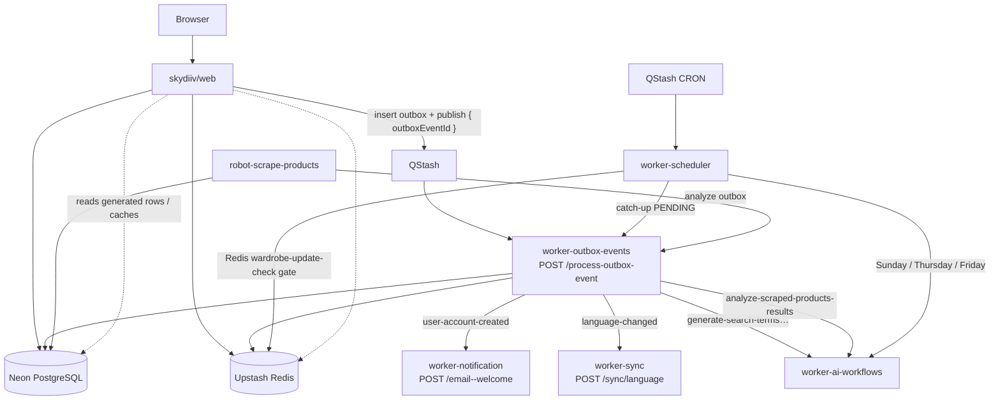

## Context

See proposal.md for why. Specs: `specs/observability/grafana/spec.md`.

Apps already export OTLP/HTTP JSON to Grafana Cloud (vendor-agnostic port; Grafana adapter). Workers record a root span plus gauges `http.server.request.count` (value 1) and `http.server.request.duration` (ms) with `http.request.method`, `http.route` (full pathname), `http.response.status_code`. The robot records `batch.run.count` / `batch.run.duration` with `batch.status`. Resource attributes: `service.name` (app folder name), `service.namespace=skydiiv-backstage`, `deployment.environment` (`staging` | `production` | `local`). Logs dual-write console NDJSON + OTLP; traces honor/generate W3C `traceparent`.

No Grafana dashboards, folders, or Grafana HTTP API usage exist today. The previous observability change explicitly left dashboards out of scope. Worker URLs stay origin-only; `serveMany` still routes by the last path segment (workflow keys cannot contain `/`). This change does not add handlers, `createWorkflow` steps, or `lib/db` repositories.

The browser never calls backstage HTTP. Web ↔ backstage is QStash + shared Neon/Redis/R2 (context only — this change does not add an interactions dashboard):



Web-triggered hops are out of dashboard scope. Scheduled hops (pipelines dashboard): weekday CRON, AI workflows, Friday robot. Redis `wardrobe-update-check:{userId}--wardrobe-panorama` is a silent gate — no OTLP today; do not invent a panel for it.

## Goals / Non-Goals

**Goals:**

- Check in Grafana dashboard JSON under `observability/grafana/` with stable `uid`s.
- Query existing OTLP metrics, Loki logs, and Tempo traces. Do not change adapters.
- Upsert into Grafana Cloud from GitHub Actions the same way workers deploy (path-filtered workflow, GitHub Environment secrets, `staging` / `main`).
- Resolve datasource UIDs at deploy time so JSON is not bound to one stack.

**Non-Goals:**

- Do not restate proposal non-goals (no alerts, no adapter changes, no web instrumentation, no Terraform/Grizzly).
- Do not add a worker URL, wrangler.toml, or QStash schedule.
- Do not scrape Neon for outbox lag; there is no such metric yet.
- Do not add `web-backstage-interactions.json` or panels dedicated to `/process-outbox-event`, `email--welcome`, `/sync/language`, or catch-up-outbox as a web-interaction story.

## Decisions

### 1. Independent Node 22 project at `observability/grafana/`

Match other backstage projects: Node 22, kebab-case files, en-US, Vitest, no pnpm workspace. This is not a Cloudflare Worker (no Wrangler, no `serveMany`).

```
observability/grafana/
  README.md
  package.json
  dashboards/
    overview.json
    scheduled-pipelines.json
    service-red.json
  src/
    deploy.mjs          # upsert folder + dashboards
    datasources.mjs     # GET /api/datasources, pick prom/loki/tempo
    validate.mjs        # structural checks used by CI and tests
  tests/
    validate.test.mjs
    deploy.test.mjs     # mocked fetch
```

`npm run validate` never calls Grafana. `npm run deploy` requires `GRAFANA_URL` + `GRAFANA_SERVICE_ACCOUNT_TOKEN`.

- Alternative considered: Python under `scripts/`. Rejected — CI already uses Node 22 for every worker; Grafana JSON is a JS-shaped payload.
- Alternative considered: shell + `curl`. Rejected — datasource UID substitution and folder upsert are easier to test with mocked `fetch`.

### 2. Grafana dashboard JSON + HTTP API upsert (not Terraform)

Each file is a Grafana dashboard document (`schemaVersion` 38+ acceptable) with:

| Field | Value |
|---|---|
| `uid` | stable, prefixed `skydiiv-bs-` (`overview`, `schedules`, `service-red`) |
| `tags` | `skydiiv`, `backstage` |
| `timezone` | `browser` |
| templating | `environment` (`staging`/`production`/`local`); service-red also has `service` |

Placeholder datasource UIDs in JSON: `DS_PROMETHEUS`, `DS_LOKI`, `DS_TEMPO`. The deploy script replaces them with UIDs from `GET /api/datasources`:

1. Prefer type `prometheus` / `loki` / `tempo`.
2. If several of one type, prefer a name containing `grafanacloud` or the Grafana Cloud default (`grafanacloud-prom`, `grafanacloud-logs`, `grafanacloud-traces`).
3. If none found, fail the deploy (do not guess).

Folder: title `SkyDIIV Backstage`, uid `skydiiv-backstage`. `GET /api/folders/skydiiv-backstage`; on 404 `POST /api/folders`. Dashboards: `POST /api/dashboards/db` with `{ dashboard, folderUid, overwrite: true, message }`. Strip `id` so Grafana keys on `uid`. Auth: `Authorization: Bearer ${GRAFANA_SERVICE_ACCOUNT_TOKEN}`. Token scopes: `dashboards:write`, `folders:write`, `datasources:read`.

- Alternative considered: Grafana Terraform provider. Rejected — robot Terraform is OCI-only; a second IaC stack for three JSON files is disproportionate.
- Alternative considered: Grizzly / jsonnet. Rejected — extra toolchain; operators already run Node in CI.

### 3. Query gauges with `_over_time`; PromQL label mapping

OTLP export uses **gauges**, not cumulative sums. Prometheus `rate()` on these series is wrong. Dashboards MUST use:

| Intent | Query shape (names after `.` → `_`) |
|---|---|
| Request / batch count | `count_over_time(http_server_request_count{...}[$__interval])` (robot: `batch_run_count`) |
| Average latency | `avg_over_time(http_server_request_duration{...}[$__interval])` |
| Percentile latency | `quantile_over_time(0.95, http_server_request_duration{...}[$__interval])` |
| Errors | same count query with `http_response_status_code=~"4..\|5.."` (401 included) |

Expected labels (Grafana Cloud Metrics from OTLP resource/datapoint attributes):

- `service_name`, `deployment_environment`
- `http_request_method`, `http_route`, `http_response_status_code`
- robot: `batch_status`

Health vs work: `http_route="/"` vs everything else.

`http.route` is the **full pathname** from `withRequestTelemetry`, not the `serveMany` key. QStash still publishes to origin + path. Filters used by dashboards in this change:

| Flow | `service_name` | `http_route` match |
|---|---|---|
| Weekday CRON | `worker-scheduler` | `/schedule/every-<day>` and `/schedule/everyday` |
| AI workflows | `worker-ai-workflows` | `/generate-weekly-outfits`, `/generate-wardrobe-panorama`, `/generate-search-terms-products-scraping`, `/analyze-scraped-products-results` |

Loki: `{service_name="$service", deployment_environment="$environment"}` with severity/error line filters. Tempo: TraceQL `{resource.service.name="$service"}`. Do not query payload/email/prompt fields.

If Explore shows different label names during apply (e.g. `exported_job`), fix the JSON in the same apply; keep `uid`s.

- Alternative considered: change adapters to OTLP Sum/Histogram. Rejected for this change — six-app behavior change, separate from dashboards. A later change can switch types and then use `rate()`.
- Alternative considered: Grafana Cloud Application Observability auto-dashboards only. Rejected — they are not git-owned and do not encode weekday CRON / AI / robot pipelines.

### 4. Three dashboards mapped to backstage RED and schedules

**overview (`skydiiv-bs-overview`)** — rows per service: volume, error %, p95, health vs work split; robot batch success/error. Includes `worker-outbox-events`, `worker-notification`, and `worker-sync` as services only (no route-level web-hop story).

**scheduled-pipelines (`skydiiv-bs-schedules`)** — scheduler weekday heatmap/series; AI workflow routes; robot batch. Friday chain (search-terms → robot → analyze) is three panels, not a distributed trace (no parent span across QStash).

**service-red (`skydiiv-bs-service-red`)** — `$service` + `$environment`; count, status table, duration, Loki errors, Tempo link. Robot uses `batch.run.*` when `$service=robot-scrape-products`. Status breakdown includes `401` for whichever service is selected; that is generic RED, not an interactions dashboard.

Time range default: last 24h (low QPS). Refresh: 1m.

### 5. GitHub Actions, secrets, no worker URLs

New `.github/workflows/deploy-grafana-dashboards.yml`, patterned on worker deploy workflows:

| Trigger | Job |
|---|---|
| `pull_request` paths `observability/grafana/**` or the workflow file | `validate` (`npm ci`, `npm test`, `npm run validate`) — no Grafana secrets |
| `push` `staging` / `main` with the same paths, plus `workflow_dispatch` | `validate` then `deploy` |

`deploy` uses `environment: staging` or `production` (same names as workers). Secrets (not wrangler `[vars]`, not worker origin URLs):

| Variable | Where | Secret? |
|---|---|---|
| `GRAFANA_URL` | GitHub Environment | yes (stack origin, no trailing path) |
| `GRAFANA_SERVICE_ACCOUNT_TOKEN` | GitHub Environment | yes |

OTLP secrets stay on the workers/robot; this workflow must not read them. Concurrency group `grafana-dashboards-${{ github.ref }}`. Missing secrets fail `deploy` only; worker workflows are unchanged.

Local: `GRAFANA_URL` + token in the shell (never committed). `npm run validate` is the default local check.

### 6. Tests and docs

Vitest (no Playwright): JSON parse; required `uid`s; each schedules route string present in panel targets; PII denylist (`email`, `prompt`, `payload`) absent from queries; no `web-backstage-interactions` file or `skydiiv-bs-web-interactions` uid; deploy mocks `GET /api/datasources`, folder 404→create, `POST /api/dashboards/db` with `overwrite: true` and stripped `id`; deploy throws when URL/token missing.

Docs: `observability/grafana/README.md` (dashboards, queries, secrets, how to add a panel). Each app `docs/OBSERVABILITY.md` gets a short “Dashboards” paragraph pointing at that README. No new public HTTP path, so no new per-app `docs/<WORKFLOW>.md`.

## Risks / Trade-offs

- **[Risk] Gauge-as-count is a poor Prometheus citizen** → Mitigation: `_over_time` only; document it; a later adapter change can emit sums.
- **[Risk] Grafana Cloud label/metric names differ from the mapping above** → Mitigation: first apply checks Explore; adjust PromQL in JSON without changing `uid`s.
- **[Risk] Multiple Prometheus datasources on the stack** → Mitigation: name preference list; fail if none match.
- **[Risk] Operators edit dashboards in the UI and lose changes on next deploy** → Mitigation: README “git is source of truth”; upsert overwrite.
- **[Risk] Token too powerful** → Mitigation: service account with dashboards/folders/datasources only; never commit it.
- **[Trade-off] No outbox PENDING lag / Redis gate panels** → Accepted; no metric exists without scraping Neon or new instrumentation.
- **[Trade-off] No end-to-end trace web → worker** → Accepted; web is not instrumented; QStash does not forward our `traceparent` into workers today.

## Migration Plan

1. Merge dashboard JSON + validate workflow. PRs start failing on invalid JSON; Grafana unchanged until secrets exist.
2. Create a Grafana Cloud service account (dashboards:write, folders:write, datasources:read). Put `GRAFANA_URL` and token in GitHub Environments `staging` then `production`.
3. Push to `staging` (or `workflow_dispatch`). Confirm folder + three dashboards; spot-check Overview against a `GET /` and a known QStash schedule or workflow route.
4. Push to `main` (or dispatch) for production stack if it is a different Grafana Cloud instance. If staging and production share one stack, production deploy overwrites the same `uid`s — that is intended.
5. Rollback: revert the git commit and re-run deploy, or delete the folder in Grafana UI. No worker/QStash/DB rollback. Setting `OBSERVABILITY_PROVIDER=noop` is unrelated and MUST NOT be used as dashboard rollback.

## Open Questions

None. Stack URL and token are operator-provided at deploy time. Metric label mismatches are handled in-apply against Explore without changing the task shape.
